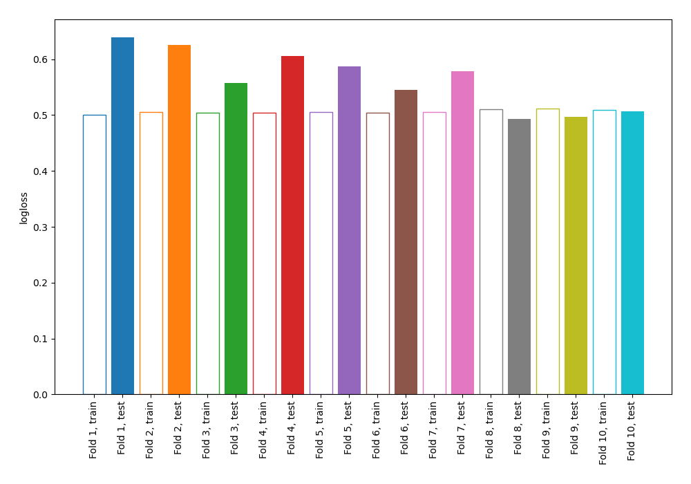
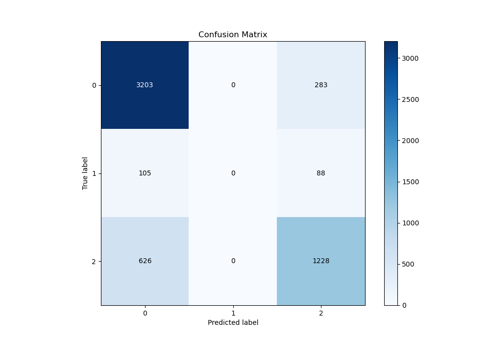
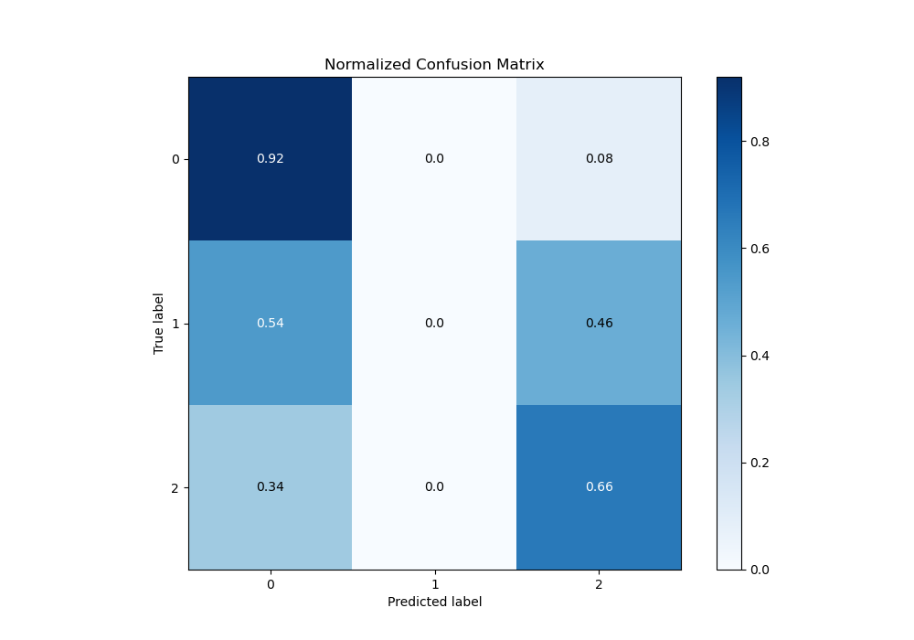
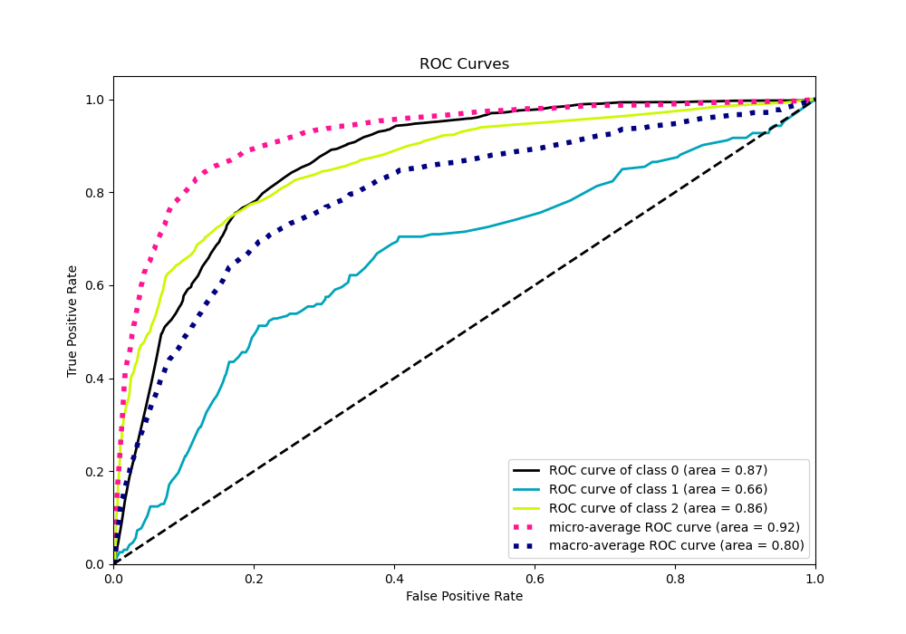
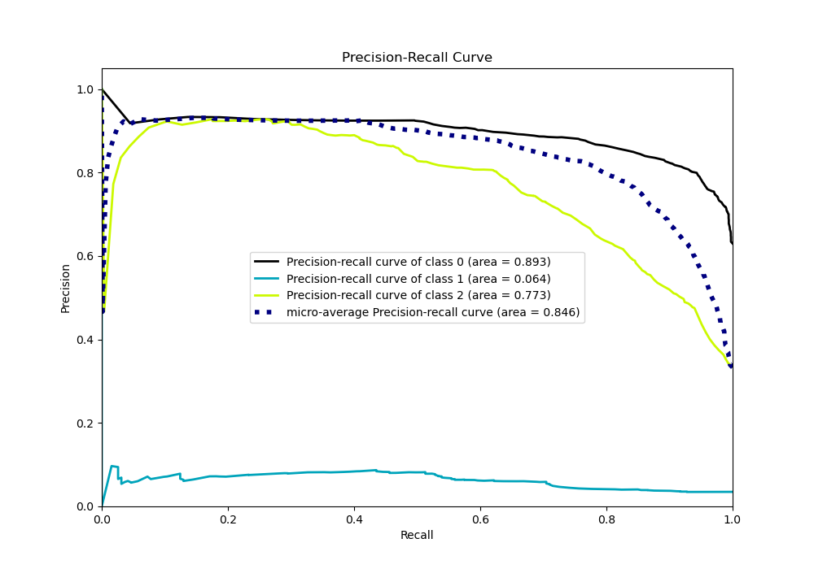

# Summary of 103_DecisionTree

[<< Go back](../README.md)

## Decision Tree
- **n_jobs**: -1
- **criterion**: entropy
- **max_depth**: 4
- **num_class**: 3
- **explain_level**: 0

## Validation
 - **validation_type**: kfold
 - **shuffle**: True
 - **stratify**: True
 - **k_folds**: 10

## Optimized metric
logloss

## Training time

7.4 seconds

### Metric details
|           |           0 |   1 |           2 |   accuracy |   macro avg |   weighted avg |   logloss |
|:----------|------------:|----:|------------:|-----------:|------------:|---------------:|----------:|
| precision |    0.814184 |   0 |    0.76798  |   0.800831 |    0.527388 |       0.770302 |  0.563529 |
| recall    |    0.918818 |   0 |    0.662352 |   0.800831 |    0.527057 |       0.800831 |  0.563529 |
| f1-score  |    0.863342 |   0 |    0.711266 |   0.800831 |    0.524869 |       0.78227  |  0.563529 |
| support   | 3486        | 193 | 1854        |   0.800831 | 5533        |    5533        |  0.563529 |

## Confusion matrix
|              |   Predicted as 0 |   Predicted as 1 |   Predicted as 2 |
|:-------------|-----------------:|-----------------:|-----------------:|
| Labeled as 0 |             3203 |                0 |              283 |
| Labeled as 1 |              105 |                0 |               88 |
| Labeled as 2 |              626 |                0 |             1228 |

## Learning curves

## Confusion Matrix

## Normalized Confusion Matrix

## ROC Curve

## Precision Recall Curve

[<< Go back](../README.md)
