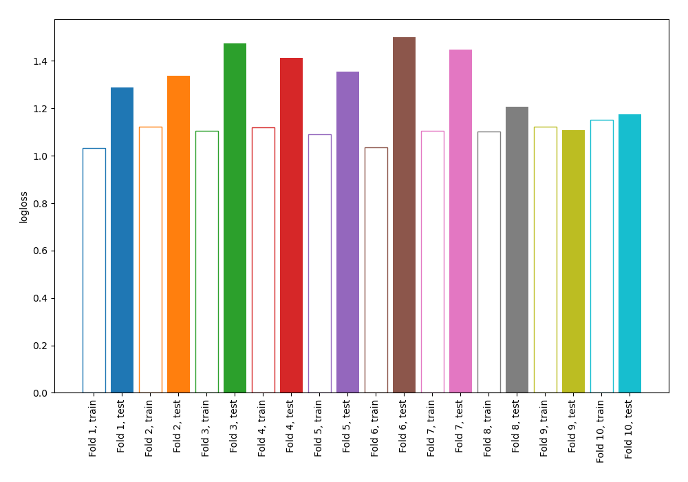
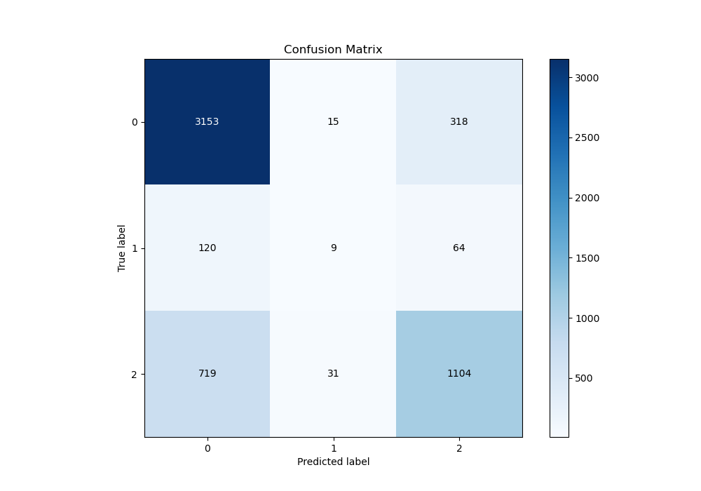
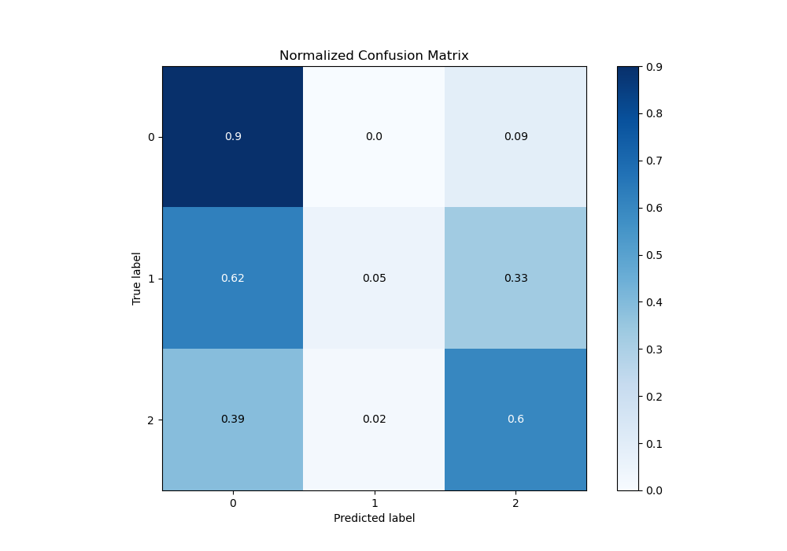
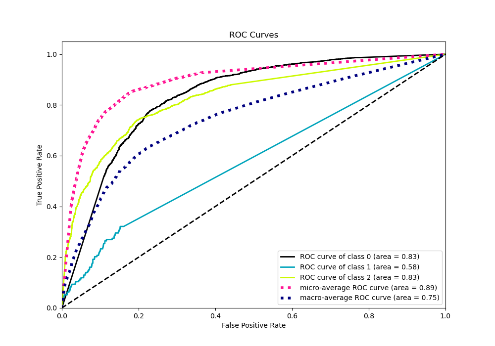
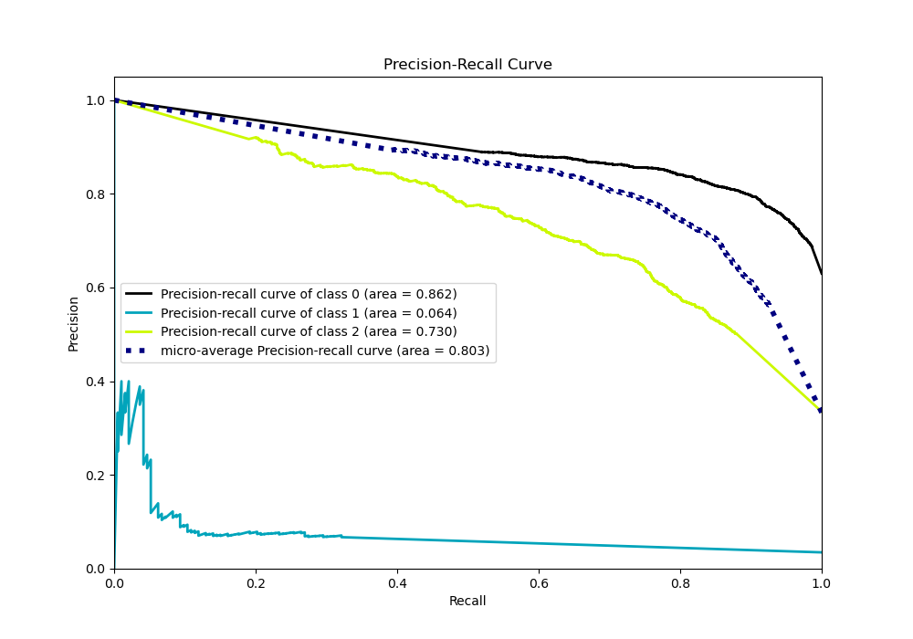

# Summary of 105_NearestNeighbors

[<< Go back](../README.md)

## k-Nearest Neighbors (Nearest Neighbors)
- **n_jobs**: -1
- **n_neighbors**: 5
- **weights**: distance
- **num_class**: 3
- **explain_level**: 0

## Validation
 - **validation_type**: kfold
 - **shuffle**: True
 - **stratify**: True
 - **k_folds**: 10

## Optimized metric
logloss

## Training time

8.9 seconds

### Metric details
|           |           0 |           1 |           2 |   accuracy |   macro avg |   weighted avg |   logloss |
|:----------|------------:|------------:|------------:|-----------:|------------:|---------------:|----------:|
| precision |    0.78983  |   0.163636  |    0.742934 |    0.77101 |    0.565467 |       0.752273 |   1.33028 |
| recall    |    0.904475 |   0.0466321 |    0.595469 |    0.77101 |    0.515525 |       0.77101  |   1.33028 |
| f1-score  |    0.843274 |   0.0725806 |    0.661078 |    0.77101 |    0.525644 |       0.75534  |   1.33028 |
| support   | 3486        | 193         | 1854        |    0.77101 | 5533        |    5533        |   1.33028 |

## Confusion matrix
|              |   Predicted as 0 |   Predicted as 1 |   Predicted as 2 |
|:-------------|-----------------:|-----------------:|-----------------:|
| Labeled as 0 |             3153 |               15 |              318 |
| Labeled as 1 |              120 |                9 |               64 |
| Labeled as 2 |              719 |               31 |             1104 |

## Learning curves

## Confusion Matrix

## Normalized Confusion Matrix

## ROC Curve

## Precision Recall Curve

[<< Go back](../README.md)
