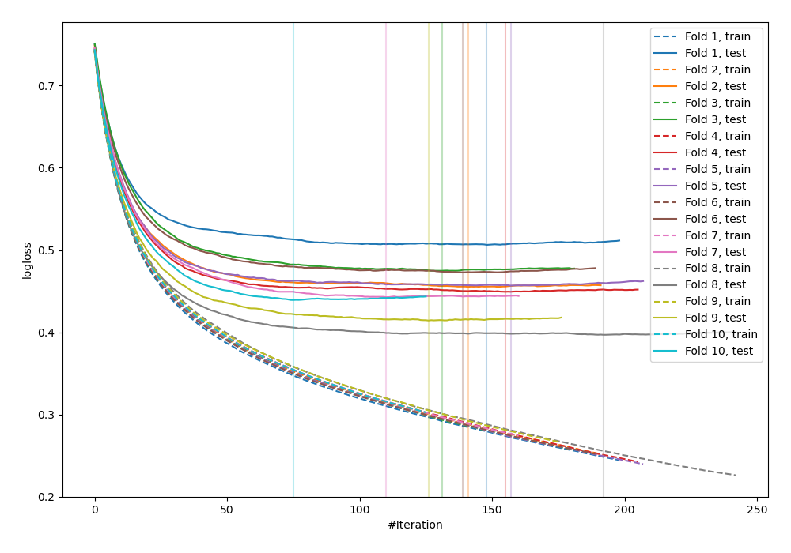
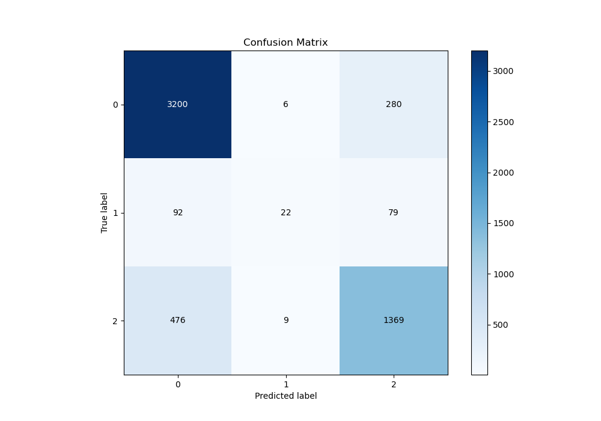
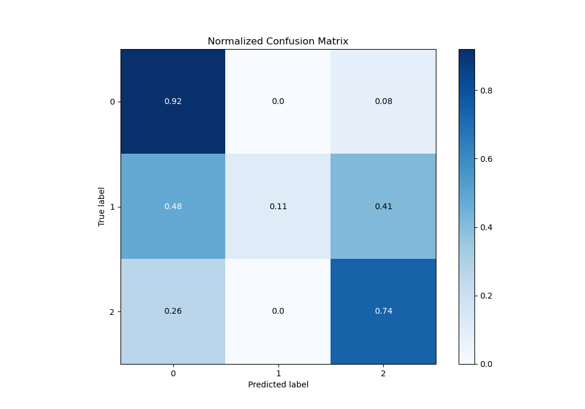
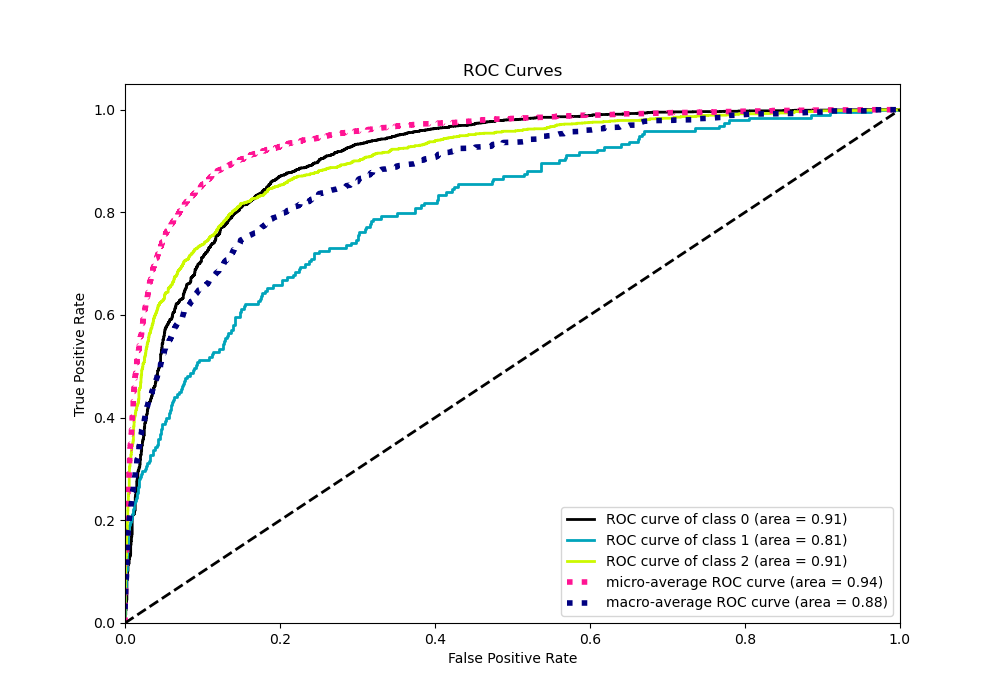
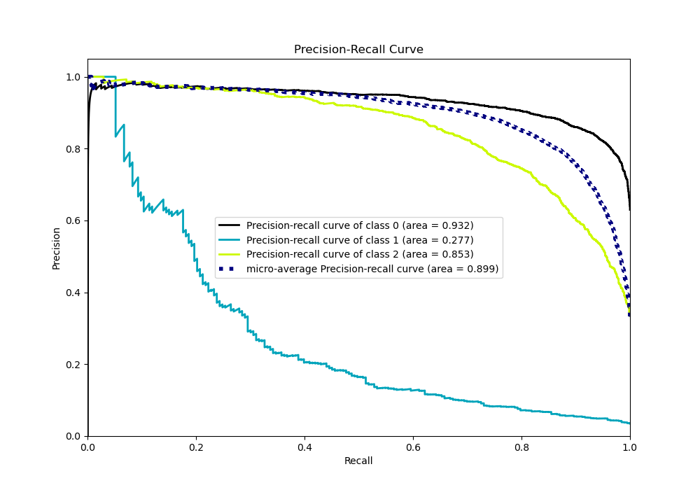

# Summary of 108_LightGBM_SelectedFeatures

[<< Go back](../README.md)

## LightGBM
- **n_jobs**: -1
- **objective**: multiclass
- **num_leaves**: 15
- **learning_rate**: 0.05
- **feature_fraction**: 0.8
- **bagging_fraction**: 0.5
- **min_data_in_leaf**: 20
- **metric**: multi_logloss
- **custom_eval_metric_name**: None
- **num_class**: 3
- **explain_level**: 0

## Validation
 - **validation_type**: kfold
 - **shuffle**: True
 - **stratify**: True
 - **k_folds**: 10

## Optimized metric
logloss

## Training time

13.9 seconds

### Metric details
|           |           0 |          1 |           2 |   accuracy |   macro avg |   weighted avg |   logloss |
|:----------|------------:|-----------:|------------:|-----------:|------------:|---------------:|----------:|
| precision |    0.849257 |   0.594595 |    0.792245 |   0.829749 |    0.745366 |       0.82127  |  0.450831 |
| recall    |    0.917958 |   0.11399  |    0.738403 |   0.829749 |    0.590117 |       0.829749 |  0.450831 |
| f1-score  |    0.882272 |   0.191304 |    0.764377 |   0.829749 |    0.612651 |       0.818666 |  0.450831 |
| support   | 3486        | 193        | 1854        |   0.829749 | 5533        |    5533        |  0.450831 |

## Confusion matrix
|              |   Predicted as 0 |   Predicted as 1 |   Predicted as 2 |
|:-------------|-----------------:|-----------------:|-----------------:|
| Labeled as 0 |             3200 |                6 |              280 |
| Labeled as 1 |               92 |               22 |               79 |
| Labeled as 2 |              476 |                9 |             1369 |

## Learning curves

## Confusion Matrix

## Normalized Confusion Matrix

## ROC Curve

## Precision Recall Curve

[<< Go back](../README.md)
