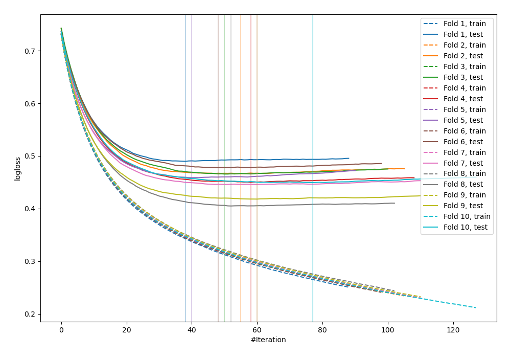
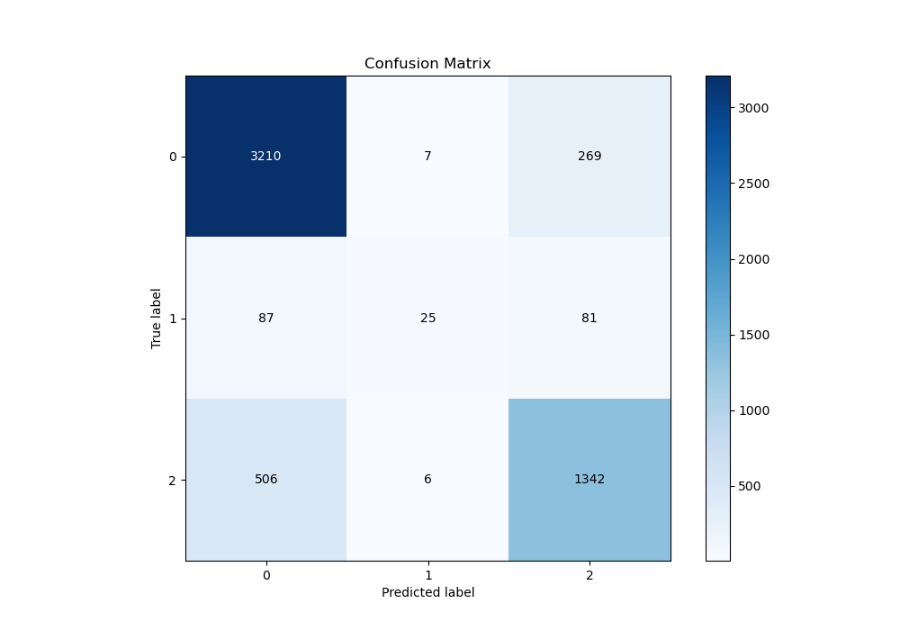
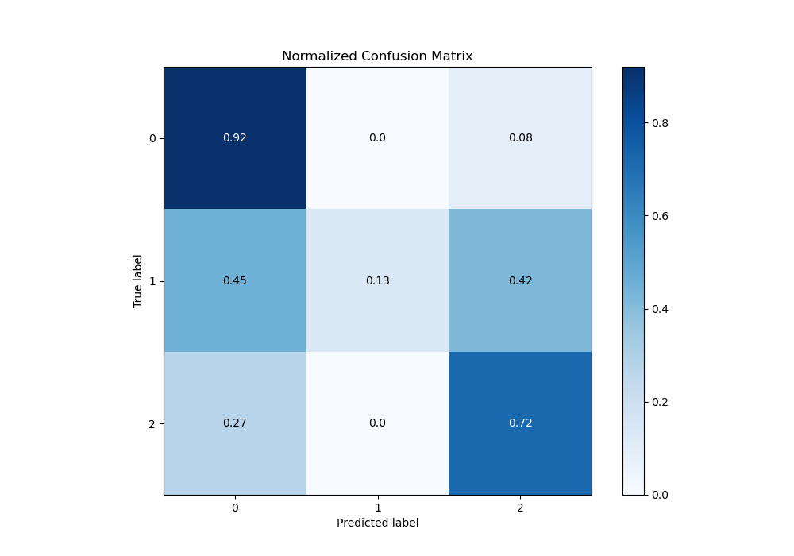
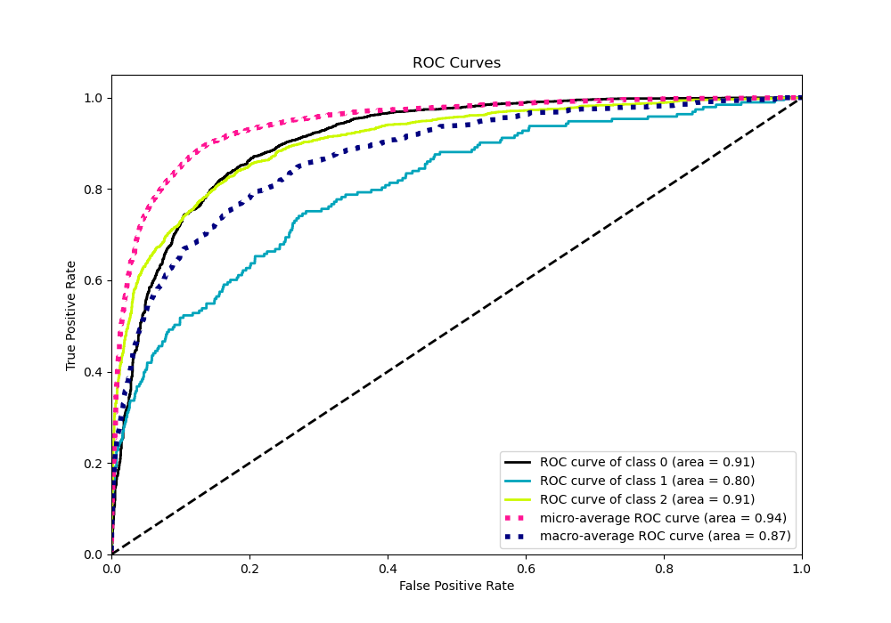
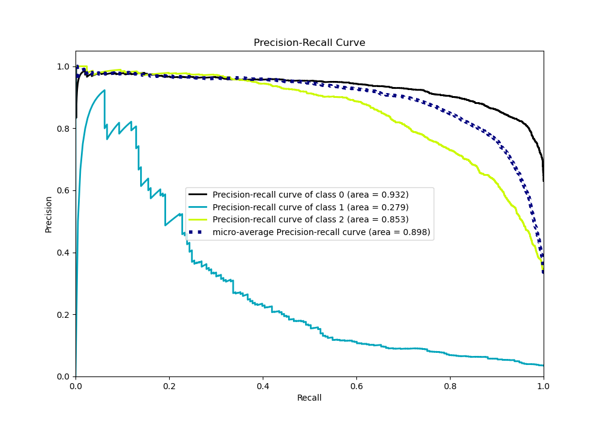

# Summary of 108_LightGBM_SelectedFeatures_Stacked

[<< Go back](../README.md)

## LightGBM
- **n_jobs**: -1
- **objective**: multiclass
- **num_leaves**: 15
- **learning_rate**: 0.05
- **feature_fraction**: 0.8
- **bagging_fraction**: 0.5
- **min_data_in_leaf**: 20
- **metric**: multi_logloss
- **custom_eval_metric_name**: None
- **num_class**: 3
- **explain_level**: 0

## Validation
 - **validation_type**: kfold
 - **shuffle**: True
 - **stratify**: True
 - **k_folds**: 10

## Optimized metric
logloss

## Training time

18.0 seconds

### Metric details
|           |           0 |          1 |           2 |   accuracy |   macro avg |   weighted avg |   logloss |
|:----------|------------:|-----------:|------------:|-----------:|------------:|---------------:|----------:|
| precision |    0.84407  |   0.657895 |    0.793144 |   0.827219 |    0.765036 |       0.820512 |  0.452683 |
| recall    |    0.920826 |   0.129534 |    0.72384  |   0.827219 |    0.5914   |       0.827219 |  0.452683 |
| f1-score  |    0.880779 |   0.21645  |    0.756909 |   0.827219 |    0.618046 |       0.8161   |  0.452683 |
| support   | 3486        | 193        | 1854        |   0.827219 | 5533        |    5533        |  0.452683 |

## Confusion matrix
|              |   Predicted as 0 |   Predicted as 1 |   Predicted as 2 |
|:-------------|-----------------:|-----------------:|-----------------:|
| Labeled as 0 |             3210 |                7 |              269 |
| Labeled as 1 |               87 |               25 |               81 |
| Labeled as 2 |              506 |                6 |             1342 |

## Learning curves

## Confusion Matrix

## Normalized Confusion Matrix

## ROC Curve

## Precision Recall Curve

[<< Go back](../README.md)
