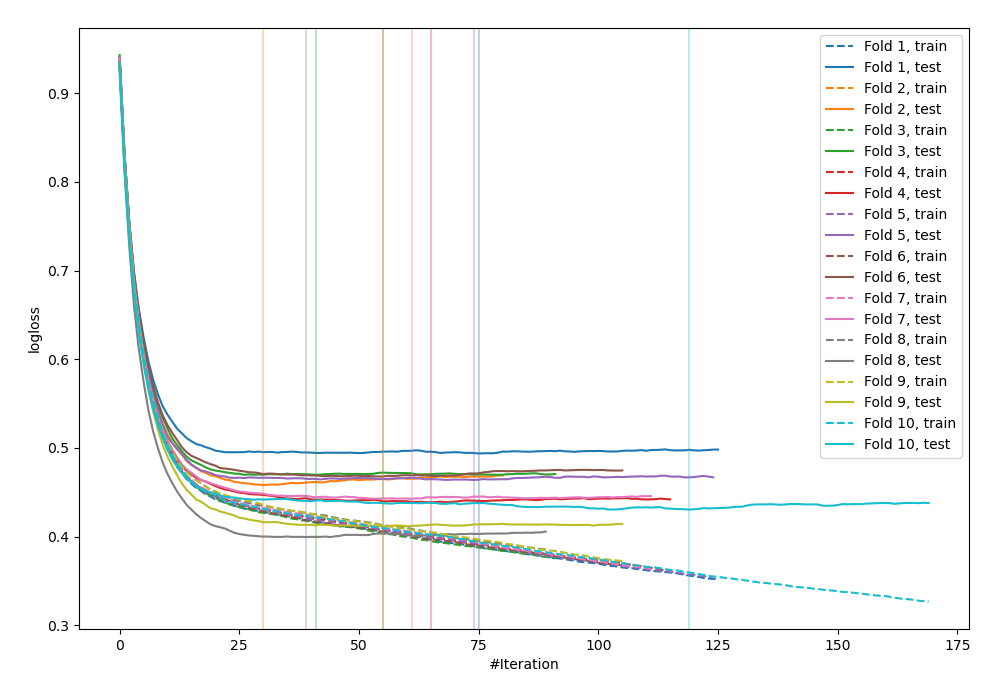
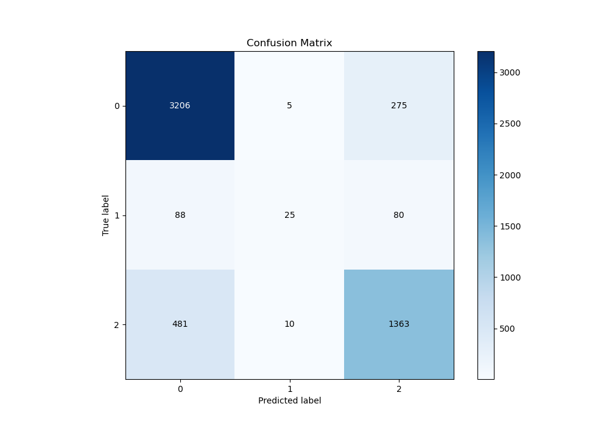
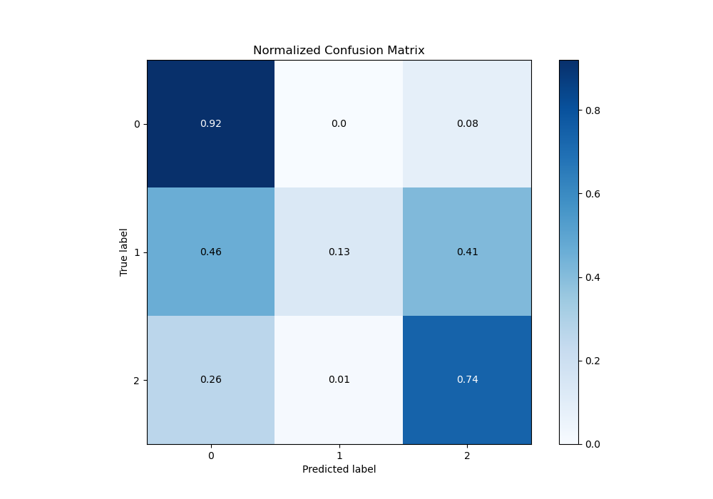
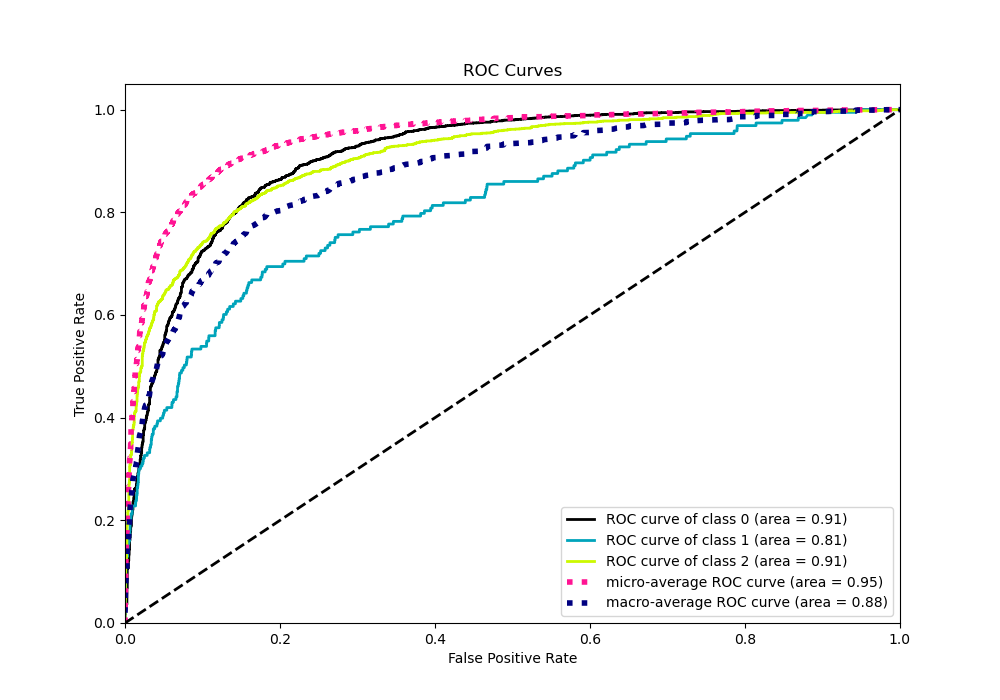
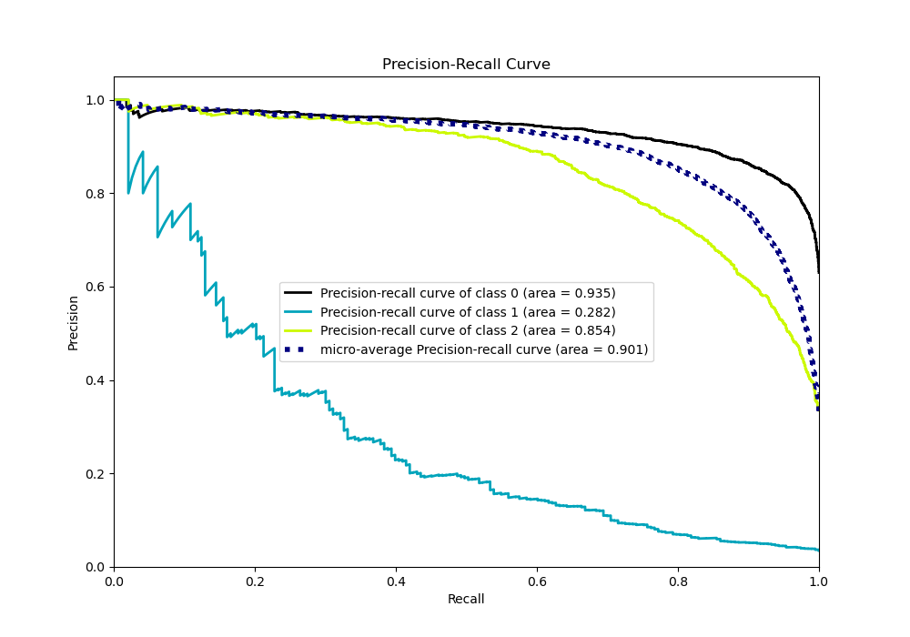

# Summary of 110_CatBoost_Stacked

[<< Go back](../README.md)

## CatBoost
- **n_jobs**: -1
- **learning_rate**: 0.15
- **depth**: 5
- **rsm**: 0.7
- **loss_function**: MultiClass
- **eval_metric**: MultiClass
- **num_class**: 3
- **explain_level**: 0

## Validation
 - **validation_type**: kfold
 - **shuffle**: True
 - **stratify**: True
 - **k_folds**: 10

## Optimized metric
logloss

## Training time

41.0 seconds

### Metric details
|           |           0 |          1 |           2 |   accuracy |   macro avg |   weighted avg |   logloss |
|:----------|------------:|-----------:|------------:|-----------:|------------:|---------------:|----------:|
| precision |    0.849272 |   0.625    |    0.793364 |   0.830291 |    0.755879 |       0.822715 |  0.447594 |
| recall    |    0.919679 |   0.129534 |    0.735167 |   0.830291 |    0.594793 |       0.830291 |  0.447594 |
| f1-score  |    0.883074 |   0.214592 |    0.763158 |   0.830291 |    0.620275 |       0.819575 |  0.447594 |
| support   | 3486        | 193        | 1854        |   0.830291 | 5533        |    5533        |  0.447594 |

## Confusion matrix
|              |   Predicted as 0 |   Predicted as 1 |   Predicted as 2 |
|:-------------|-----------------:|-----------------:|-----------------:|
| Labeled as 0 |             3206 |                5 |              275 |
| Labeled as 1 |               88 |               25 |               80 |
| Labeled as 2 |              481 |               10 |             1363 |

## Learning curves

## Confusion Matrix

## Normalized Confusion Matrix

## ROC Curve

## Precision Recall Curve

[<< Go back](../README.md)
