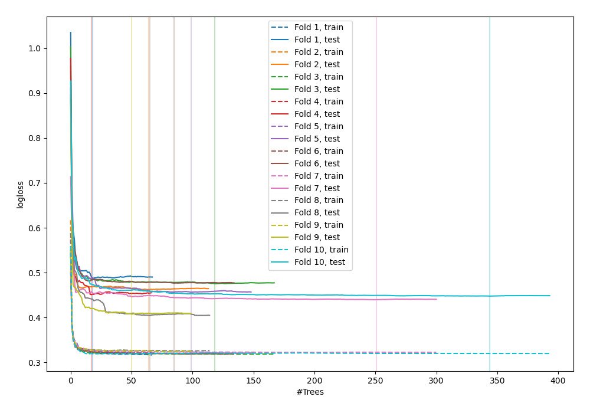
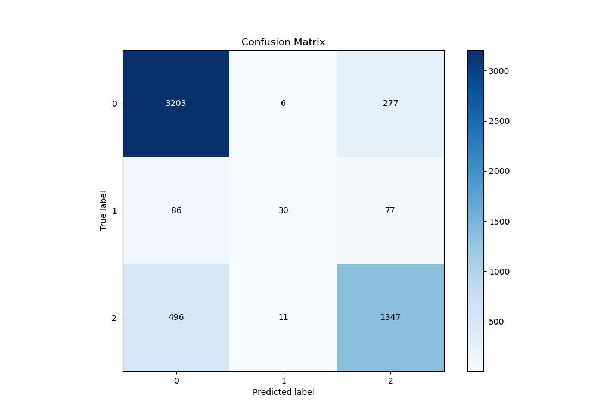
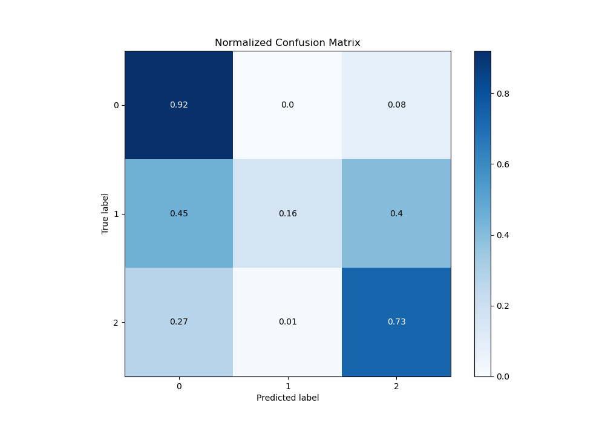
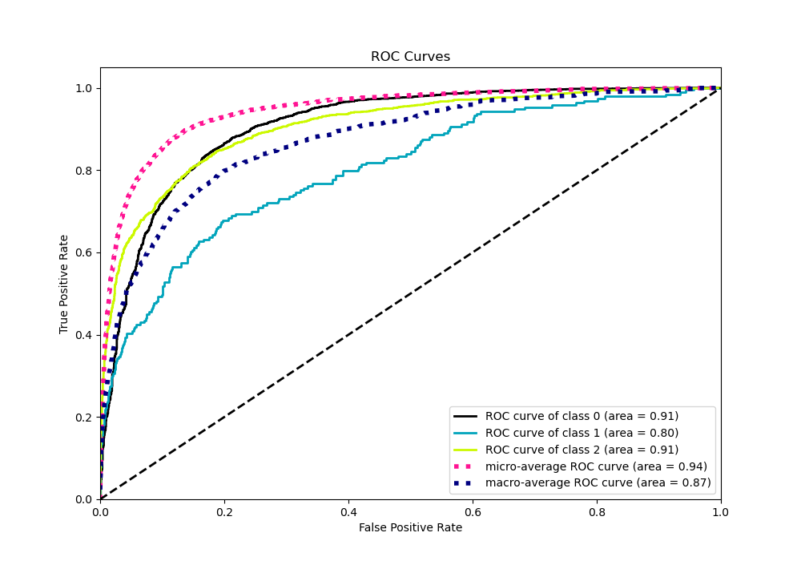
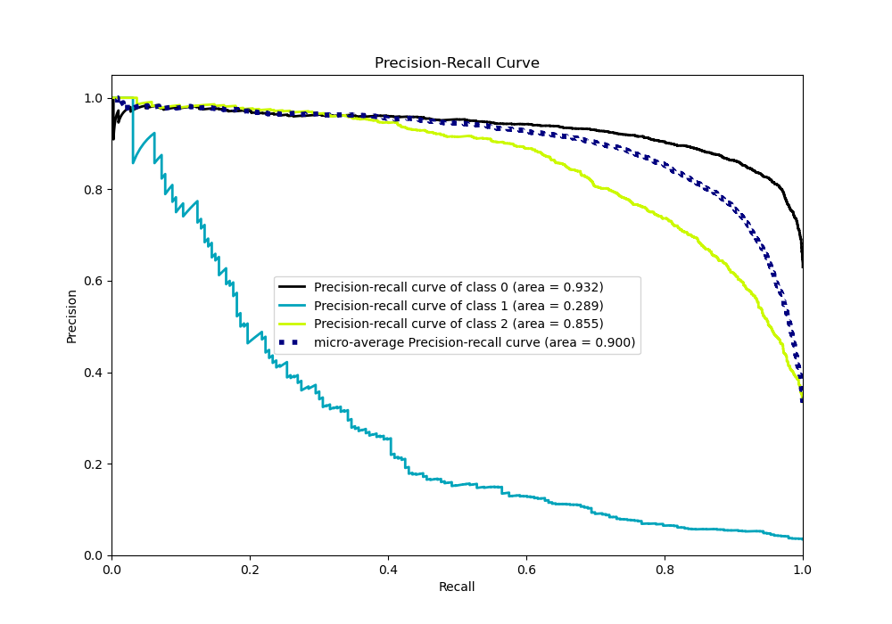

# Summary of 113_RandomForest_SelectedFeatures_Stacked

[<< Go back](../README.md)

## Random Forest
- **n_jobs**: -1
- **criterion**: entropy
- **max_features**: 0.6
- **min_samples_split**: 30
- **max_depth**: 7
- **eval_metric_name**: logloss
- **num_class**: 3
- **explain_level**: 0

## Validation
 - **validation_type**: kfold
 - **shuffle**: True
 - **stratify**: True
 - **k_folds**: 10

## Optimized metric
logloss

## Training time

231.3 seconds

### Metric details
|           |           0 |          1 |           2 |   accuracy |   macro avg |   weighted avg |   logloss |
|:----------|------------:|-----------:|------------:|-----------:|------------:|---------------:|----------:|
| precision |    0.846235 |   0.638298 |    0.791887 |   0.827761 |    0.758807 |       0.820771 |   0.45081 |
| recall    |    0.918818 |   0.15544  |    0.726537 |   0.827761 |    0.600265 |       0.827761 |   0.45081 |
| f1-score  |    0.881034 |   0.25     |    0.757806 |   0.827761 |    0.629613 |       0.817731 |   0.45081 |
| support   | 3486        | 193        | 1854        |   0.827761 | 5533        |    5533        |   0.45081 |

## Confusion matrix
|              |   Predicted as 0 |   Predicted as 1 |   Predicted as 2 |
|:-------------|-----------------:|-----------------:|-----------------:|
| Labeled as 0 |             3203 |                6 |              277 |
| Labeled as 1 |               86 |               30 |               77 |
| Labeled as 2 |              496 |               11 |             1347 |

## Learning curves

## Confusion Matrix

## Normalized Confusion Matrix

## ROC Curve

## Precision Recall Curve

[<< Go back](../README.md)
