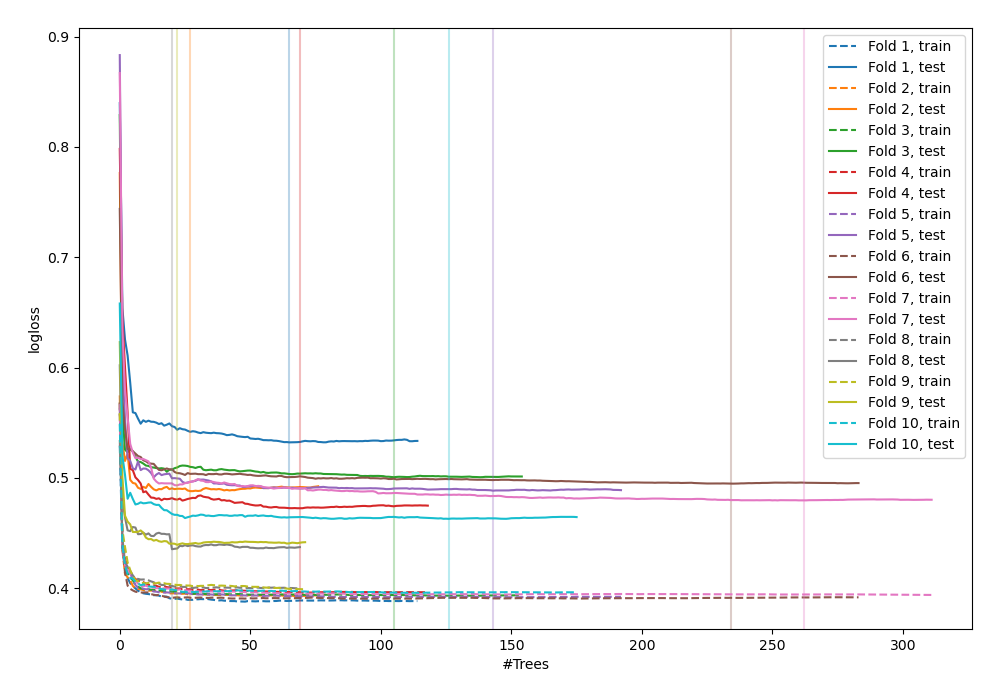
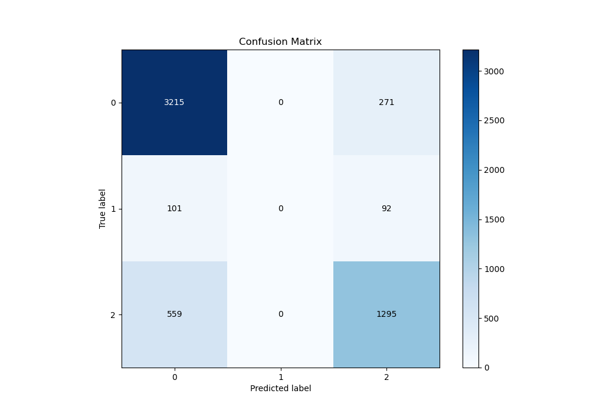
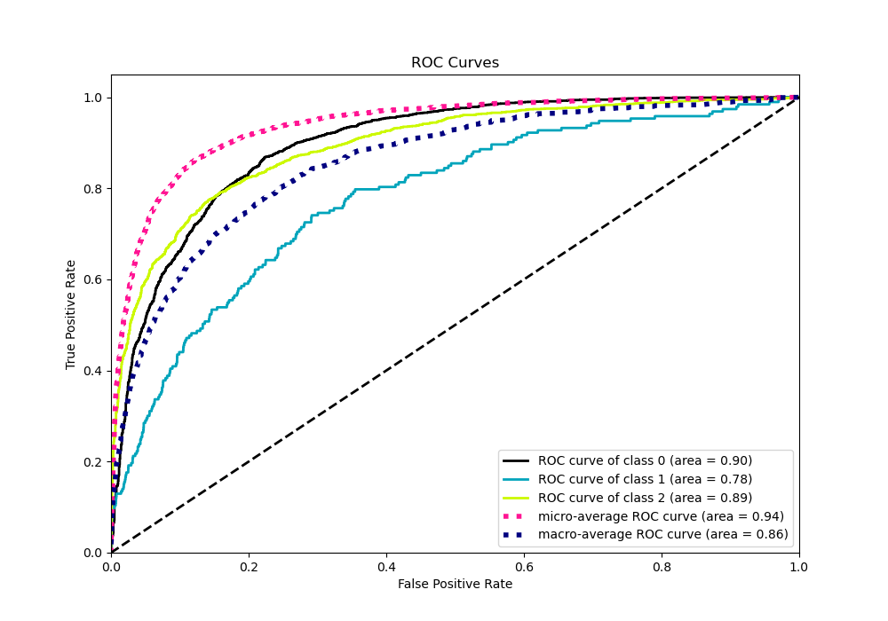
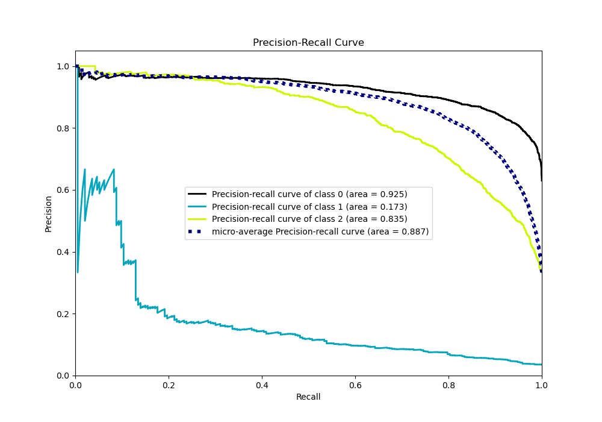

# Summary of 114_RandomForest

[<< Go back](../README.md)

## Random Forest
- **n_jobs**: -1
- **criterion**: entropy
- **max_features**: 0.7
- **min_samples_split**: 30
- **max_depth**: 7
- **eval_metric_name**: logloss
- **num_class**: 3
- **explain_level**: 0

## Validation
 - **validation_type**: kfold
 - **shuffle**: True
 - **stratify**: True
 - **k_folds**: 10

## Optimized metric
logloss

## Training time

27.4 seconds

### Metric details
|           |           0 |   1 |           2 |   accuracy |   macro avg |   weighted avg |   logloss |
|:----------|------------:|----:|------------:|-----------:|------------:|---------------:|----------:|
| precision |    0.829677 |   0 |    0.781062 |   0.815109 |    0.536913 |       0.784447 |  0.479304 |
| recall    |    0.92226  |   0 |    0.69849  |   0.815109 |    0.54025  |       0.815109 |  0.479304 |
| f1-score  |    0.873523 |   0 |    0.737472 |   0.815109 |    0.536998 |       0.797465 |  0.479304 |
| support   | 3486        | 193 | 1854        |   0.815109 | 5533        |    5533        |  0.479304 |

## Confusion matrix
|              |   Predicted as 0 |   Predicted as 1 |   Predicted as 2 |
|:-------------|-----------------:|-----------------:|-----------------:|
| Labeled as 0 |             3215 |                0 |              271 |
| Labeled as 1 |              101 |                0 |               92 |
| Labeled as 2 |              559 |                0 |             1295 |

## Learning curves

## Confusion Matrix

## Normalized Confusion Matrix

## ROC Curve

## Precision Recall Curve

[<< Go back](../README.md)
