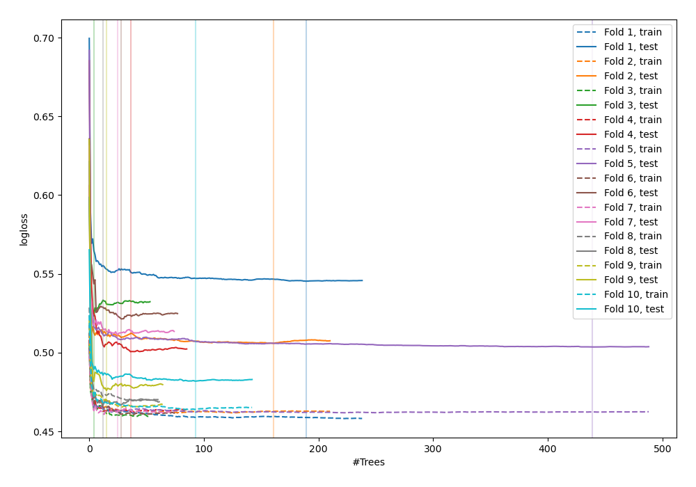
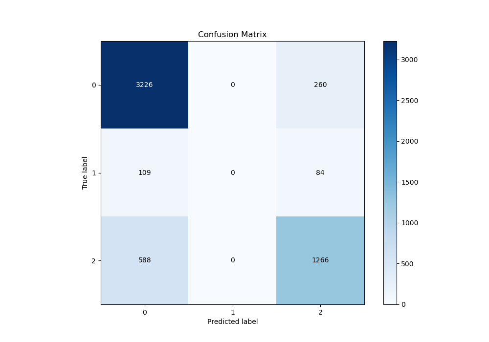
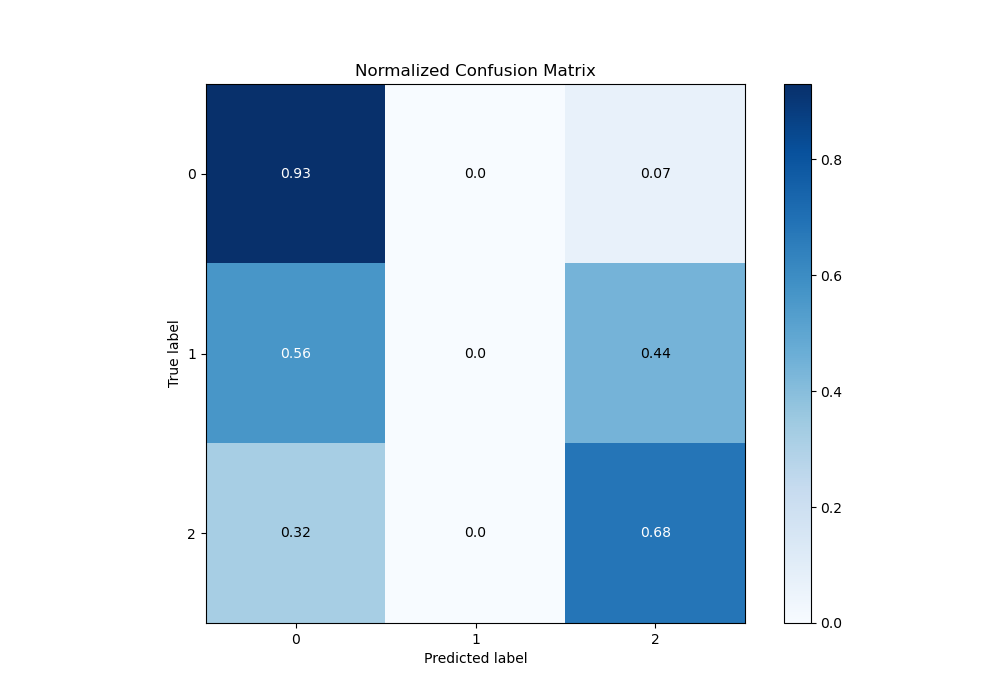
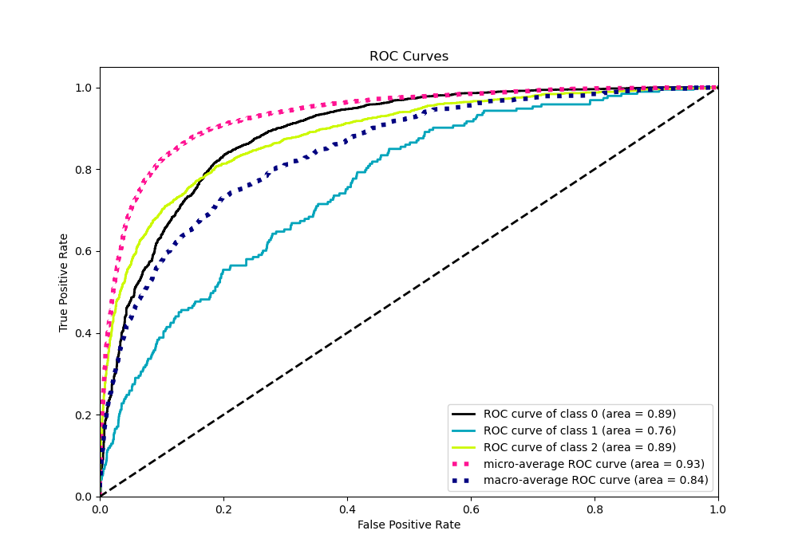
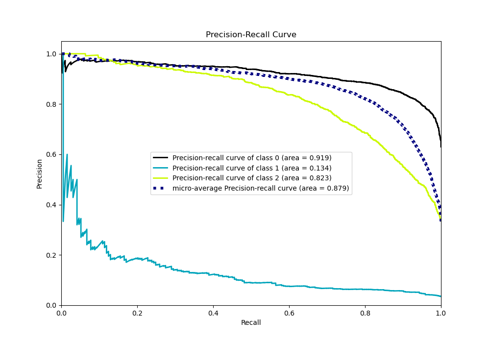

# Summary of 116_ExtraTrees_SelectedFeatures

[<< Go back](../README.md)

## Extra Trees Classifier (Extra Trees)
- **n_jobs**: -1
- **criterion**: entropy
- **max_features**: 1.0
- **min_samples_split**: 40
- **max_depth**: 7
- **eval_metric_name**: logloss
- **num_class**: 3
- **explain_level**: 0

## Validation
 - **validation_type**: kfold
 - **shuffle**: True
 - **stratify**: True
 - **k_folds**: 10

## Optimized metric
logloss

## Training time

21.9 seconds

### Metric details
|           |           0 |   1 |           2 |   accuracy |   macro avg |   weighted avg |   logloss |
|:----------|------------:|----:|------------:|-----------:|------------:|---------------:|----------:|
| precision |    0.82233  |   0 |    0.786335 |   0.811856 |    0.536222 |       0.781585 |  0.503609 |
| recall    |    0.925416 |   0 |    0.682848 |   0.811856 |    0.536088 |       0.811856 |  0.503609 |
| f1-score  |    0.870833 |   0 |    0.730947 |   0.811856 |    0.533927 |       0.793584 |  0.503609 |
| support   | 3486        | 193 | 1854        |   0.811856 | 5533        |    5533        |  0.503609 |

## Confusion matrix
|              |   Predicted as 0 |   Predicted as 1 |   Predicted as 2 |
|:-------------|-----------------:|-----------------:|-----------------:|
| Labeled as 0 |             3226 |                0 |              260 |
| Labeled as 1 |              109 |                0 |               84 |
| Labeled as 2 |              588 |                0 |             1266 |

## Learning curves

## Confusion Matrix

## Normalized Confusion Matrix

## ROC Curve

## Precision Recall Curve

[<< Go back](../README.md)
