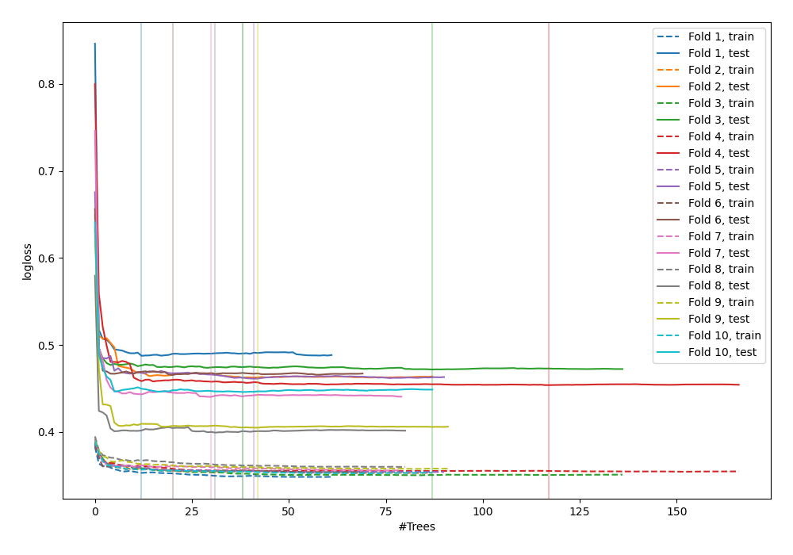
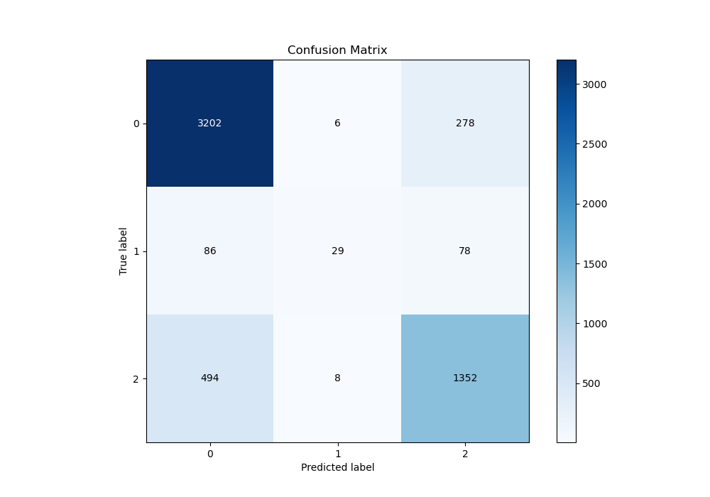
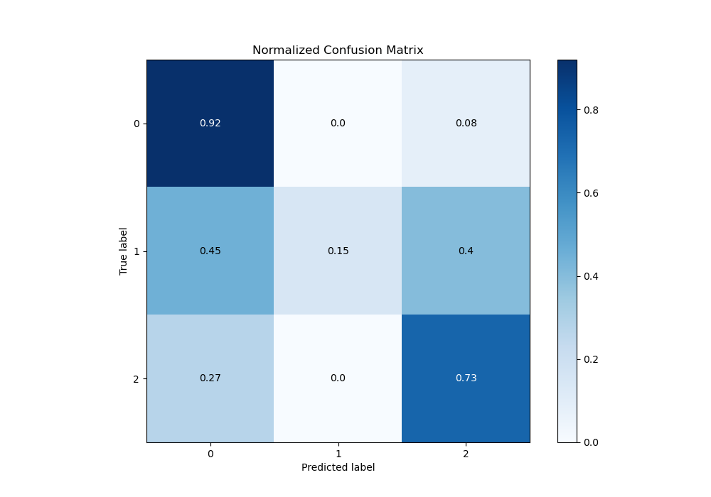
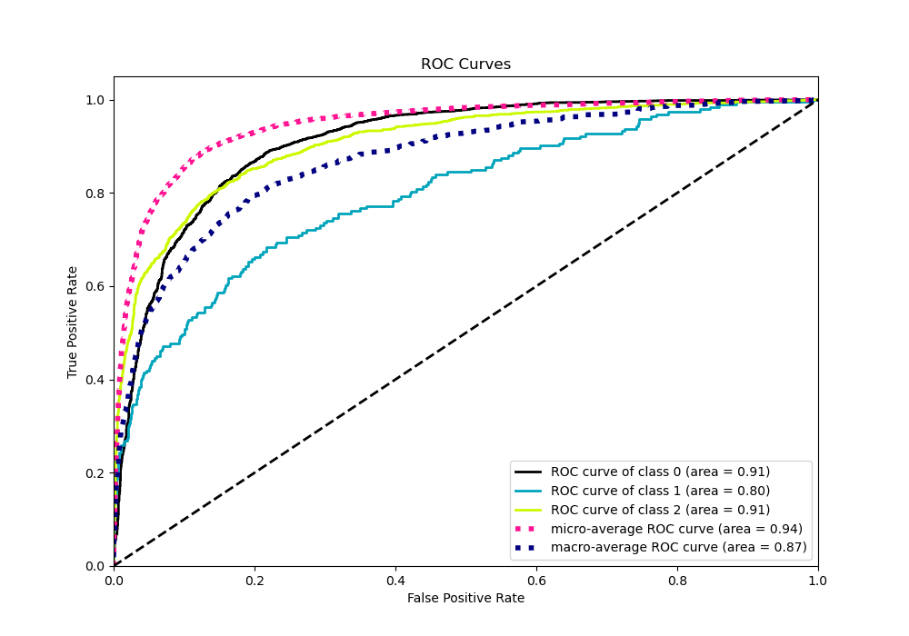
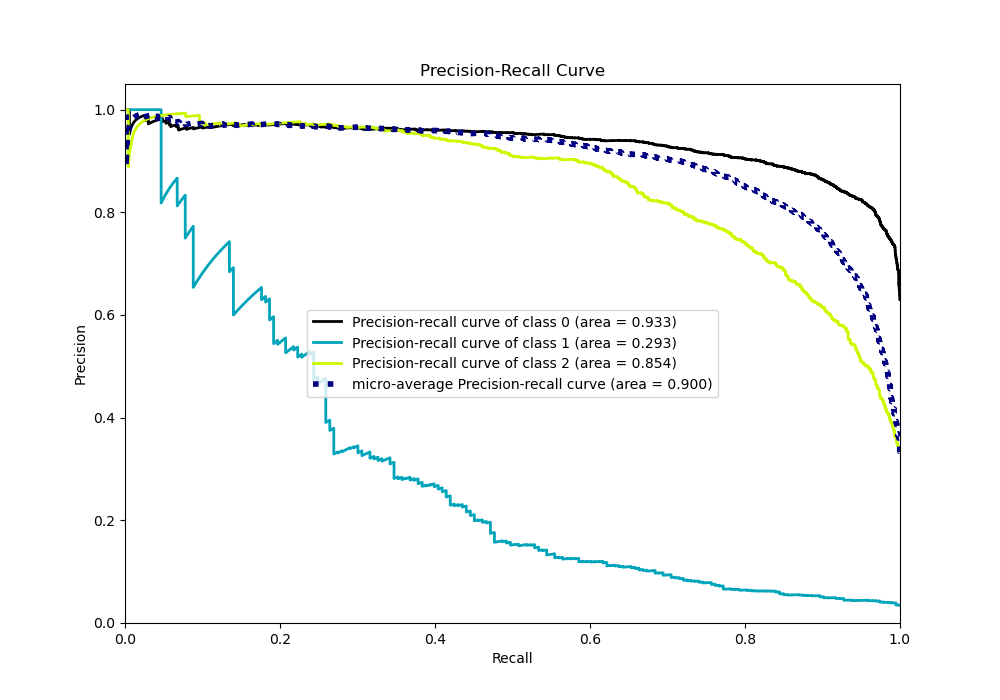

# Summary of 117_ExtraTrees_SelectedFeatures_Stacked

[<< Go back](../README.md)

## Extra Trees Classifier (Extra Trees)
- **n_jobs**: -1
- **criterion**: entropy
- **max_features**: 0.9
- **min_samples_split**: 40
- **max_depth**: 7
- **eval_metric_name**: logloss
- **num_class**: 3
- **explain_level**: 0

## Validation
 - **validation_type**: kfold
 - **shuffle**: True
 - **stratify**: True
 - **k_folds**: 10

## Optimized metric
logloss

## Training time

52.5 seconds

### Metric details
|           |           0 |          1 |           2 |   accuracy |   macro avg |   weighted avg |   logloss |
|:----------|------------:|-----------:|------------:|-----------:|------------:|---------------:|----------:|
| precision |    0.846642 |   0.674419 |    0.791569 |   0.828303 |    0.770877 |       0.822181 |  0.449271 |
| recall    |    0.918531 |   0.150259 |    0.729234 |   0.828303 |    0.599341 |       0.828303 |  0.449271 |
| f1-score  |    0.881123 |   0.245763 |    0.759124 |   0.828303 |    0.62867  |       0.818081 |  0.449271 |
| support   | 3486        | 193        | 1854        |   0.828303 | 5533        |    5533        |  0.449271 |

## Confusion matrix
|              |   Predicted as 0 |   Predicted as 1 |   Predicted as 2 |
|:-------------|-----------------:|-----------------:|-----------------:|
| Labeled as 0 |             3202 |                6 |              278 |
| Labeled as 1 |               86 |               29 |               78 |
| Labeled as 2 |              494 |                8 |             1352 |

## Learning curves

## Confusion Matrix

## Normalized Confusion Matrix

## ROC Curve

## Precision Recall Curve

[<< Go back](../README.md)
