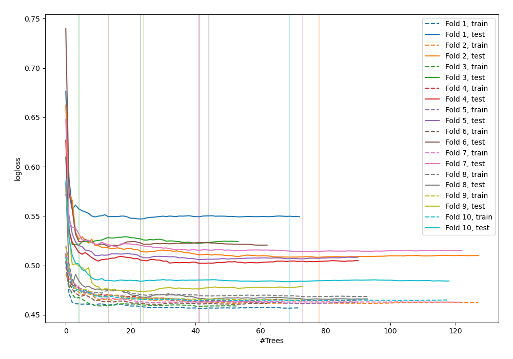
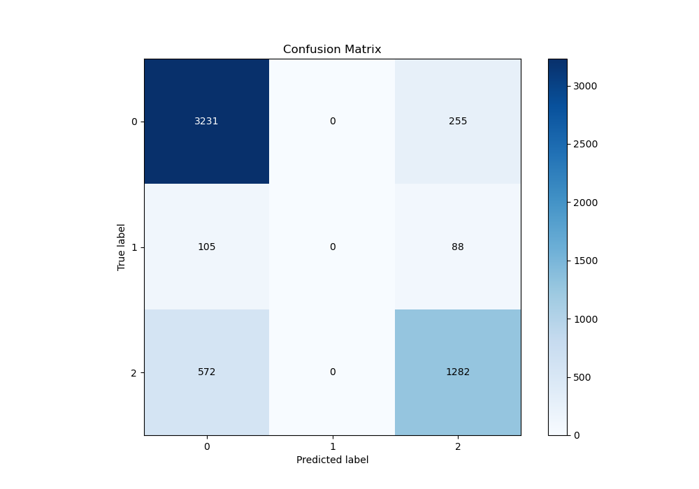
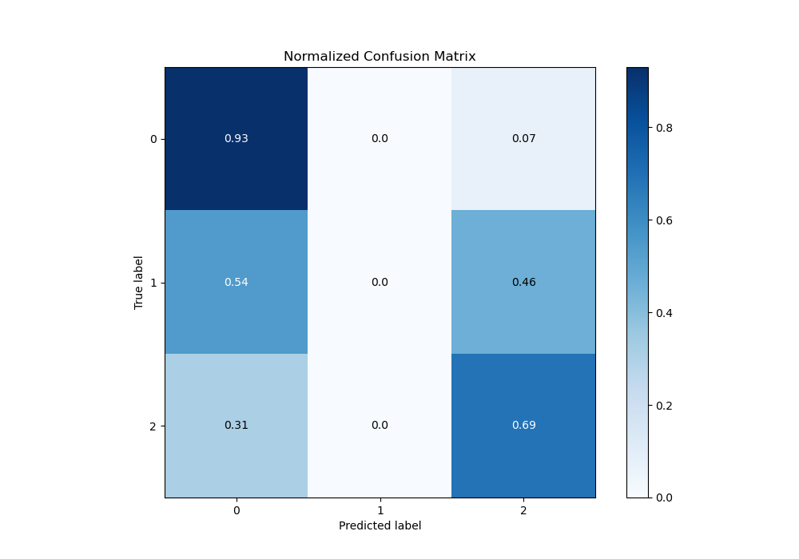
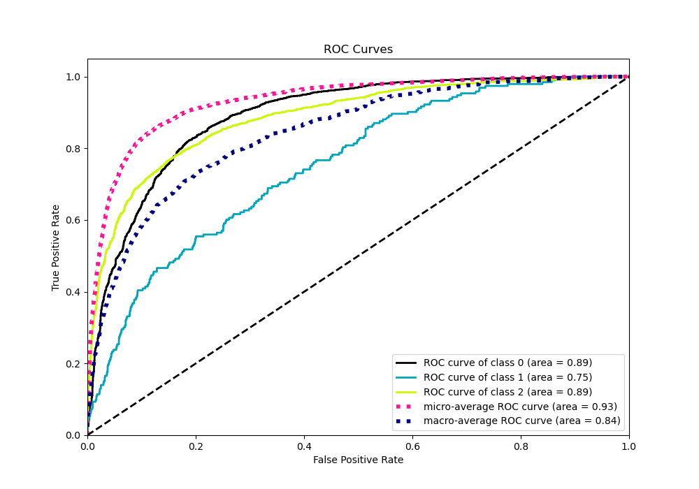
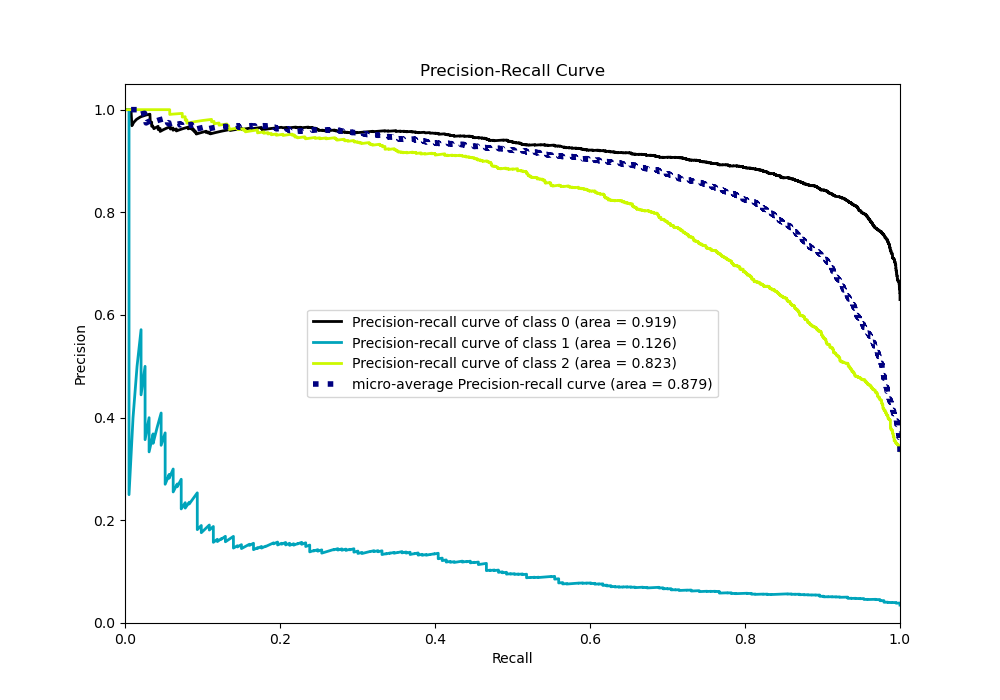

# Summary of 118_ExtraTrees

[<< Go back](../README.md)

## Extra Trees Classifier (Extra Trees)
- **n_jobs**: -1
- **criterion**: entropy
- **max_features**: 1.0
- **min_samples_split**: 40
- **max_depth**: 7
- **eval_metric_name**: logloss
- **num_class**: 3
- **explain_level**: 0

## Validation
 - **validation_type**: kfold
 - **shuffle**: True
 - **stratify**: True
 - **k_folds**: 10

## Optimized metric
logloss

## Training time

15.7 seconds

### Metric details
|           |           0 |   1 |           2 |   accuracy |   macro avg |   weighted avg |   logloss |
|:----------|------------:|----:|------------:|-----------:|------------:|---------------:|----------:|
| precision |    0.826766 |   0 |    0.788923 |   0.815652 |    0.538563 |       0.785246 |   0.50397 |
| recall    |    0.92685  |   0 |    0.691478 |   0.815652 |    0.539443 |       0.815652 |   0.50397 |
| f1-score  |    0.873952 |   0 |    0.736993 |   0.815652 |    0.536982 |       0.797575 |   0.50397 |
| support   | 3486        | 193 | 1854        |   0.815652 | 5533        |    5533        |   0.50397 |

## Confusion matrix
|              |   Predicted as 0 |   Predicted as 1 |   Predicted as 2 |
|:-------------|-----------------:|-----------------:|-----------------:|
| Labeled as 0 |             3231 |                0 |              255 |
| Labeled as 1 |              105 |                0 |               88 |
| Labeled as 2 |              572 |                0 |             1282 |

## Learning curves

## Confusion Matrix

## Normalized Confusion Matrix

## ROC Curve

## Precision Recall Curve

[<< Go back](../README.md)
