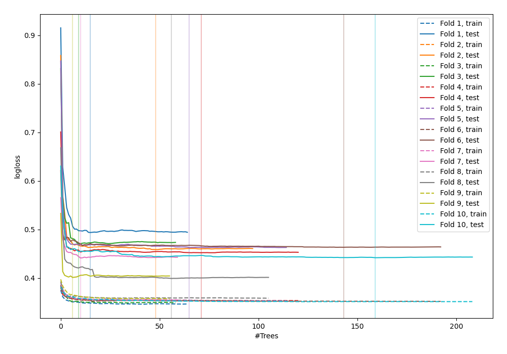
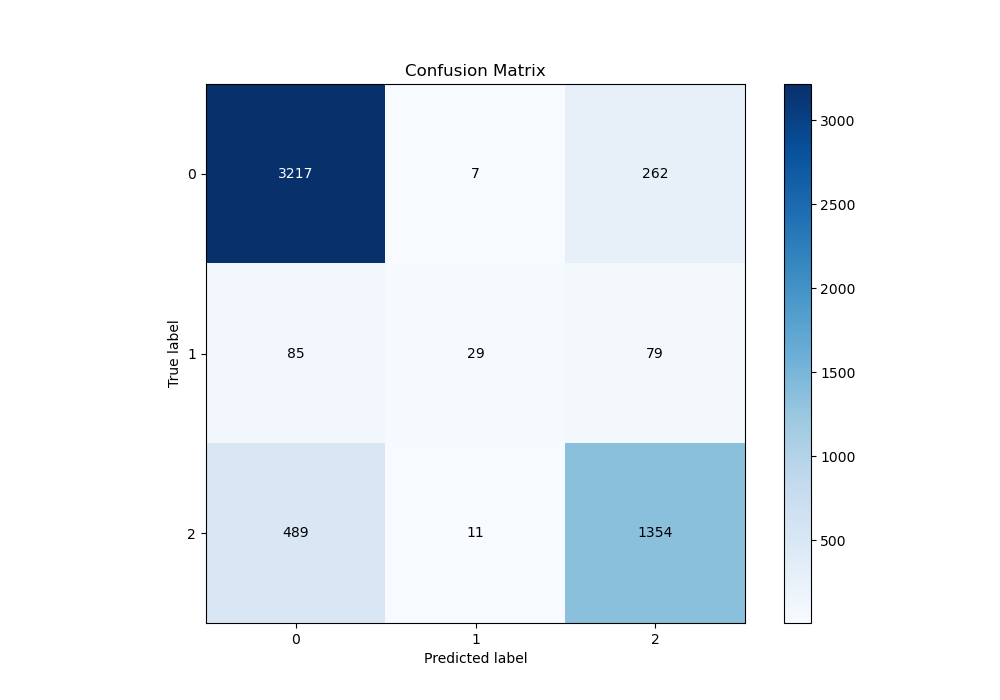
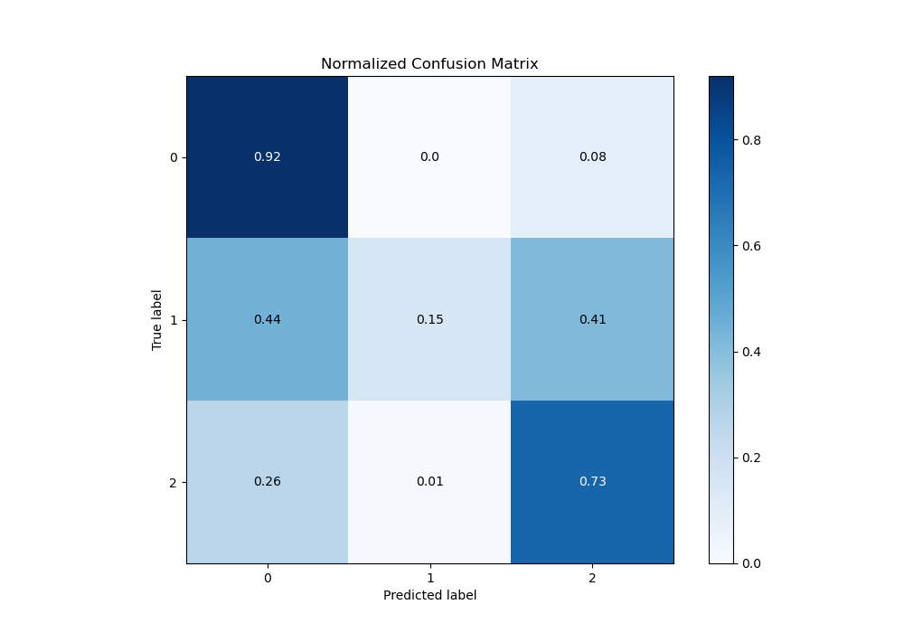
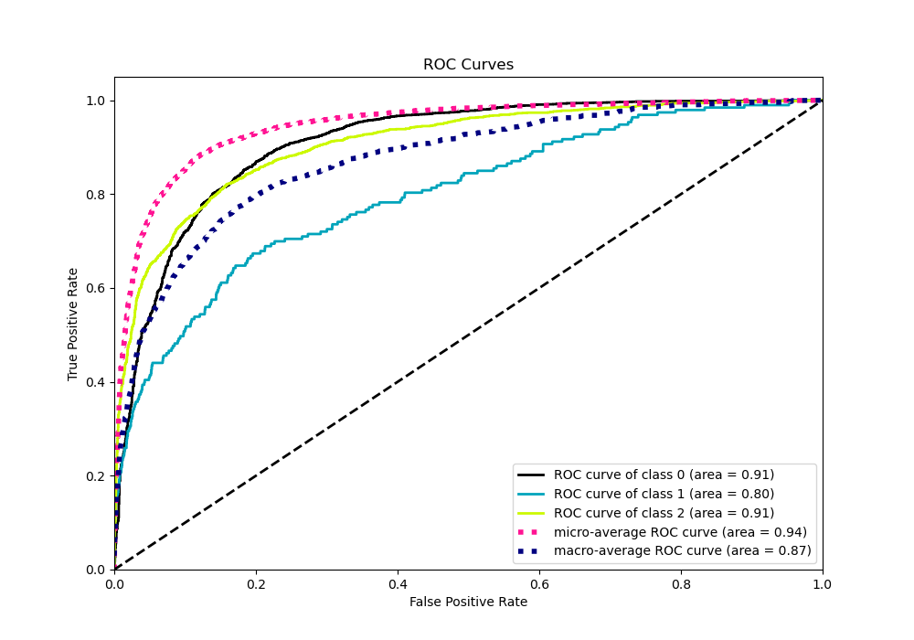
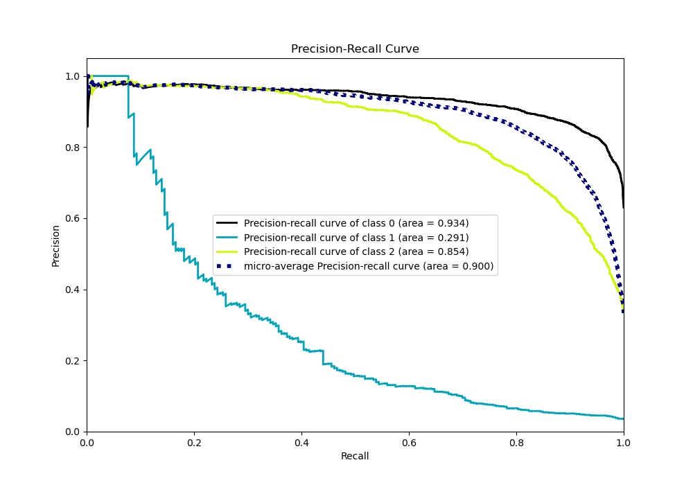

# Summary of 118_ExtraTrees_Stacked

[<< Go back](../README.md)

## Extra Trees Classifier (Extra Trees)
- **n_jobs**: -1
- **criterion**: entropy
- **max_features**: 1.0
- **min_samples_split**: 40
- **max_depth**: 7
- **eval_metric_name**: logloss
- **num_class**: 3
- **explain_level**: 0

## Validation
 - **validation_type**: kfold
 - **shuffle**: True
 - **stratify**: True
 - **k_folds**: 10

## Optimized metric
logloss

## Training time

59.6 seconds

### Metric details
|           |           0 |          1 |           2 |   accuracy |   macro avg |   weighted avg |   logloss |
|:----------|------------:|-----------:|------------:|-----------:|------------:|---------------:|----------:|
| precision |    0.848589 |   0.617021 |    0.79882  |   0.831375 |    0.75481  |       0.823835 |  0.448496 |
| recall    |    0.922834 |   0.150259 |    0.730313 |   0.831375 |    0.601135 |       0.831375 |  0.448496 |
| f1-score  |    0.884156 |   0.241667 |    0.763032 |   0.831375 |    0.629618 |       0.821158 |  0.448496 |
| support   | 3486        | 193        | 1854        |   0.831375 | 5533        |    5533        |  0.448496 |

## Confusion matrix
|              |   Predicted as 0 |   Predicted as 1 |   Predicted as 2 |
|:-------------|-----------------:|-----------------:|-----------------:|
| Labeled as 0 |             3217 |                7 |              262 |
| Labeled as 1 |               85 |               29 |               79 |
| Labeled as 2 |              489 |               11 |             1354 |

## Learning curves

## Confusion Matrix

## Normalized Confusion Matrix

## ROC Curve

## Precision Recall Curve

[<< Go back](../README.md)
