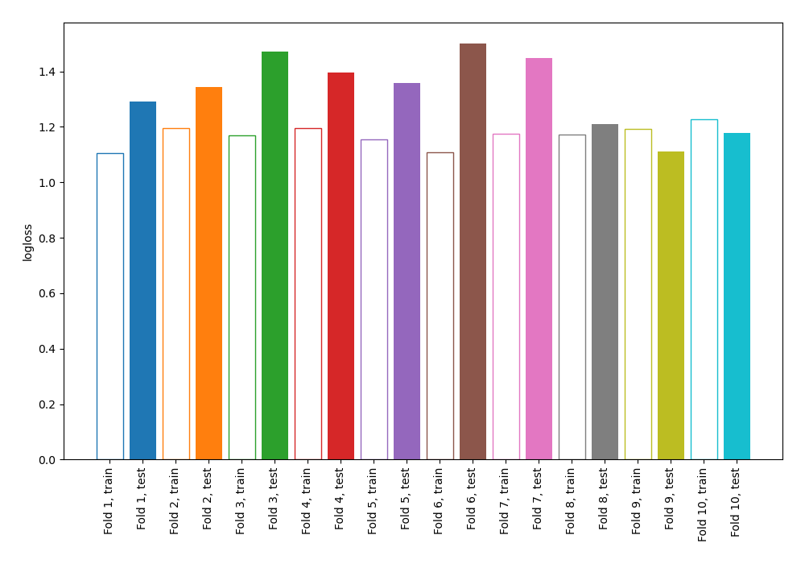
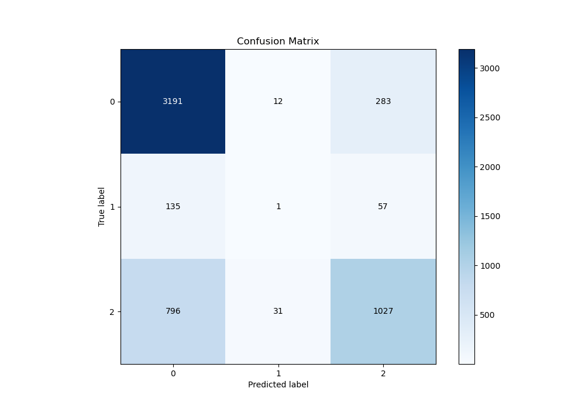
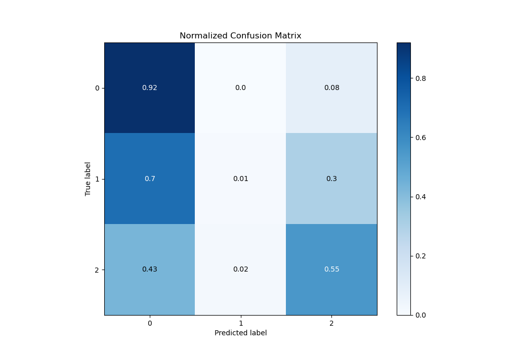
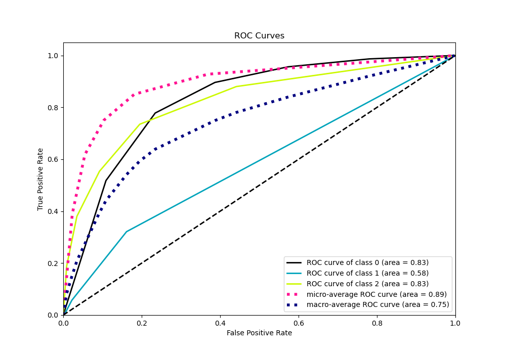
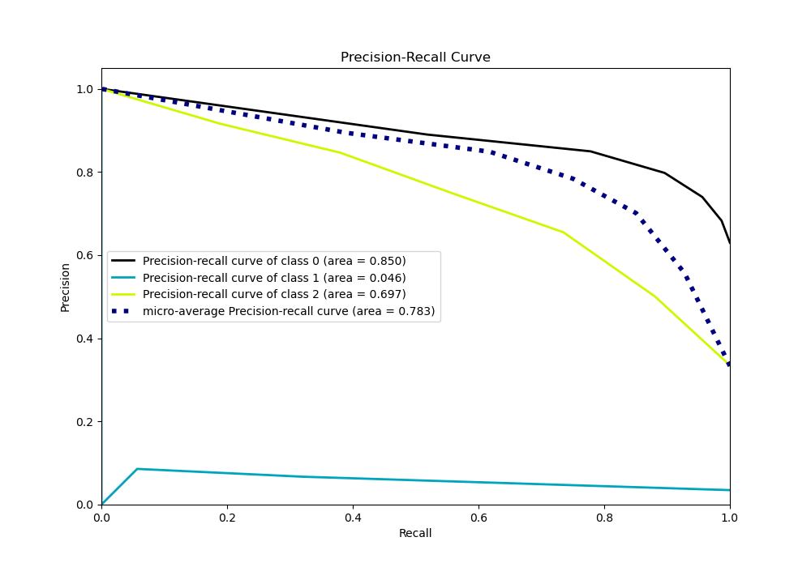

# Summary of 11_Default_NearestNeighbors

[<< Go back](../README.md)

## k-Nearest Neighbors (Nearest Neighbors)
- **n_jobs**: -1
- **n_neighbors**: 5
- **weights**: uniform
- **num_class**: 3
- **explain_level**: 0

## Validation
 - **validation_type**: kfold
 - **shuffle**: True
 - **stratify**: True
 - **k_folds**: 10

## Optimized metric
logloss

## Training time

3.0 seconds

### Metric details
|           |           0 |            1 |           2 |   accuracy |   macro avg |   weighted avg |   logloss |
|:----------|------------:|-------------:|------------:|-----------:|------------:|---------------:|----------:|
| precision |    0.774139 |   0.0227273  |    0.75128  |   0.762516 |    0.516049 |       0.740269 |   1.33113 |
| recall    |    0.915376 |   0.00518135 |    0.553937 |   0.762516 |    0.491498 |       0.762516 |   1.33113 |
| f1-score  |    0.838854 |   0.00843882 |    0.63769  |   0.762516 |    0.494994 |       0.742482 |   1.33113 |
| support   | 3486        | 193          | 1854        |   0.762516 | 5533        |    5533        |   1.33113 |

## Confusion matrix
|              |   Predicted as 0 |   Predicted as 1 |   Predicted as 2 |
|:-------------|-----------------:|-----------------:|-----------------:|
| Labeled as 0 |             3191 |               12 |              283 |
| Labeled as 1 |              135 |                1 |               57 |
| Labeled as 2 |              796 |               31 |             1027 |

## Learning curves

## Confusion Matrix

## Normalized Confusion Matrix

## ROC Curve

## Precision Recall Curve

[<< Go back](../README.md)
