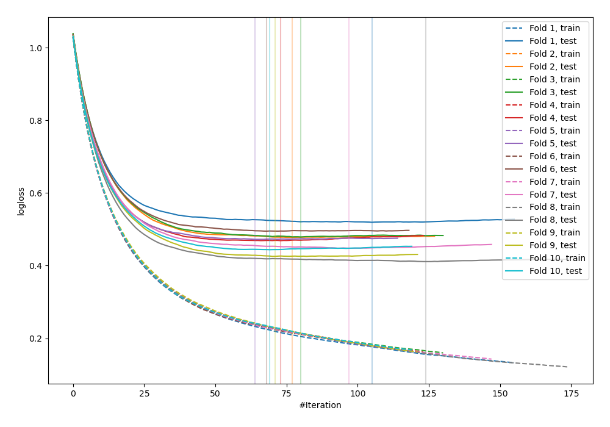
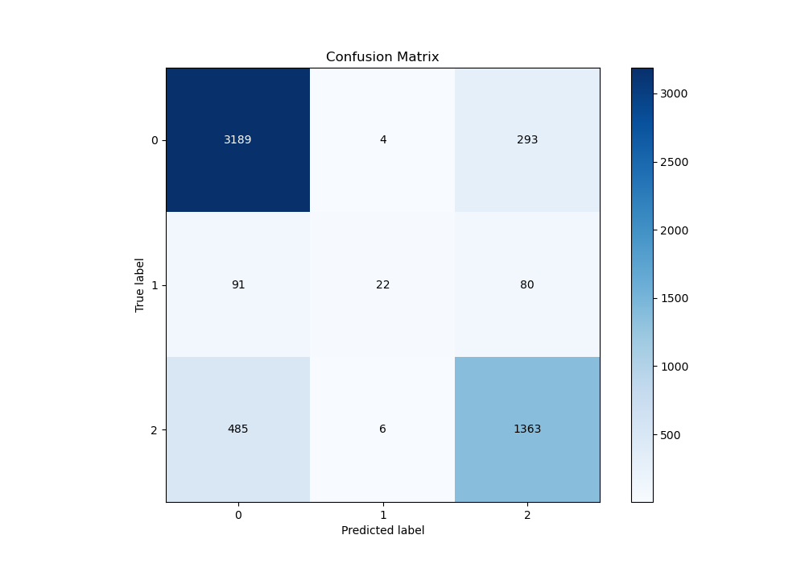
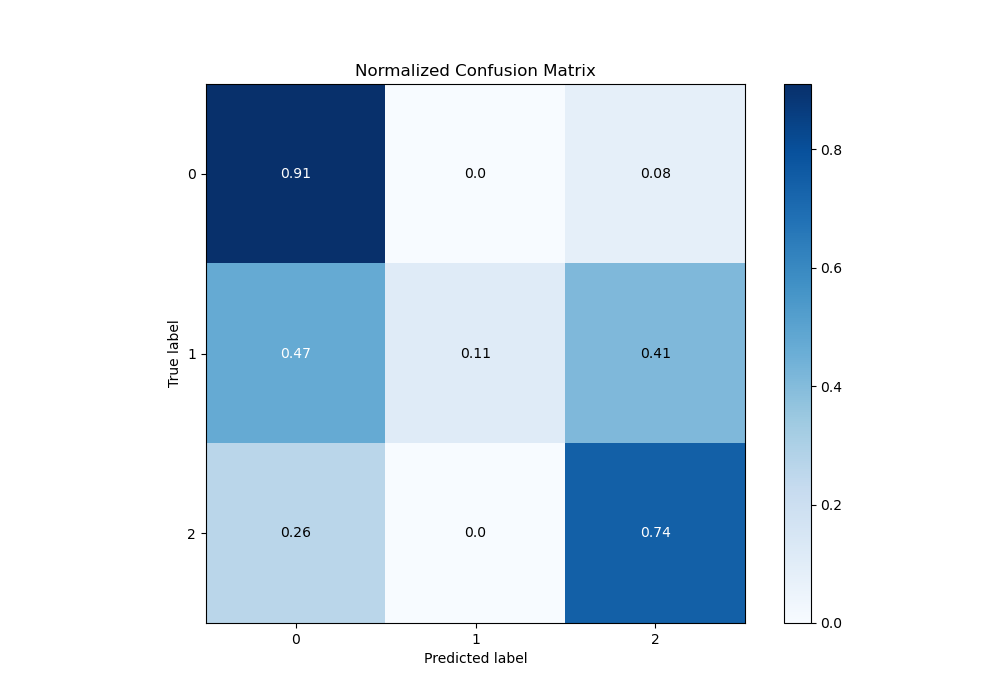
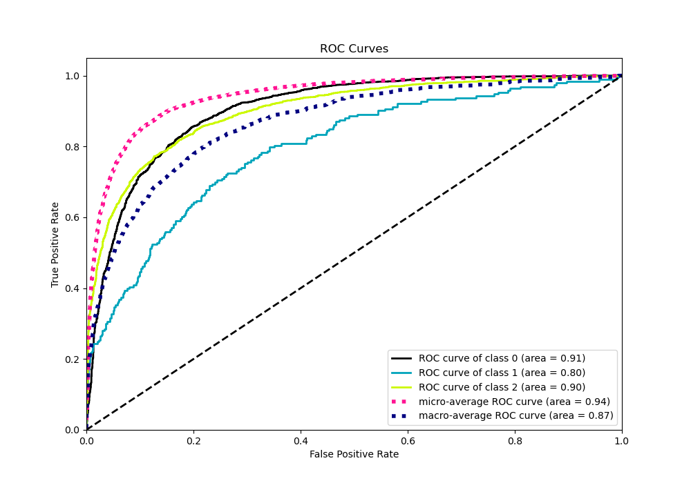
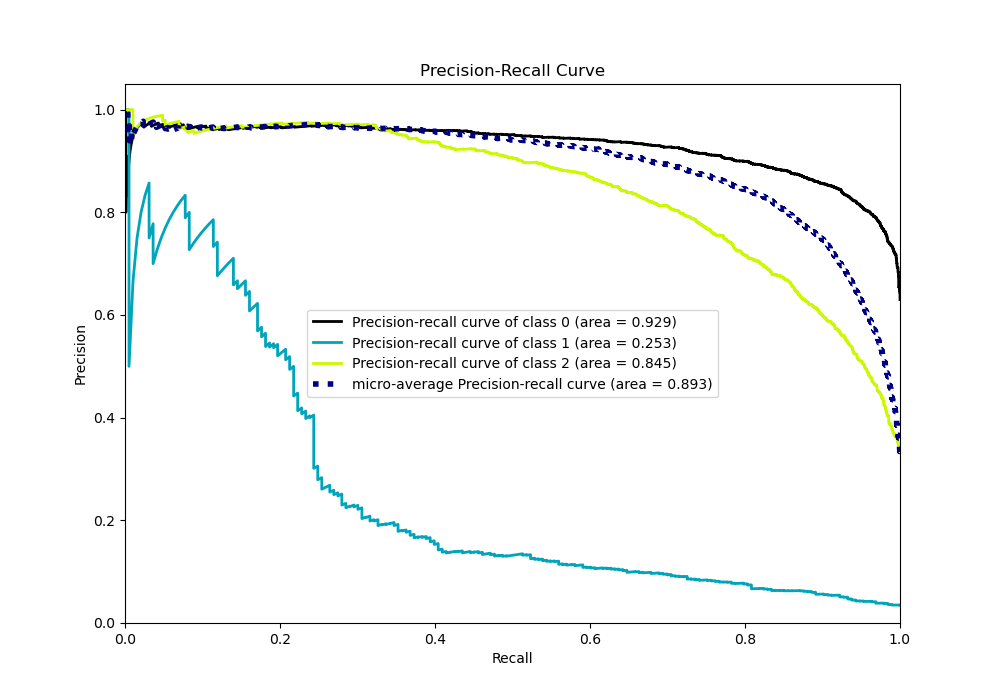

# Summary of 12_Xgboost

[<< Go back](../README.md)

## Extreme Gradient Boosting (Xgboost)
- **n_jobs**: -1
- **objective**: multi:softprob
- **eta**: 0.075
- **max_depth**: 8
- **min_child_weight**: 5
- **subsample**: 1.0
- **colsample_bytree**: 1.0
- **eval_metric**: mlogloss
- **num_class**: 3
- **explain_level**: 0

## Validation
 - **validation_type**: kfold
 - **shuffle**: True
 - **stratify**: True
 - **k_folds**: 10

## Optimized metric
logloss

## Training time

9.1 seconds

### Metric details
|           |           0 |          1 |           2 |   accuracy |   macro avg |   weighted avg |   logloss |
|:----------|------------:|-----------:|------------:|-----------:|------------:|---------------:|----------:|
| precision |    0.847012 |   0.6875   |    0.785138 |   0.826676 |    0.773217 |       0.820715 |  0.464065 |
| recall    |    0.914802 |   0.11399  |    0.735167 |   0.826676 |    0.587986 |       0.826676 |  0.464065 |
| f1-score  |    0.879603 |   0.195556 |    0.759331 |   0.826676 |    0.611497 |       0.815442 |  0.464065 |
| support   | 3486        | 193        | 1854        |   0.826676 | 5533        |    5533        |  0.464065 |

## Confusion matrix
|              |   Predicted as 0 |   Predicted as 1 |   Predicted as 2 |
|:-------------|-----------------:|-----------------:|-----------------:|
| Labeled as 0 |             3189 |                4 |              293 |
| Labeled as 1 |               91 |               22 |               80 |
| Labeled as 2 |              485 |                6 |             1363 |

## Learning curves

## Confusion Matrix

## Normalized Confusion Matrix

## ROC Curve

## Precision Recall Curve

[<< Go back](../README.md)
