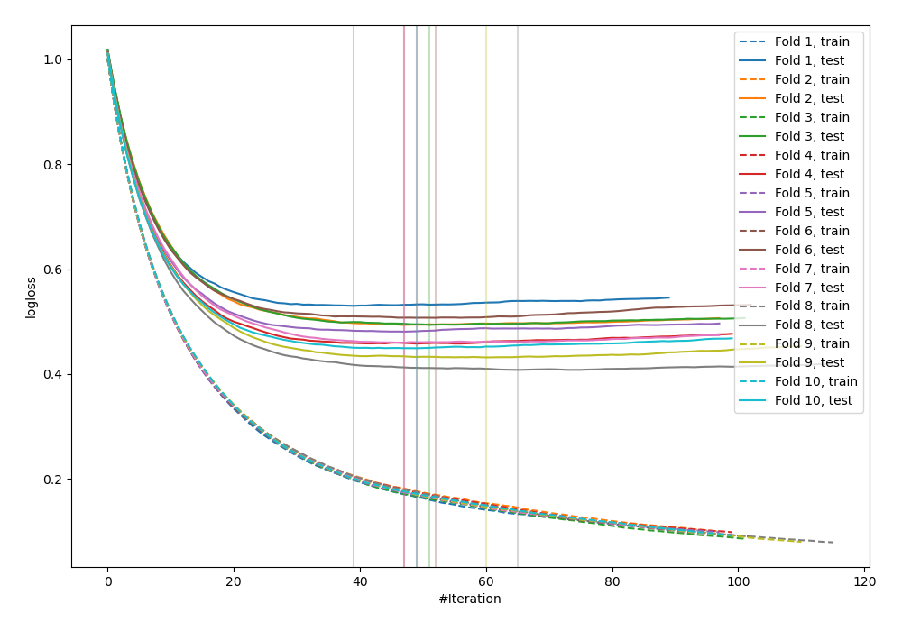
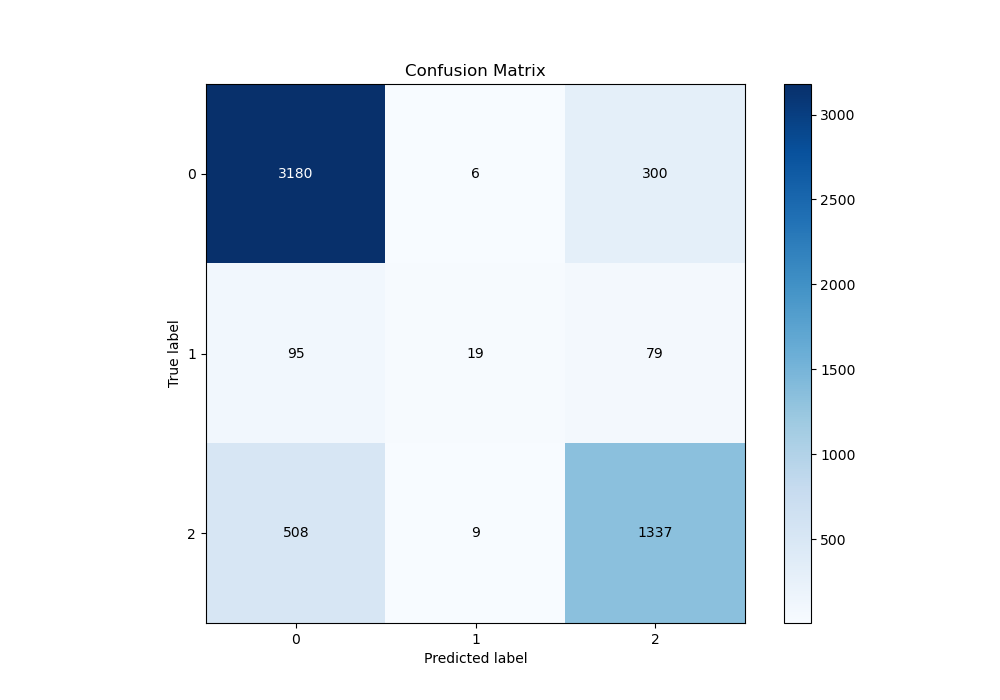
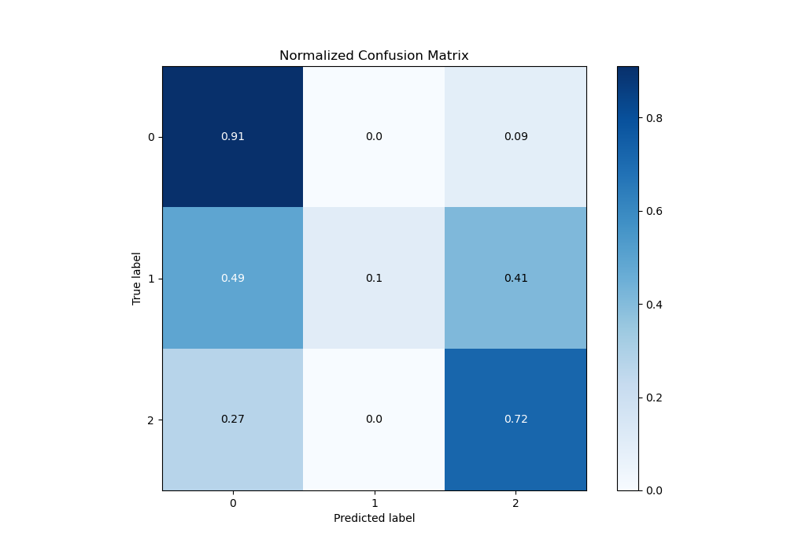
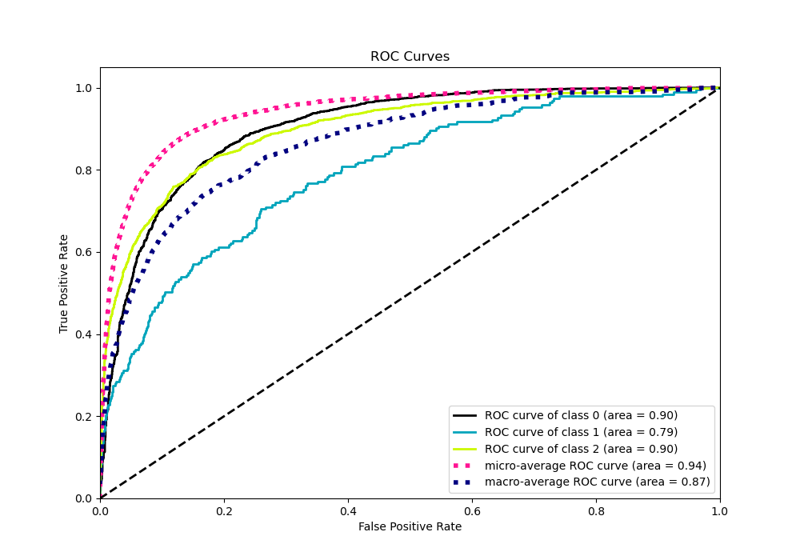
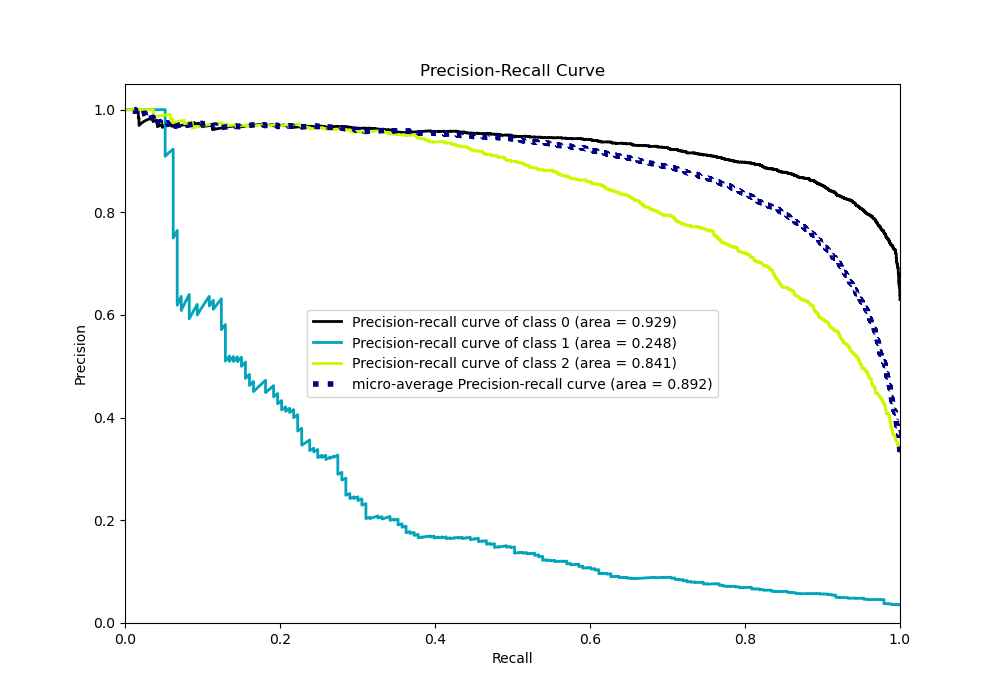

# Summary of 13_Xgboost

[<< Go back](../README.md)

## Extreme Gradient Boosting (Xgboost)
- **n_jobs**: -1
- **objective**: multi:softprob
- **eta**: 0.1
- **max_depth**: 8
- **min_child_weight**: 1
- **subsample**: 1.0
- **colsample_bytree**: 1.0
- **eval_metric**: mlogloss
- **num_class**: 3
- **explain_level**: 0

## Validation
 - **validation_type**: kfold
 - **shuffle**: True
 - **stratify**: True
 - **k_folds**: 10

## Optimized metric
logloss

## Training time

9.4 seconds

### Metric details
|           |           0 |           1 |           2 |   accuracy |   macro avg |   weighted avg |   logloss |
|:----------|------------:|------------:|------------:|-----------:|------------:|---------------:|----------:|
| precision |    0.840603 |   0.558824  |    0.779138 |   0.819808 |    0.726188 |       0.810178 |  0.471247 |
| recall    |    0.91222  |   0.0984456 |    0.721143 |   0.819808 |    0.57727  |       0.819808 |  0.471247 |
| f1-score  |    0.874948 |   0.167401  |    0.74902  |   0.819808 |    0.597123 |       0.808072 |  0.471247 |
| support   | 3486        | 193         | 1854        |   0.819808 | 5533        |    5533        |  0.471247 |

## Confusion matrix
|              |   Predicted as 0 |   Predicted as 1 |   Predicted as 2 |
|:-------------|-----------------:|-----------------:|-----------------:|
| Labeled as 0 |             3180 |                6 |              300 |
| Labeled as 1 |               95 |               19 |               79 |
| Labeled as 2 |              508 |                9 |             1337 |

## Learning curves

## Confusion Matrix

## Normalized Confusion Matrix

## ROC Curve

## Precision Recall Curve

[<< Go back](../README.md)
