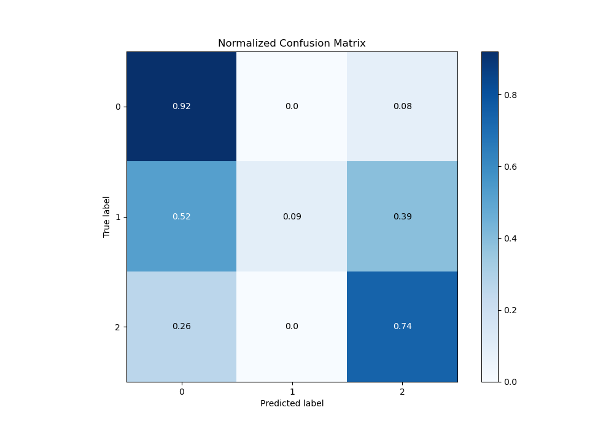

# Summary of 14_Xgboost

[<< Go back](../README.md)

## Extreme Gradient Boosting (Xgboost)
- **n_jobs**: -1
- **objective**: multi:softprob
- **eta**: 0.1
- **max_depth**: 7
- **min_child_weight**: 25
- **subsample**: 0.9
- **colsample_bytree**: 0.6
- **eval_metric**: mlogloss
- **num_class**: 3
- **explain_level**: 0

## Validation
 - **validation_type**: kfold
 - **shuffle**: True
 - **stratify**: True
 - **k_folds**: 10

## Optimized metric
logloss

## Training time

8.3 seconds

### Metric details
|           |           0 |           1 |           2 |   accuracy |   macro avg |   weighted avg |   logloss |
|:----------|------------:|------------:|------------:|-----------:|------------:|---------------:|----------:|
| precision |    0.847521 |   0.548387  |    0.792028 |   0.828484 |    0.729312 |       0.818492 |  0.446651 |
| recall    |    0.91681  |   0.0880829 |    0.739482 |   0.828484 |    0.581458 |       0.828484 |  0.446651 |
| f1-score  |    0.880805 |   0.151786  |    0.764854 |   0.828484 |    0.599148 |       0.816522 |  0.446651 |
| support   | 3486        | 193         | 1854        |   0.828484 | 5533        |    5533        |  0.446651 |

## Confusion matrix
|              |   Predicted as 0 |   Predicted as 1 |   Predicted as 2 |
|:-------------|-----------------:|-----------------:|-----------------:|
| Labeled as 0 |             3196 |                6 |              284 |
| Labeled as 1 |              100 |               17 |               76 |
| Labeled as 2 |              475 |                8 |             1371 |

## Learning curves

## Confusion Matrix

## Normalized Confusion Matrix

## ROC Curve

## Precision Recall Curve

[<< Go back](../README.md)
