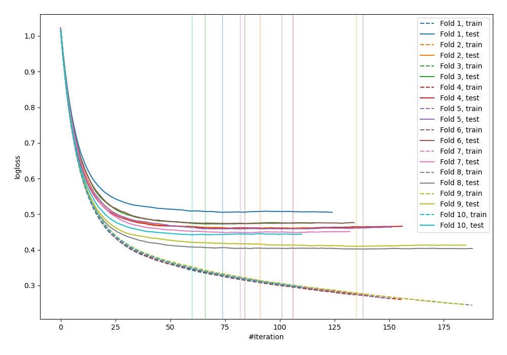
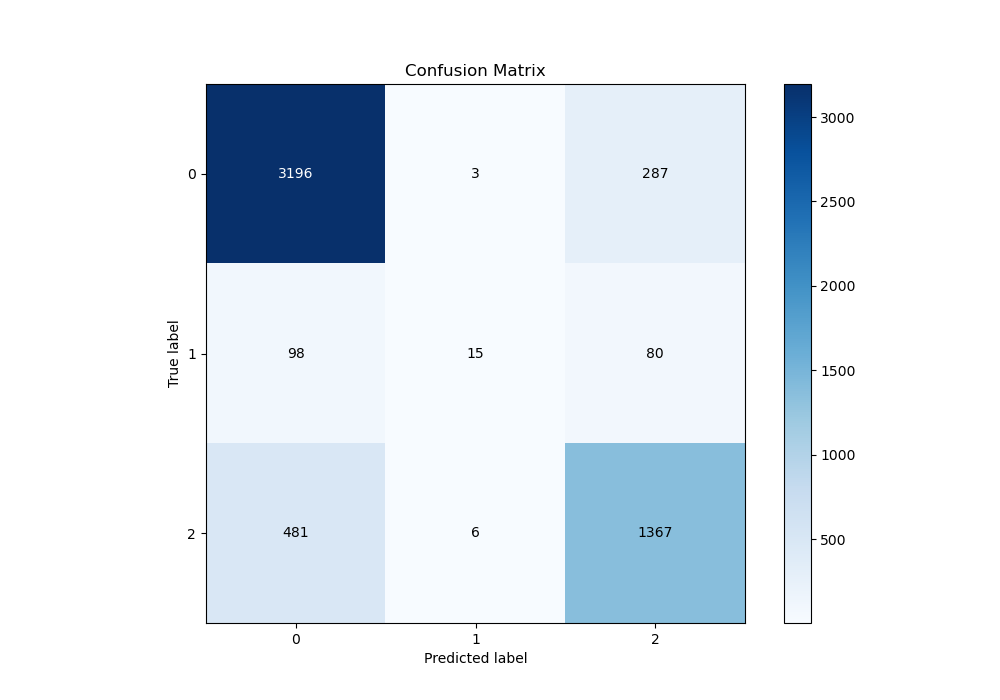
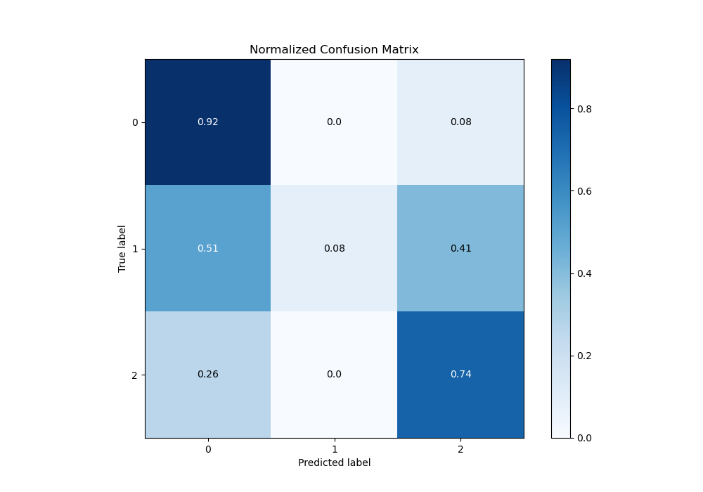
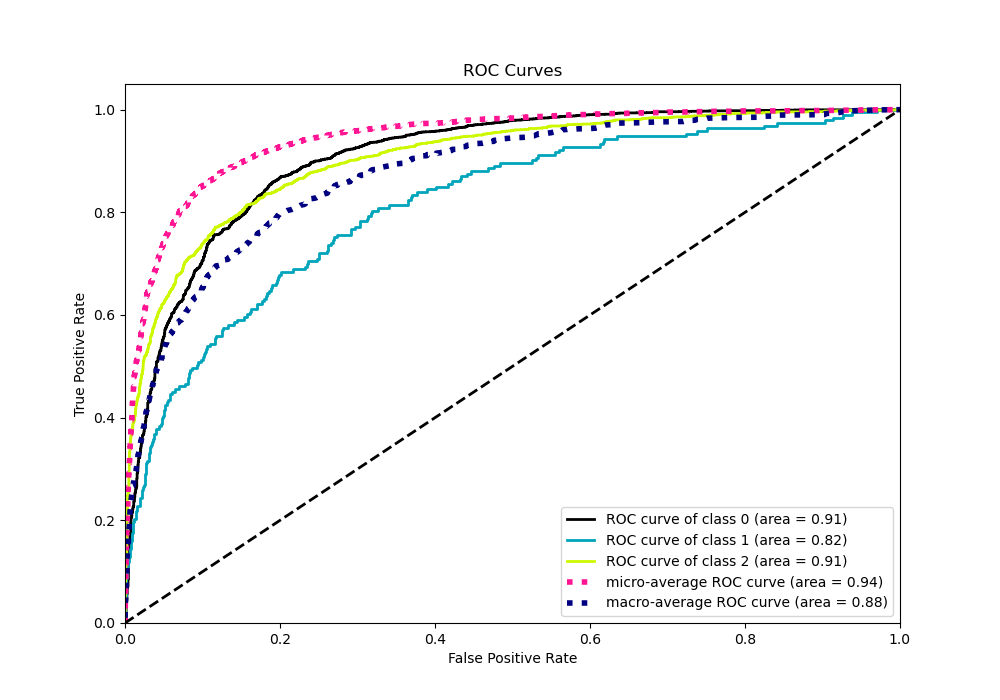
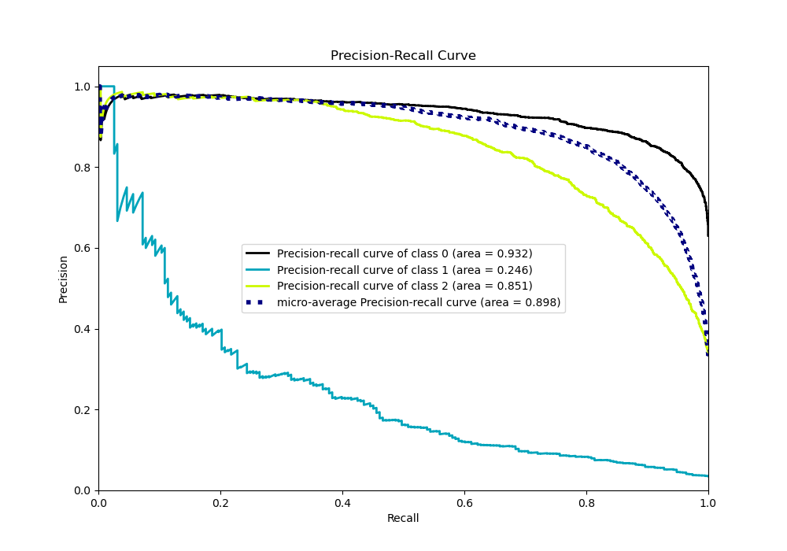

# Summary of 14_Xgboost_GoldenFeatures

[<< Go back](../README.md)

## Extreme Gradient Boosting (Xgboost)
- **n_jobs**: -1
- **objective**: multi:softprob
- **eta**: 0.1
- **max_depth**: 7
- **min_child_weight**: 25
- **subsample**: 0.9
- **colsample_bytree**: 0.6
- **eval_metric**: mlogloss
- **num_class**: 3
- **explain_level**: 0

## Validation
 - **validation_type**: kfold
 - **shuffle**: True
 - **stratify**: True
 - **k_folds**: 10

## Optimized metric
logloss

## Training time

21.2 seconds

### Metric details
|           |           0 |           1 |           2 |   accuracy |   macro avg |   weighted avg |   logloss |
|:----------|------------:|------------:|------------:|-----------:|------------:|---------------:|----------:|
| precision |    0.846623 |   0.625     |    0.788351 |   0.827399 |    0.753324 |       0.819366 |  0.453055 |
| recall    |    0.91681  |   0.0777202 |    0.737325 |   0.827399 |    0.577285 |       0.827399 |  0.453055 |
| f1-score  |    0.88032  |   0.138249  |    0.761984 |   0.827399 |    0.593518 |       0.814783 |  0.453055 |
| support   | 3486        | 193         | 1854        |   0.827399 | 5533        |    5533        |  0.453055 |

## Confusion matrix
|              |   Predicted as 0 |   Predicted as 1 |   Predicted as 2 |
|:-------------|-----------------:|-----------------:|-----------------:|
| Labeled as 0 |             3196 |                3 |              287 |
| Labeled as 1 |               98 |               15 |               80 |
| Labeled as 2 |              481 |                6 |             1367 |

## Learning curves

## Confusion Matrix

## Normalized Confusion Matrix

## ROC Curve

## Precision Recall Curve

[<< Go back](../README.md)
