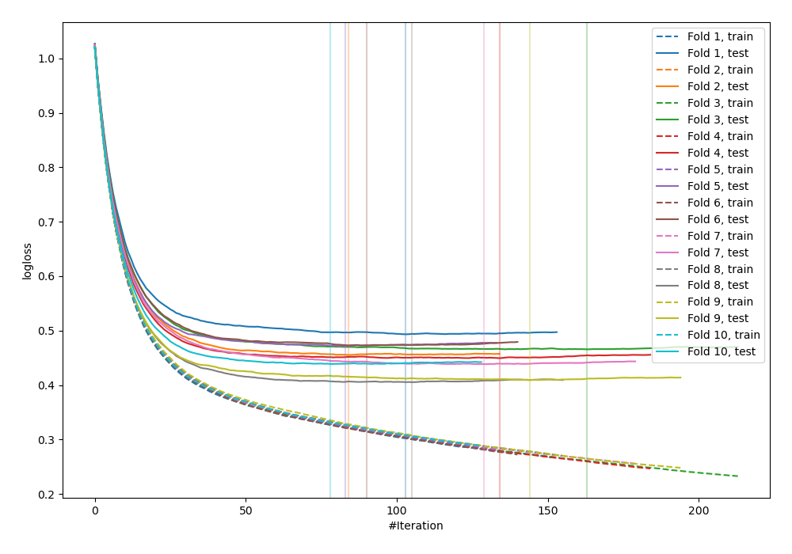
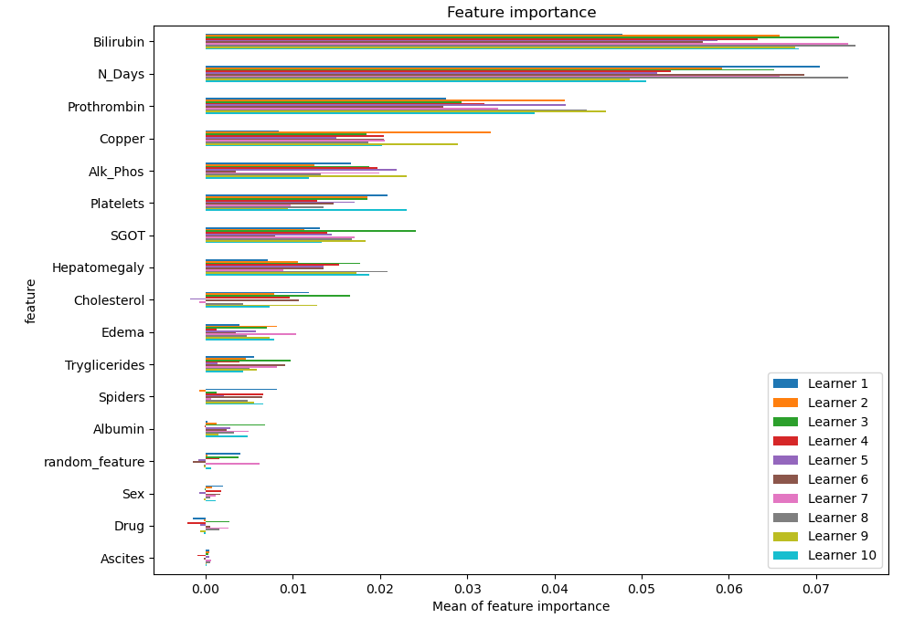
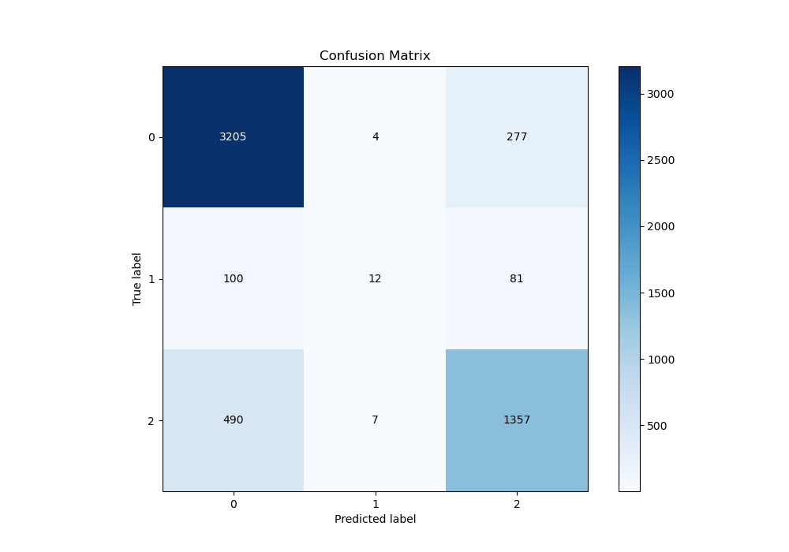
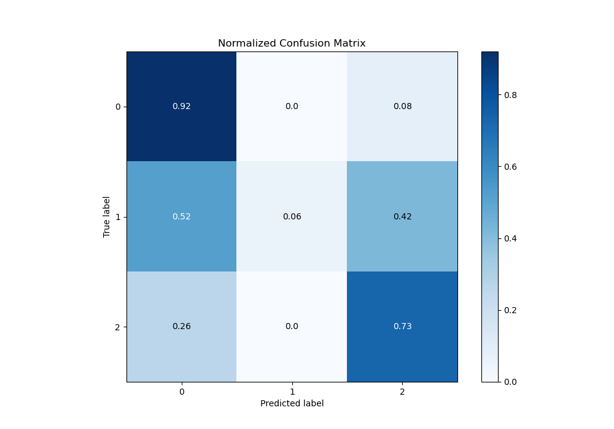
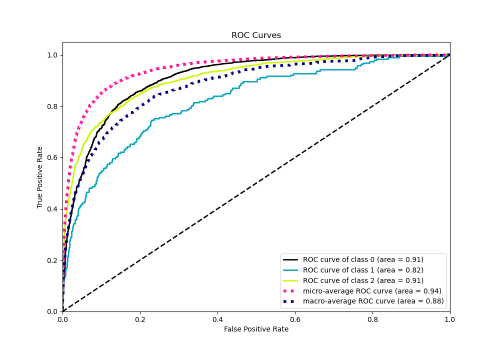
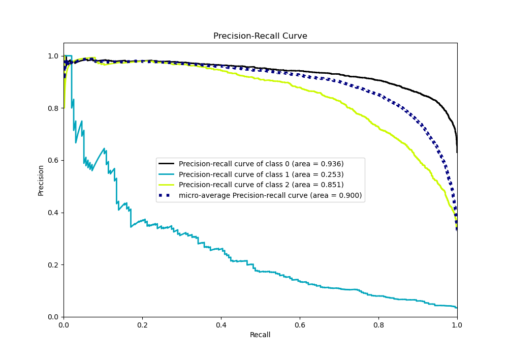

# Summary of 14_Xgboost_RandomFeature

[<< Go back](../README.md)

## Extreme Gradient Boosting (Xgboost)
- **n_jobs**: -1
- **objective**: multi:softprob
- **eta**: 0.1
- **max_depth**: 7
- **min_child_weight**: 25
- **subsample**: 0.9
- **colsample_bytree**: 0.6
- **eval_metric**: mlogloss
- **num_class**: 3
- **explain_level**: 1

## Validation
 - **validation_type**: kfold
 - **shuffle**: True
 - **stratify**: True
 - **k_folds**: 10

## Optimized metric
logloss

## Training time

14.6 seconds

### Metric details
|           |           0 |           1 |           2 |   accuracy |   macro avg |   weighted avg |   logloss |
|:----------|------------:|------------:|------------:|-----------:|------------:|---------------:|----------:|
| precision |    0.844532 |   0.521739  |    0.791254 |   0.826676 |    0.719175 |       0.81542  |  0.450003 |
| recall    |    0.919392 |   0.0621762 |    0.731931 |   0.826676 |    0.571166 |       0.826676 |  0.450003 |
| f1-score  |    0.880374 |   0.111111  |    0.760437 |   0.826676 |    0.583974 |       0.813352 |  0.450003 |
| support   | 3486        | 193         | 1854        |   0.826676 | 5533        |    5533        |  0.450003 |

## Confusion matrix
|              |   Predicted as 0 |   Predicted as 1 |   Predicted as 2 |
|:-------------|-----------------:|-----------------:|-----------------:|
| Labeled as 0 |             3205 |                4 |              277 |
| Labeled as 1 |              100 |               12 |               81 |
| Labeled as 2 |              490 |                7 |             1357 |

## Learning curves

## Permutation-based Importance

## Confusion Matrix

## Normalized Confusion Matrix

## ROC Curve

## Precision Recall Curve

[<< Go back](../README.md)
