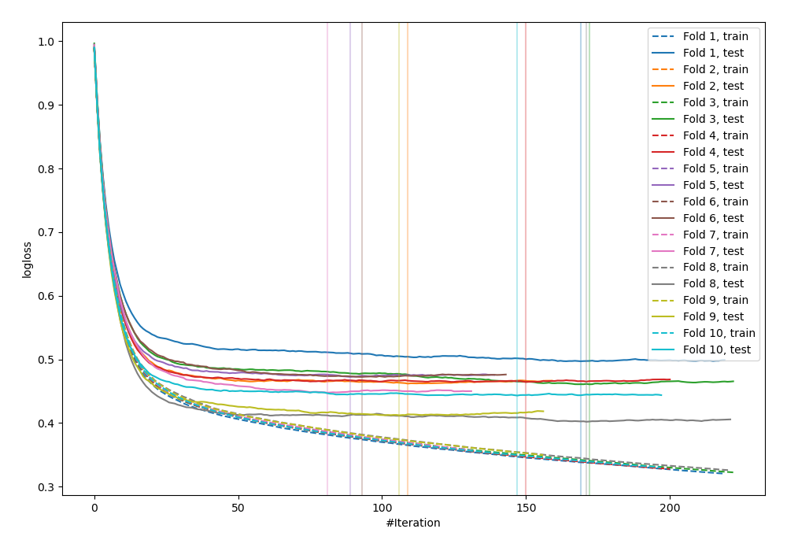

# Summary of 15_Xgboost

[<< Go back](../README.md)

## Extreme Gradient Boosting (Xgboost)
- **n_jobs**: -1
- **objective**: multi:softprob
- **eta**: 0.15
- **max_depth**: 8
- **min_child_weight**: 50
- **subsample**: 0.6
- **colsample_bytree**: 0.6
- **eval_metric**: mlogloss
- **num_class**: 3
- **explain_level**: 0

## Validation
 - **validation_type**: kfold
 - **shuffle**: True
 - **stratify**: True
 - **k_folds**: 10

## Optimized metric
logloss

## Training time

7.4 seconds

### Metric details
|           |           0 |           1 |           2 |   accuracy |   macro avg |   weighted avg |   logloss |
|:----------|------------:|------------:|------------:|-----------:|------------:|---------------:|----------:|
| precision |    0.848004 |   0.611111  |    0.794457 |   0.830472 |    0.751191 |       0.821798 |  0.453478 |
| recall    |    0.920252 |   0.0569948 |    0.742179 |   0.830472 |    0.573142 |       0.830472 |  0.453478 |
| f1-score  |    0.882652 |   0.104265  |    0.767429 |   0.830472 |    0.584782 |       0.816892 |  0.453478 |
| support   | 3486        | 193         | 1854        |   0.830472 | 5533        |    5533        |  0.453478 |

## Confusion matrix
|              |   Predicted as 0 |   Predicted as 1 |   Predicted as 2 |
|:-------------|-----------------:|-----------------:|-----------------:|
| Labeled as 0 |             3208 |                3 |              275 |
| Labeled as 1 |              101 |               11 |               81 |
| Labeled as 2 |              474 |                4 |             1376 |

## Learning curves

## Confusion Matrix

## Normalized Confusion Matrix

## ROC Curve

## Precision Recall Curve

[<< Go back](../README.md)
