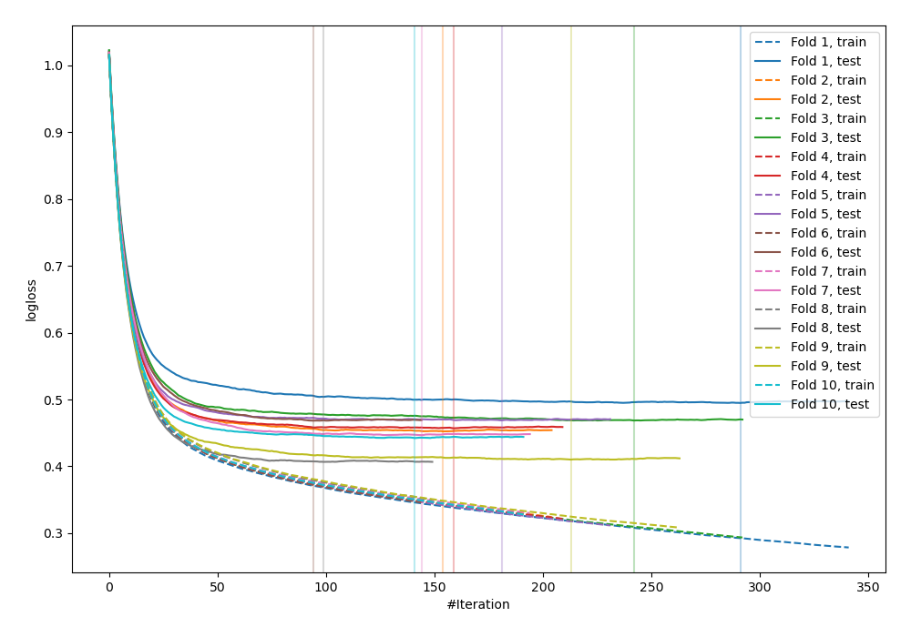
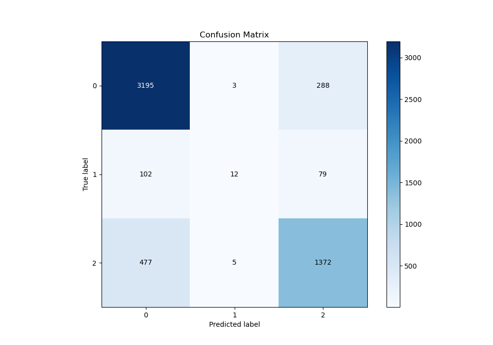
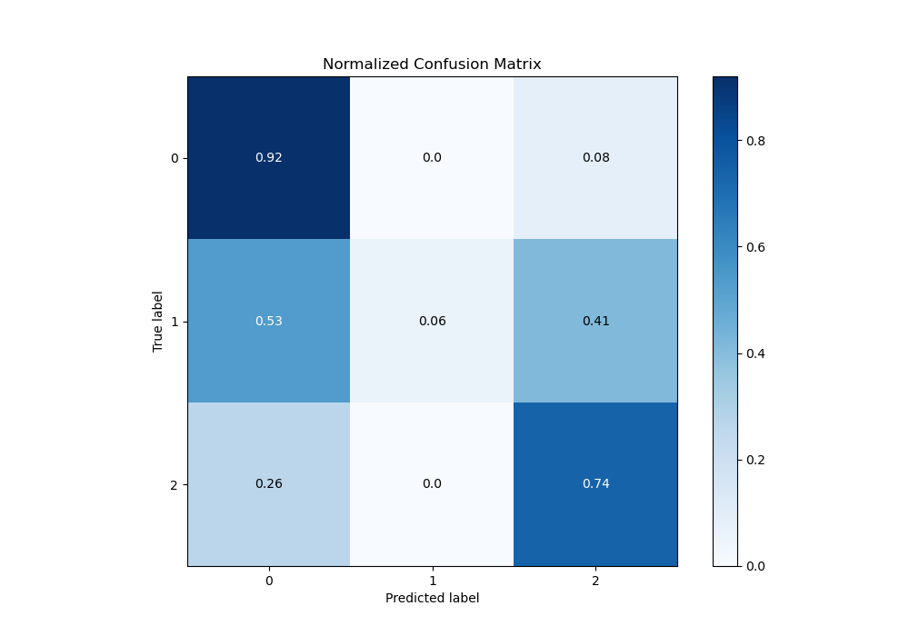
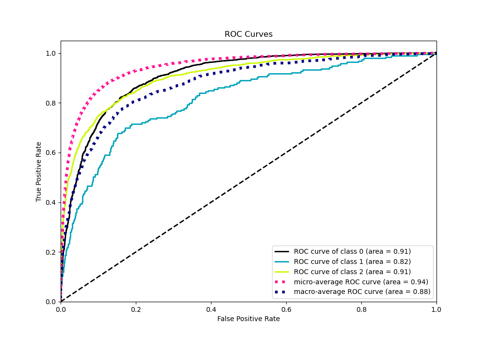
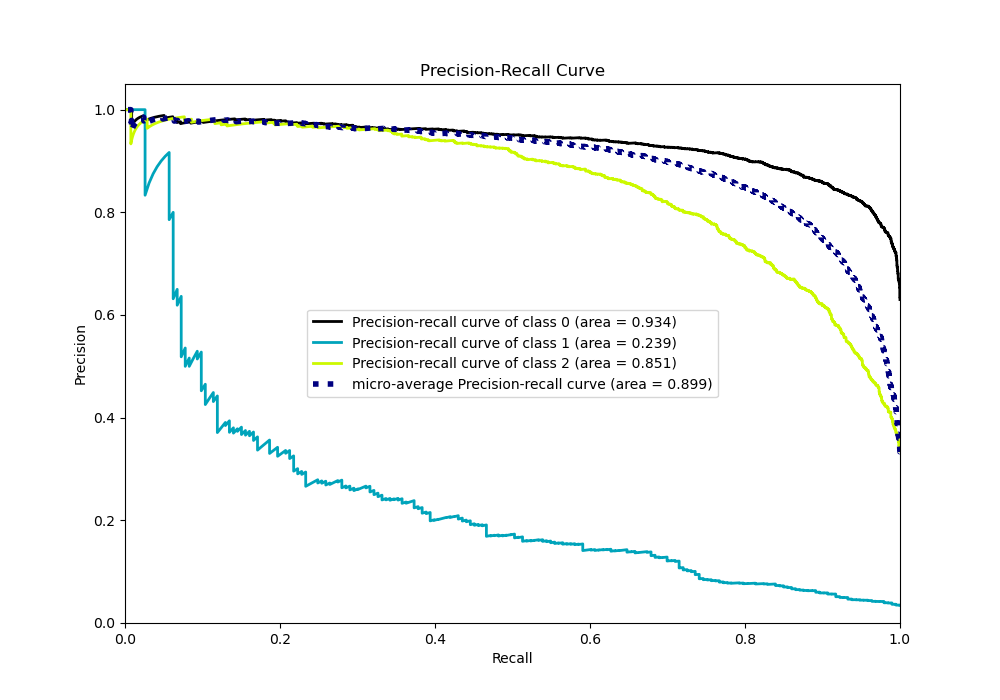

# Summary of 16_Xgboost

[<< Go back](../README.md)

## Extreme Gradient Boosting (Xgboost)
- **n_jobs**: -1
- **objective**: multi:softprob
- **eta**: 0.1
- **max_depth**: 6
- **min_child_weight**: 50
- **subsample**: 0.9
- **colsample_bytree**: 0.7
- **eval_metric**: mlogloss
- **num_class**: 3
- **explain_level**: 0

## Validation
 - **validation_type**: kfold
 - **shuffle**: True
 - **stratify**: True
 - **k_folds**: 10

## Optimized metric
logloss

## Training time

9.5 seconds

### Metric details
|           |           0 |           1 |           2 |   accuracy |   macro avg |   weighted avg |   logloss |
|:----------|------------:|------------:|------------:|-----------:|------------:|---------------:|----------:|
| precision |    0.846582 |   0.6       |    0.788959 |    0.82758 |    0.74518  |       0.818672 |  0.451553 |
| recall    |    0.916523 |   0.0621762 |    0.740022 |    0.82758 |    0.572907 |       0.82758  |  0.451553 |
| f1-score  |    0.880165 |   0.112676  |    0.763707 |    0.82758 |    0.585516 |       0.814371 |  0.451553 |
| support   | 3486        | 193         | 1854        |    0.82758 | 5533        |    5533        |  0.451553 |

## Confusion matrix
|              |   Predicted as 0 |   Predicted as 1 |   Predicted as 2 |
|:-------------|-----------------:|-----------------:|-----------------:|
| Labeled as 0 |             3195 |                3 |              288 |
| Labeled as 1 |              102 |               12 |               79 |
| Labeled as 2 |              477 |                5 |             1372 |

## Learning curves

## Confusion Matrix

## Normalized Confusion Matrix

## ROC Curve

## Precision Recall Curve

[<< Go back](../README.md)
