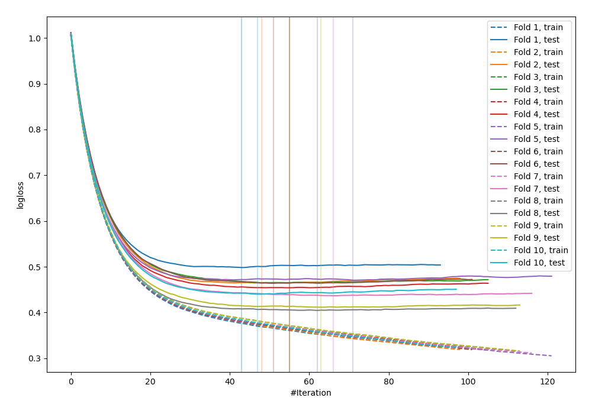
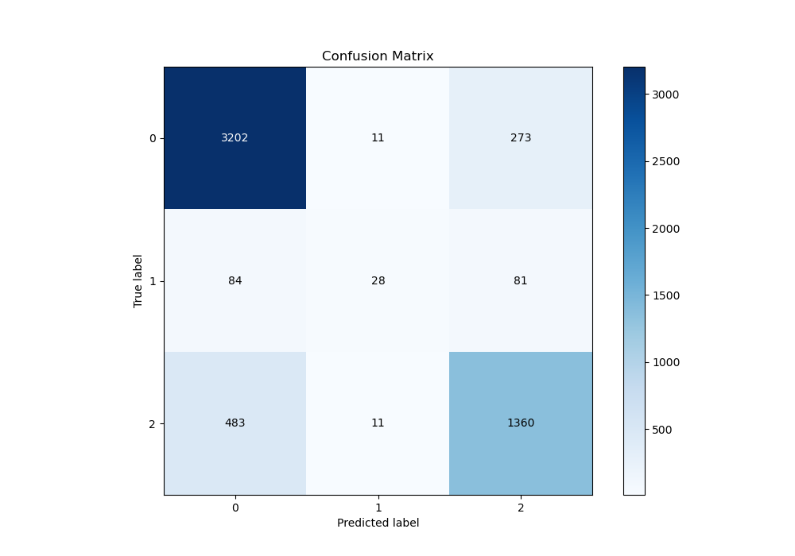
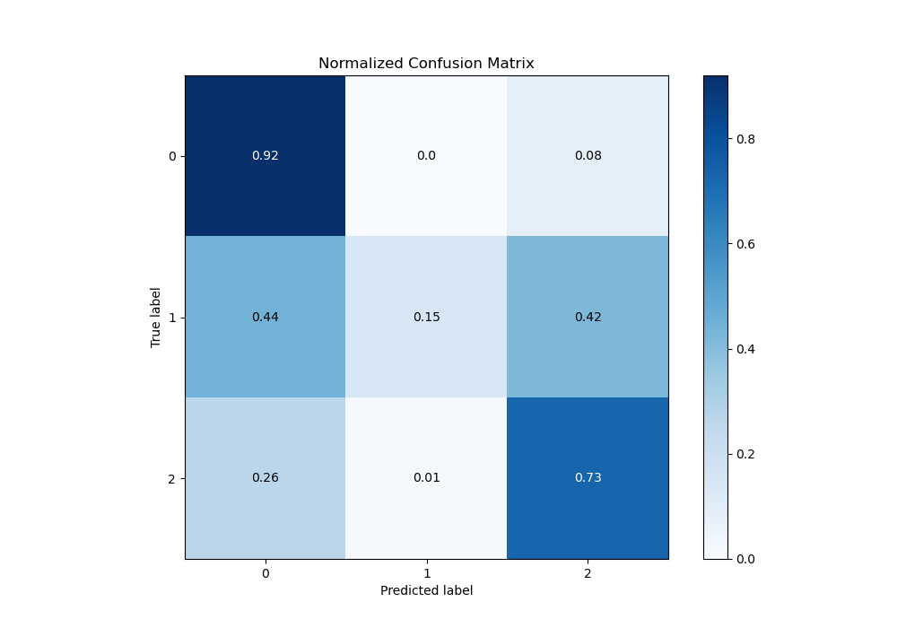
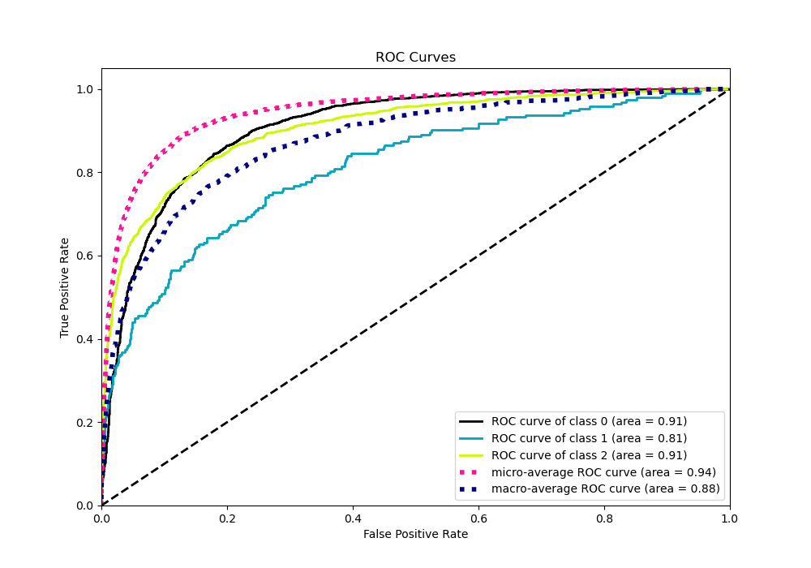
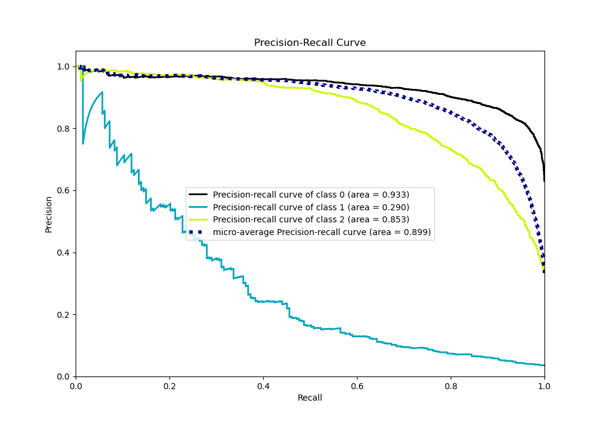

# Summary of 17_Xgboost_Stacked

[<< Go back](../README.md)

## Extreme Gradient Boosting (Xgboost)
- **n_jobs**: -1
- **objective**: multi:softprob
- **eta**: 0.1
- **max_depth**: 4
- **min_child_weight**: 25
- **subsample**: 0.7
- **colsample_bytree**: 0.7
- **eval_metric**: mlogloss
- **num_class**: 3
- **explain_level**: 0

## Validation
 - **validation_type**: kfold
 - **shuffle**: True
 - **stratify**: True
 - **k_folds**: 10

## Optimized metric
logloss

## Training time

30.2 seconds

### Metric details
|           |           0 |          1 |           2 |   accuracy |   macro avg |   weighted avg |   logloss |
|:----------|------------:|-----------:|------------:|-----------:|------------:|---------------:|----------:|
| precision |    0.849562 |   0.56     |    0.793466 |   0.829568 |    0.734343 |       0.820665 |  0.451015 |
| recall    |    0.918531 |   0.145078 |    0.733549 |   0.829568 |    0.599053 |       0.829568 |  0.451015 |
| f1-score  |    0.882702 |   0.230453 |    0.762332 |   0.829568 |    0.625162 |       0.819617 |  0.451015 |
| support   | 3486        | 193        | 1854        |   0.829568 | 5533        |    5533        |  0.451015 |

## Confusion matrix
|              |   Predicted as 0 |   Predicted as 1 |   Predicted as 2 |
|:-------------|-----------------:|-----------------:|-----------------:|
| Labeled as 0 |             3202 |               11 |              273 |
| Labeled as 1 |               84 |               28 |               81 |
| Labeled as 2 |              483 |               11 |             1360 |

## Learning curves

## Confusion Matrix

## Normalized Confusion Matrix

## ROC Curve

## Precision Recall Curve

[<< Go back](../README.md)
