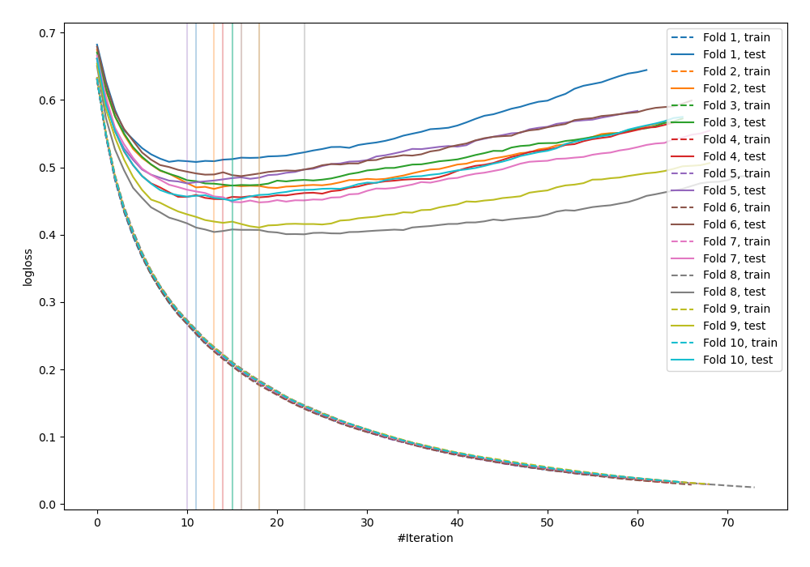
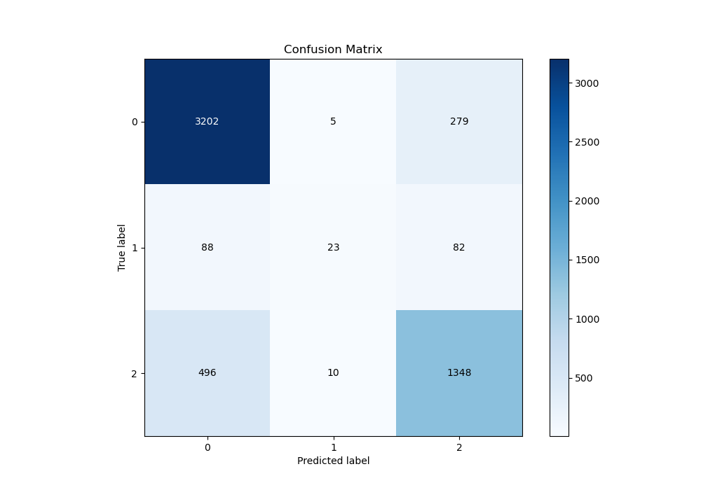
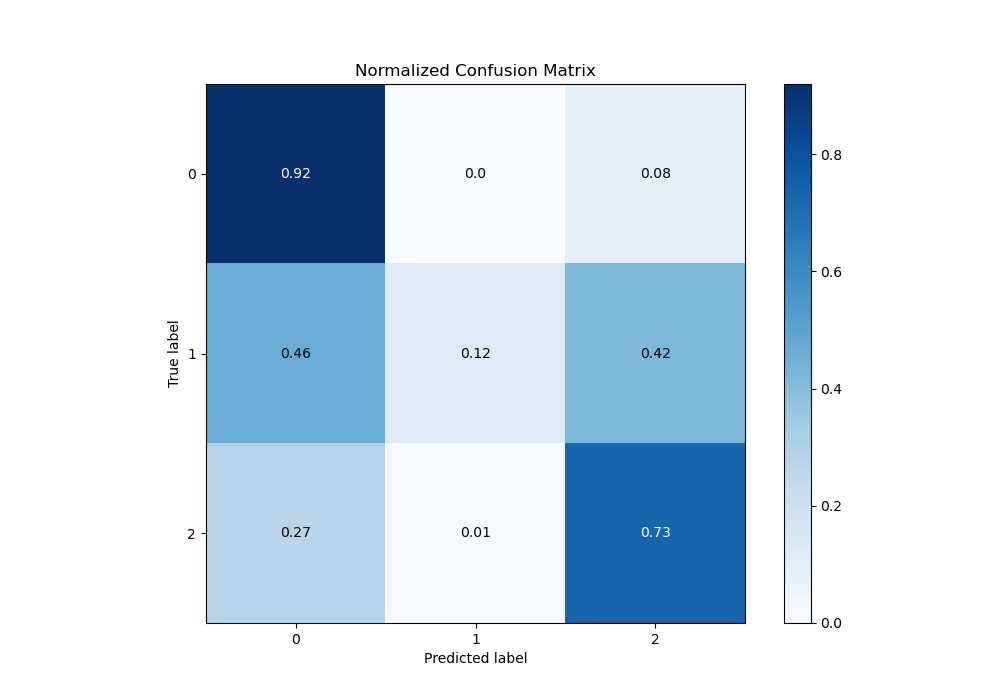
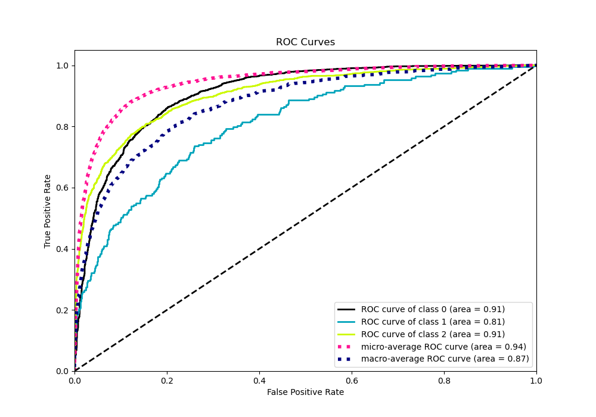
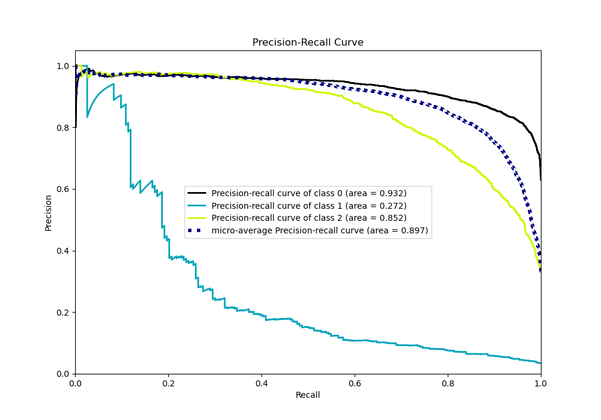

# Summary of 22_LightGBM

[<< Go back](../README.md)

## LightGBM
- **n_jobs**: -1
- **objective**: multiclass
- **num_leaves**: 63
- **learning_rate**: 0.2
- **feature_fraction**: 0.5
- **bagging_fraction**: 1.0
- **min_data_in_leaf**: 10
- **metric**: multi_logloss
- **custom_eval_metric_name**: None
- **num_class**: 3
- **explain_level**: 0

## Validation
 - **validation_type**: kfold
 - **shuffle**: True
 - **stratify**: True
 - **k_folds**: 10

## Optimized metric
logloss

## Training time

6.4 seconds

### Metric details
|           |           0 |          1 |           2 |   accuracy |   macro avg |   weighted avg |   logloss |
|:----------|------------:|-----------:|------------:|-----------:|------------:|---------------:|----------:|
| precision |    0.845747 |   0.605263 |    0.788765 |   0.826496 |    0.746592 |       0.818265 |  0.457489 |
| recall    |    0.918531 |   0.119171 |    0.727077 |   0.826496 |    0.58826  |       0.826496 |  0.457489 |
| f1-score  |    0.880638 |   0.199134 |    0.756666 |   0.826496 |    0.612146 |       0.815325 |  0.457489 |
| support   | 3486        | 193        | 1854        |   0.826496 | 5533        |    5533        |  0.457489 |

## Confusion matrix
|              |   Predicted as 0 |   Predicted as 1 |   Predicted as 2 |
|:-------------|-----------------:|-----------------:|-----------------:|
| Labeled as 0 |             3202 |                5 |              279 |
| Labeled as 1 |               88 |               23 |               82 |
| Labeled as 2 |              496 |               10 |             1348 |

## Learning curves

## Confusion Matrix

## Normalized Confusion Matrix

## ROC Curve

## Precision Recall Curve

[<< Go back](../README.md)
