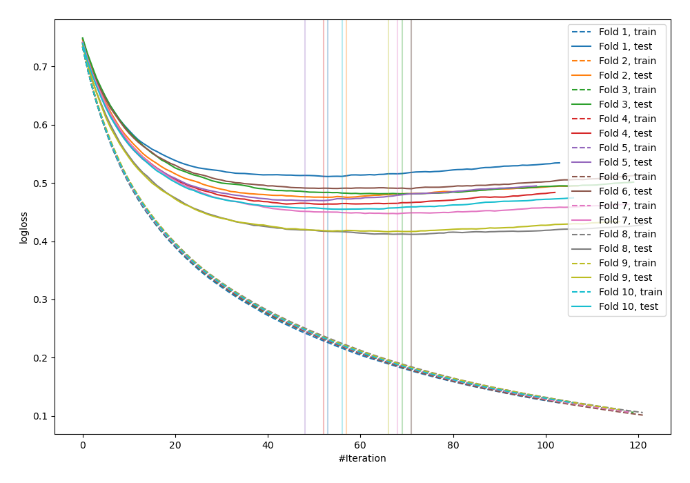
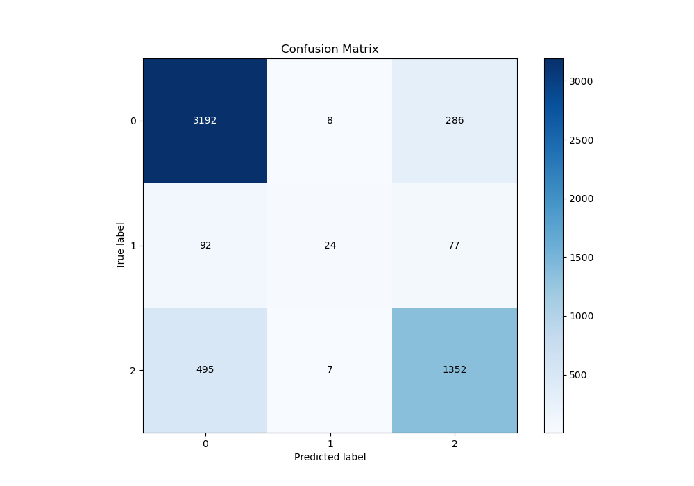
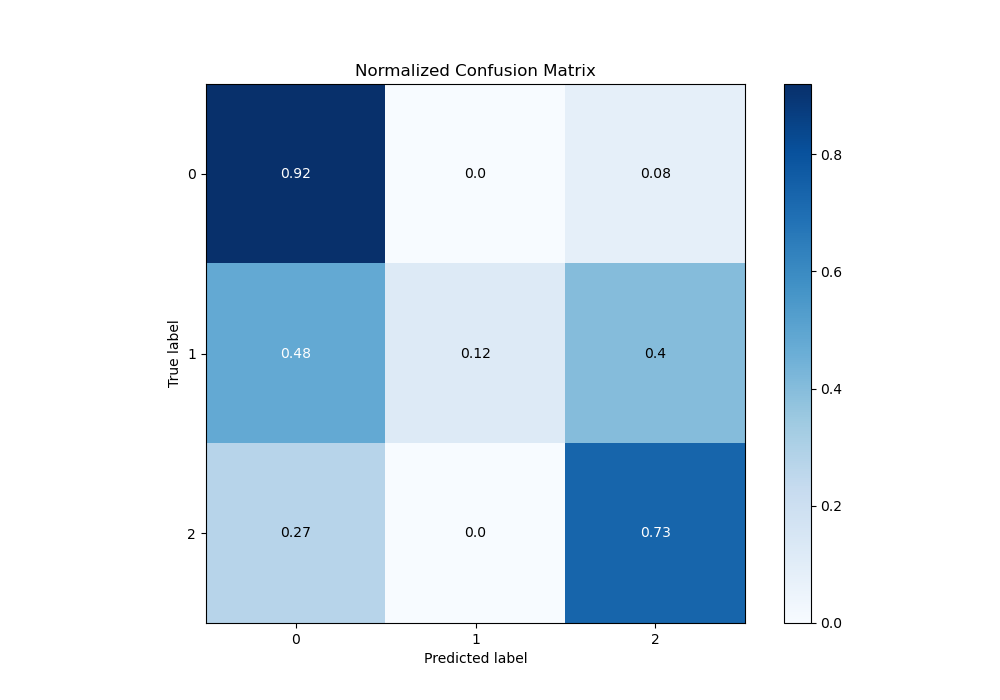
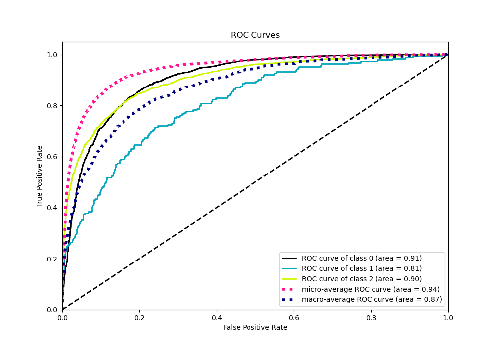
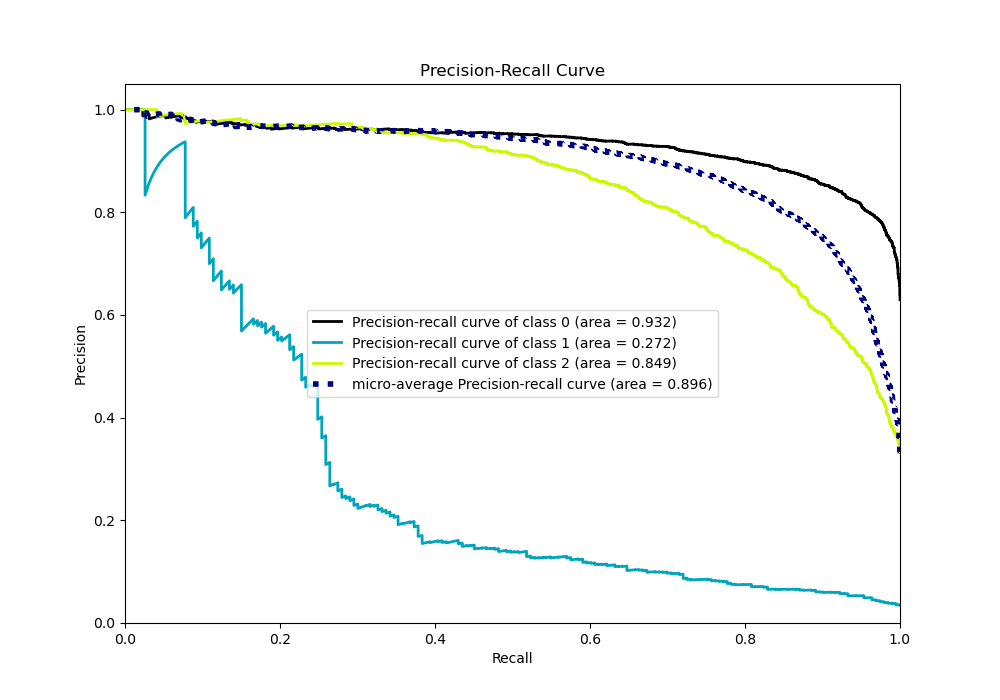

# Summary of 23_LightGBM

[<< Go back](../README.md)

## LightGBM
- **n_jobs**: -1
- **objective**: multiclass
- **num_leaves**: 63
- **learning_rate**: 0.05
- **feature_fraction**: 0.9
- **bagging_fraction**: 1.0
- **min_data_in_leaf**: 20
- **metric**: multi_logloss
- **custom_eval_metric_name**: None
- **num_class**: 3
- **explain_level**: 0

## Validation
 - **validation_type**: kfold
 - **shuffle**: True
 - **stratify**: True
 - **k_folds**: 10

## Optimized metric
logloss

## Training time

10.3 seconds

### Metric details
|           |           0 |          1 |           2 |   accuracy |   macro avg |   weighted avg |   logloss |
|:----------|------------:|-----------:|------------:|-----------:|------------:|---------------:|----------:|
| precision |    0.844668 |   0.615385 |    0.788338 |   0.825592 |    0.749464 |       0.817795 |  0.462077 |
| recall    |    0.915663 |   0.124352 |    0.729234 |   0.825592 |    0.58975  |       0.825592 |  0.462077 |
| f1-score  |    0.878734 |   0.206897 |    0.757635 |   0.825592 |    0.614422 |       0.814721 |  0.462077 |
| support   | 3486        | 193        | 1854        |   0.825592 | 5533        |    5533        |  0.462077 |

## Confusion matrix
|              |   Predicted as 0 |   Predicted as 1 |   Predicted as 2 |
|:-------------|-----------------:|-----------------:|-----------------:|
| Labeled as 0 |             3192 |                8 |              286 |
| Labeled as 1 |               92 |               24 |               77 |
| Labeled as 2 |              495 |                7 |             1352 |

## Learning curves

## Confusion Matrix

## Normalized Confusion Matrix

## ROC Curve

## Precision Recall Curve

[<< Go back](../README.md)
