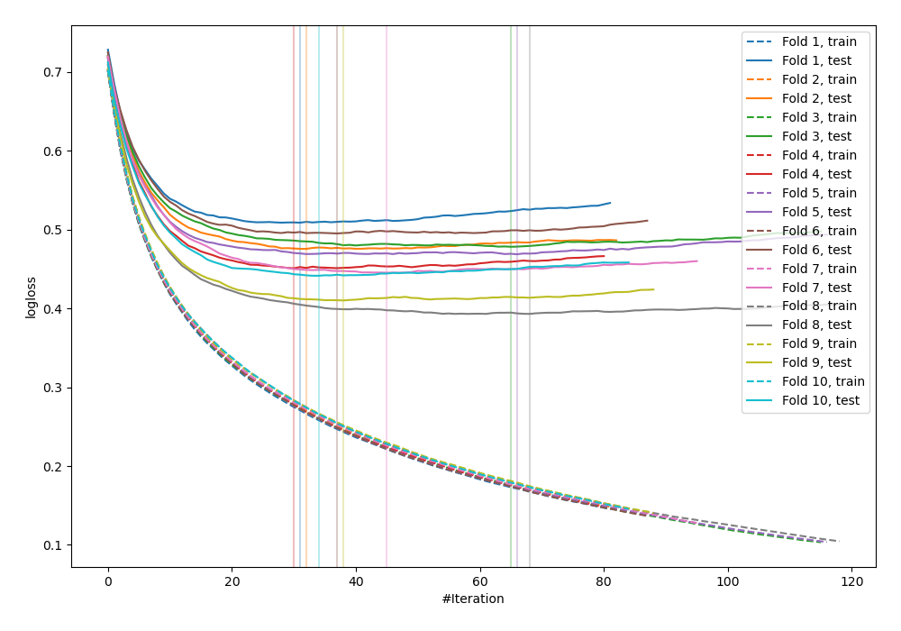
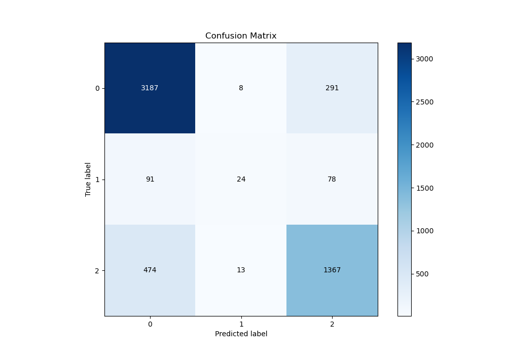
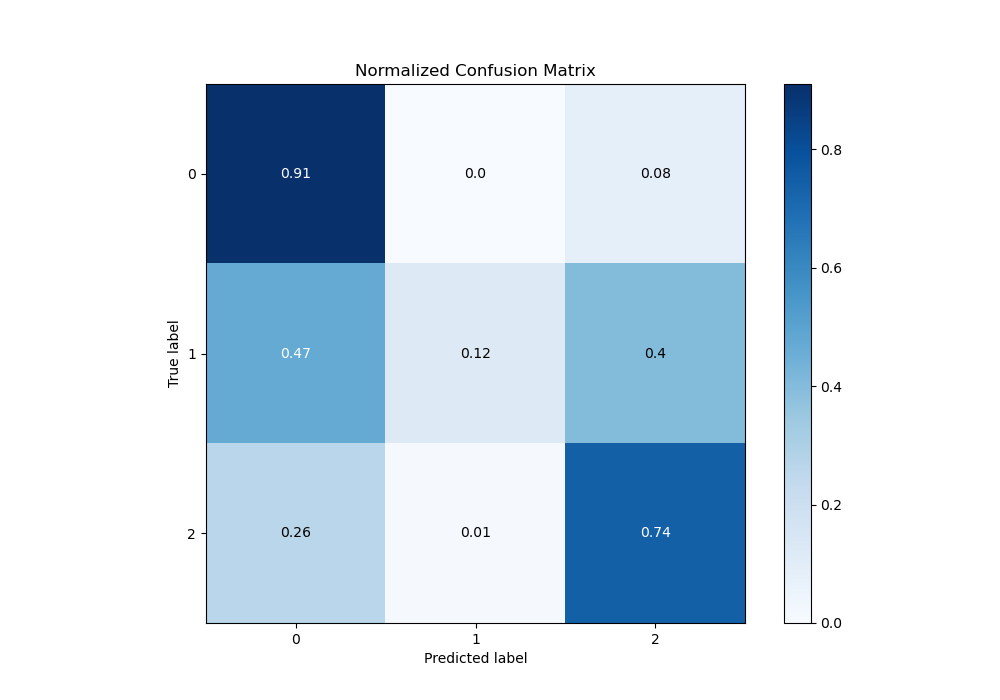
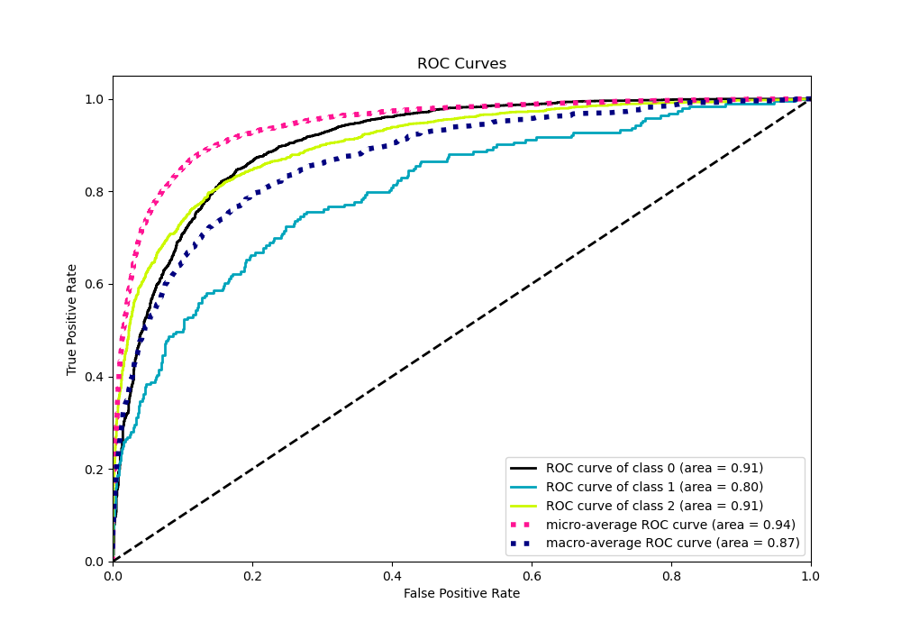
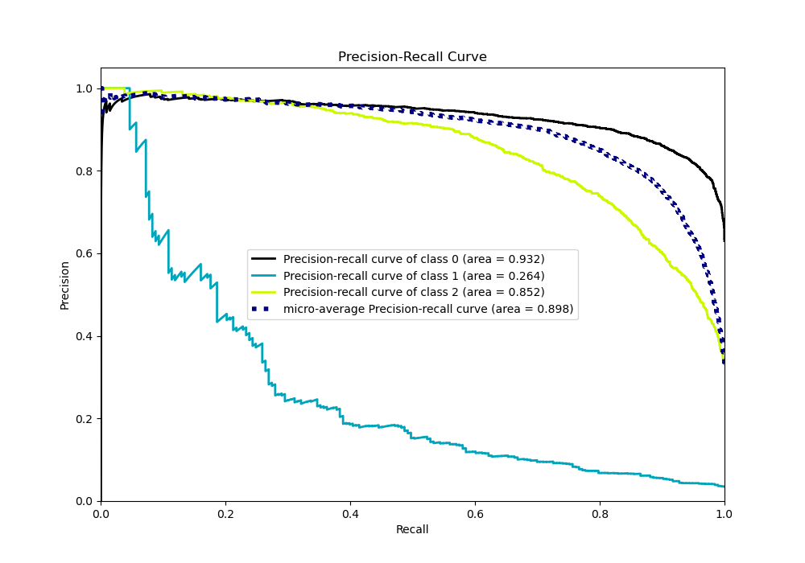

# Summary of 28_LightGBM

[<< Go back](../README.md)

## LightGBM
- **n_jobs**: -1
- **objective**: multiclass
- **num_leaves**: 31
- **learning_rate**: 0.1
- **feature_fraction**: 0.8
- **bagging_fraction**: 0.8
- **min_data_in_leaf**: 5
- **metric**: multi_logloss
- **custom_eval_metric_name**: None
- **num_class**: 3
- **explain_level**: 0

## Validation
 - **validation_type**: kfold
 - **shuffle**: True
 - **stratify**: True
 - **k_folds**: 10

## Optimized metric
logloss

## Training time

8.2 seconds

### Metric details
|           |           0 |          1 |           2 |   accuracy |   macro avg |   weighted avg |   logloss |
|:----------|------------:|-----------:|------------:|-----------:|------------:|---------------:|----------:|
| precision |    0.849414 |   0.533333 |    0.787442 |   0.827399 |    0.723396 |       0.817623 |  0.456705 |
| recall    |    0.914228 |   0.124352 |    0.737325 |   0.827399 |    0.591968 |       0.827399 |  0.456705 |
| f1-score  |    0.88063  |   0.201681 |    0.76156  |   0.827399 |    0.614624 |       0.817049 |  0.456705 |
| support   | 3486        | 193        | 1854        |   0.827399 | 5533        |    5533        |  0.456705 |

## Confusion matrix
|              |   Predicted as 0 |   Predicted as 1 |   Predicted as 2 |
|:-------------|-----------------:|-----------------:|-----------------:|
| Labeled as 0 |             3187 |                8 |              291 |
| Labeled as 1 |               91 |               24 |               78 |
| Labeled as 2 |              474 |               13 |             1367 |

## Learning curves

## Confusion Matrix

## Normalized Confusion Matrix

## ROC Curve

## Precision Recall Curve

[<< Go back](../README.md)
