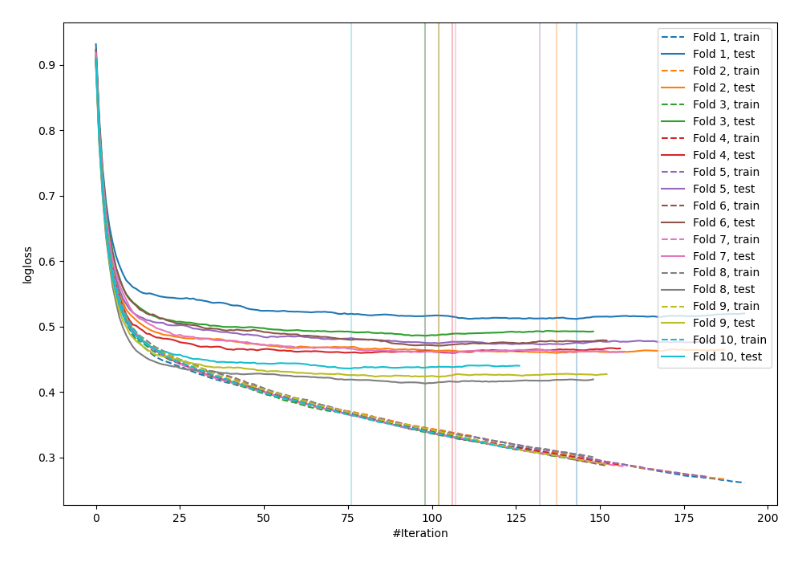
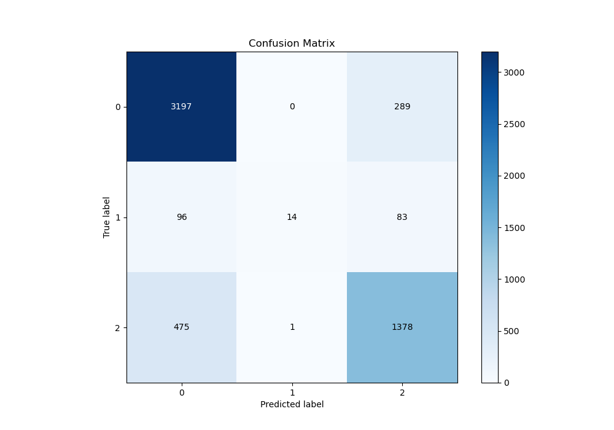
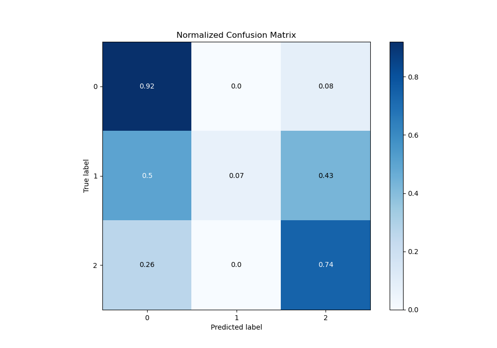
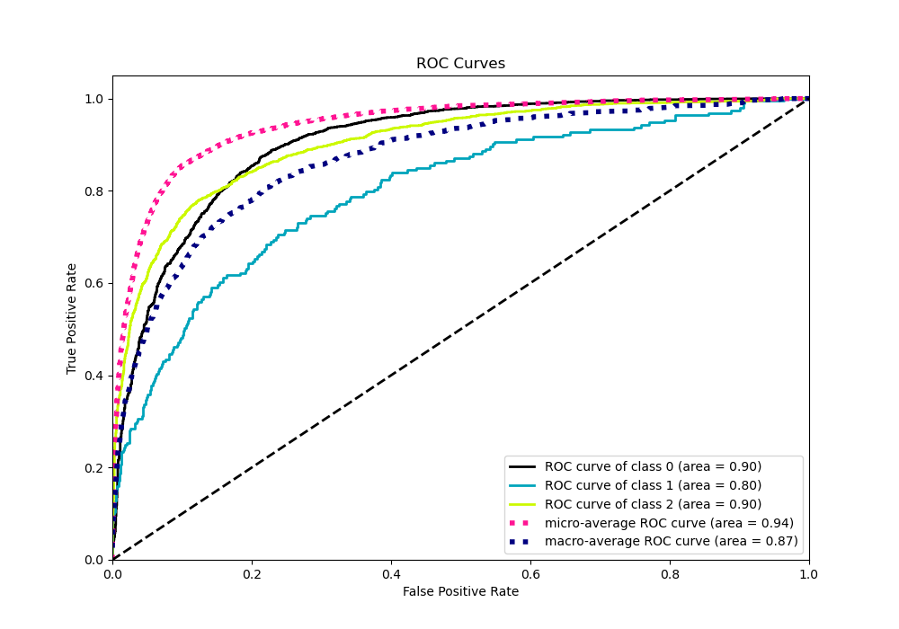
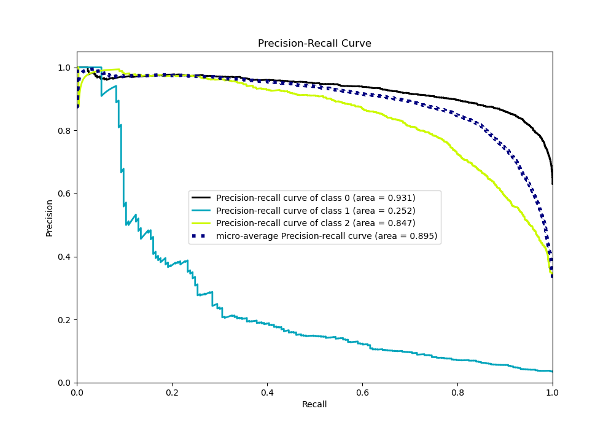

# Summary of 32_CatBoost

[<< Go back](../README.md)

## CatBoost
- **n_jobs**: -1
- **learning_rate**: 0.2
- **depth**: 6
- **rsm**: 0.9
- **loss_function**: MultiClass
- **eval_metric**: MultiClass
- **num_class**: 3
- **explain_level**: 0

## Validation
 - **validation_type**: kfold
 - **shuffle**: True
 - **stratify**: True
 - **k_folds**: 10

## Optimized metric
logloss

## Training time

10.0 seconds

### Metric details
|           |           0 |           1 |           2 |   accuracy |   macro avg |   weighted avg |   logloss |
|:----------|------------:|------------:|------------:|-----------:|------------:|---------------:|----------:|
| precision |    0.848461 |   0.933333  |    0.787429 |   0.829387 |    0.856408 |       0.830971 |  0.459245 |
| recall    |    0.917097 |   0.0725389 |    0.743258 |   0.829387 |    0.577631 |       0.829387 |  0.459245 |
| f1-score  |    0.881445 |   0.134615  |    0.764706 |   0.829387 |    0.593589 |       0.816277 |  0.459245 |
| support   | 3486        | 193         | 1854        |   0.829387 | 5533        |    5533        |  0.459245 |

## Confusion matrix
|              |   Predicted as 0 |   Predicted as 1 |   Predicted as 2 |
|:-------------|-----------------:|-----------------:|-----------------:|
| Labeled as 0 |             3197 |                0 |              289 |
| Labeled as 1 |               96 |               14 |               83 |
| Labeled as 2 |              475 |                1 |             1378 |

## Learning curves

## Confusion Matrix

## Normalized Confusion Matrix

## ROC Curve

## Precision Recall Curve

[<< Go back](../README.md)
