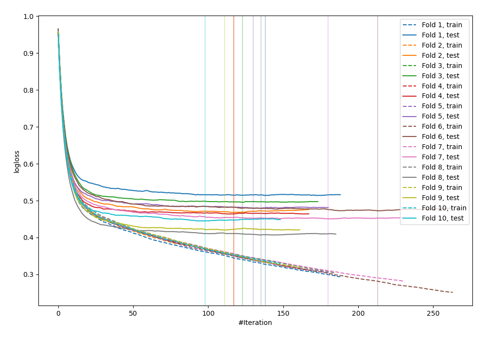
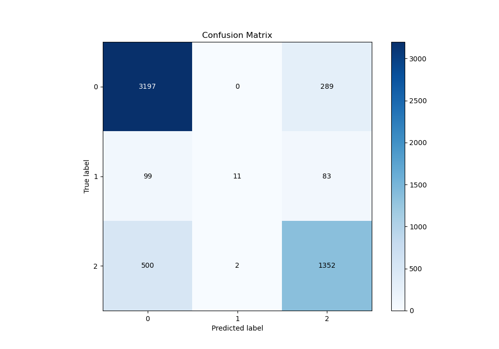
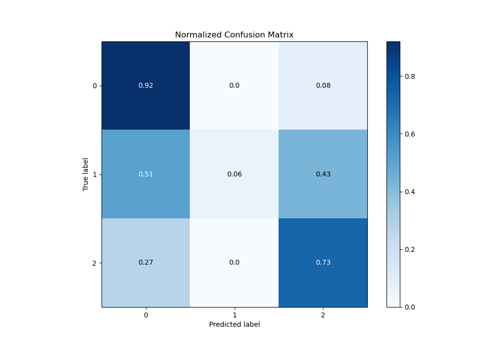
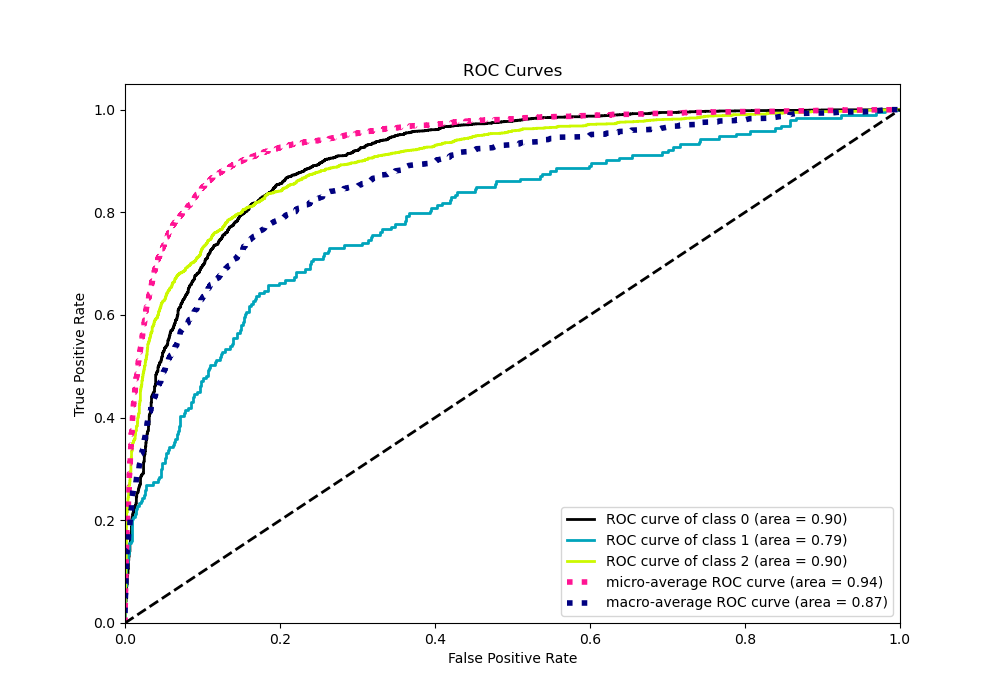
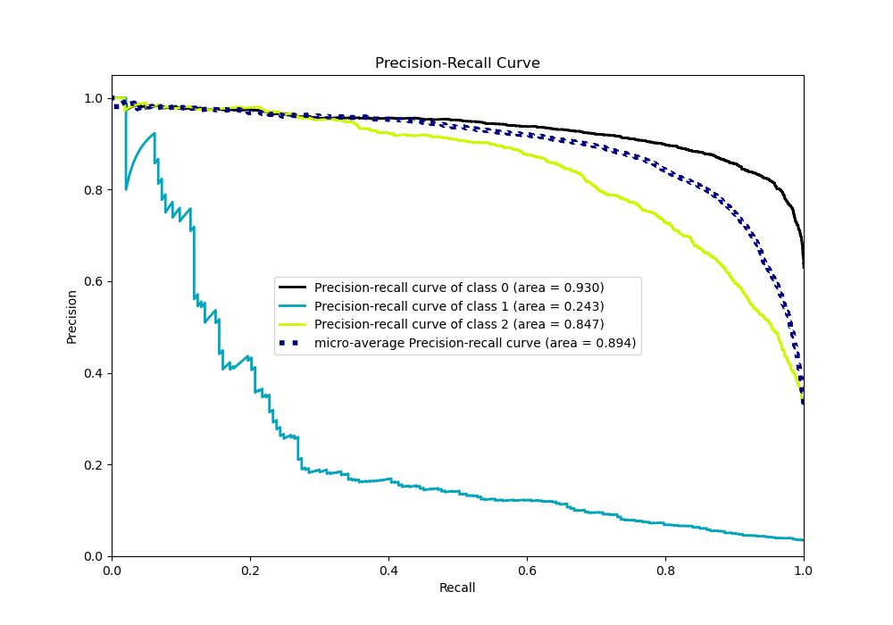

# Summary of 33_CatBoost

[<< Go back](../README.md)

## CatBoost
- **n_jobs**: -1
- **learning_rate**: 0.15
- **depth**: 6
- **rsm**: 0.8
- **loss_function**: MultiClass
- **eval_metric**: MultiClass
- **num_class**: 3
- **explain_level**: 0

## Validation
 - **validation_type**: kfold
 - **shuffle**: True
 - **stratify**: True
 - **k_folds**: 10

## Optimized metric
logloss

## Training time

11.7 seconds

### Metric details
|           |           0 |           1 |           2 |   accuracy |   macro avg |   weighted avg |   logloss |
|:----------|------------:|------------:|------------:|-----------:|------------:|---------------:|----------:|
| precision |    0.842202 |   0.846154  |    0.784223 |   0.824146 |    0.824193 |       0.822912 |  0.461453 |
| recall    |    0.917097 |   0.0569948 |    0.729234 |   0.824146 |    0.567775 |       0.824146 |  0.461453 |
| f1-score  |    0.878055 |   0.106796  |    0.755729 |   0.824146 |    0.580194 |       0.810164 |  0.461453 |
| support   | 3486        | 193         | 1854        |   0.824146 | 5533        |    5533        |  0.461453 |

## Confusion matrix
|              |   Predicted as 0 |   Predicted as 1 |   Predicted as 2 |
|:-------------|-----------------:|-----------------:|-----------------:|
| Labeled as 0 |             3197 |                0 |              289 |
| Labeled as 1 |               99 |               11 |               83 |
| Labeled as 2 |              500 |                2 |             1352 |

## Learning curves

## Confusion Matrix

## Normalized Confusion Matrix

## ROC Curve

## Precision Recall Curve

[<< Go back](../README.md)
