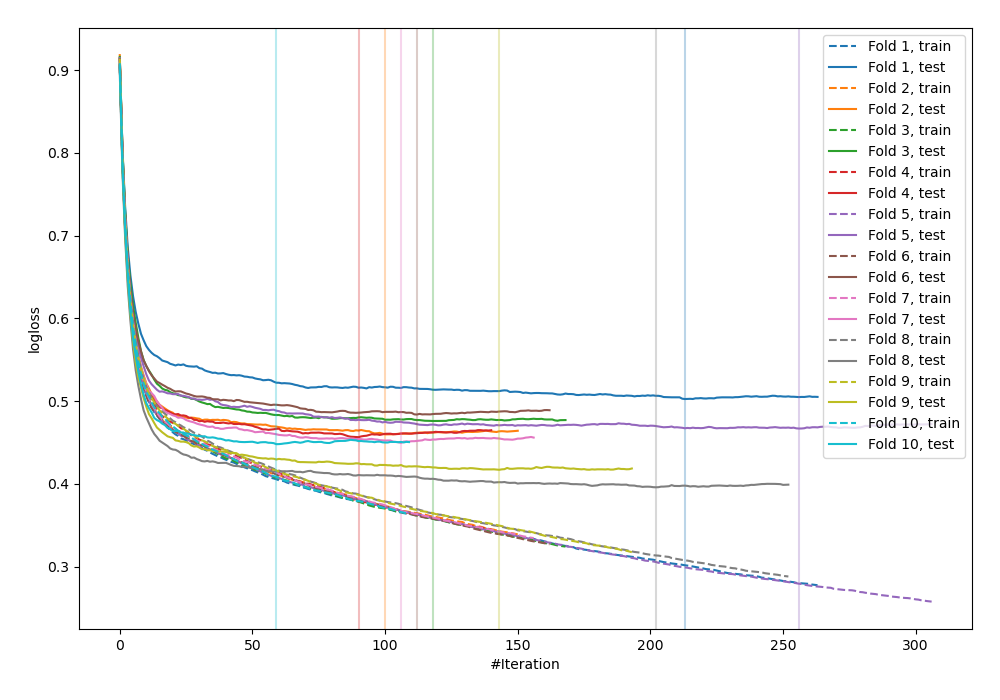
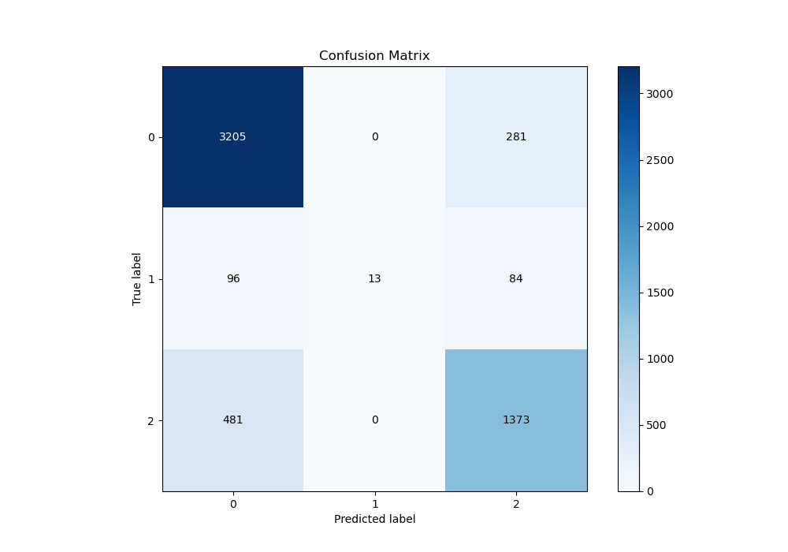
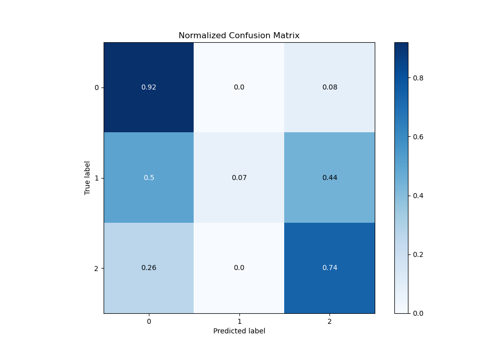
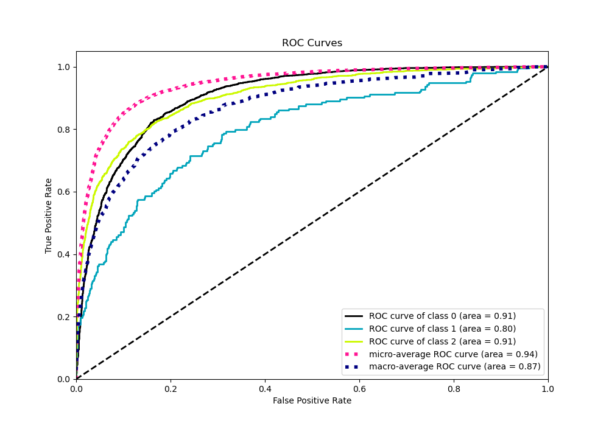
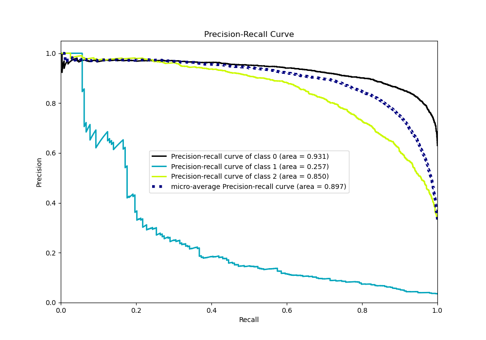

# Summary of 34_CatBoost

[<< Go back](../README.md)

## CatBoost
- **n_jobs**: -1
- **learning_rate**: 0.2
- **depth**: 5
- **rsm**: 0.7
- **loss_function**: MultiClass
- **eval_metric**: MultiClass
- **num_class**: 3
- **explain_level**: 0

## Validation
 - **validation_type**: kfold
 - **shuffle**: True
 - **stratify**: True
 - **k_folds**: 10

## Optimized metric
logloss

## Training time

9.8 seconds

### Metric details
|           |           0 |           1 |           2 |   accuracy |   macro avg |   weighted avg |   logloss |
|:----------|------------:|------------:|------------:|-----------:|------------:|---------------:|----------:|
| precision |    0.847435 |   1         |    0.789988 |   0.829749 |    0.879141 |       0.833508 |  0.455583 |
| recall    |    0.919392 |   0.0673575 |    0.740561 |   0.829749 |    0.57577  |       0.829749 |  0.455583 |
| f1-score  |    0.881948 |   0.126214  |    0.764477 |   0.829749 |    0.590879 |       0.816225 |  0.455583 |
| support   | 3486        | 193         | 1854        |   0.829749 | 5533        |    5533        |  0.455583 |

## Confusion matrix
|              |   Predicted as 0 |   Predicted as 1 |   Predicted as 2 |
|:-------------|-----------------:|-----------------:|-----------------:|
| Labeled as 0 |             3205 |                0 |              281 |
| Labeled as 1 |               96 |               13 |               84 |
| Labeled as 2 |              481 |                0 |             1373 |

## Learning curves

## Confusion Matrix

## Normalized Confusion Matrix

## ROC Curve

## Precision Recall Curve

[<< Go back](../README.md)
