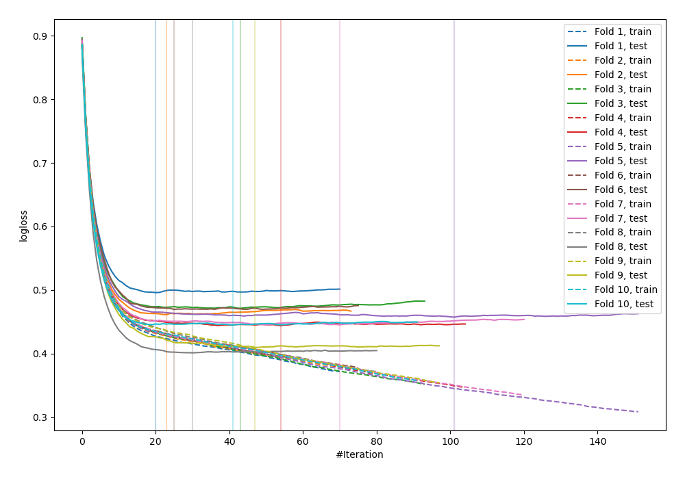
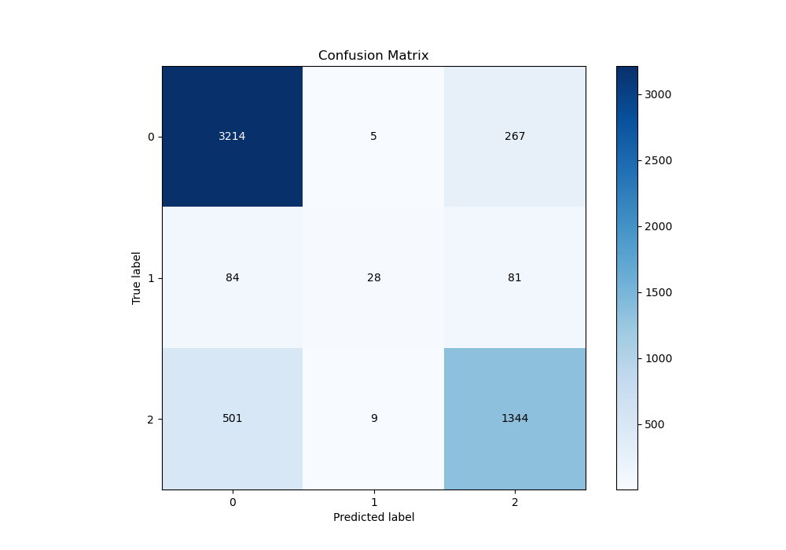
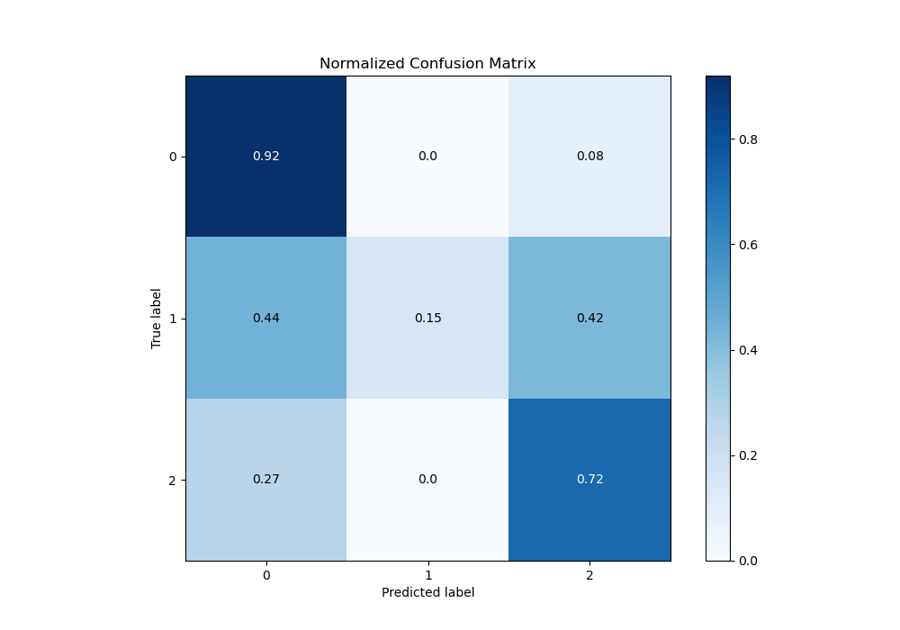
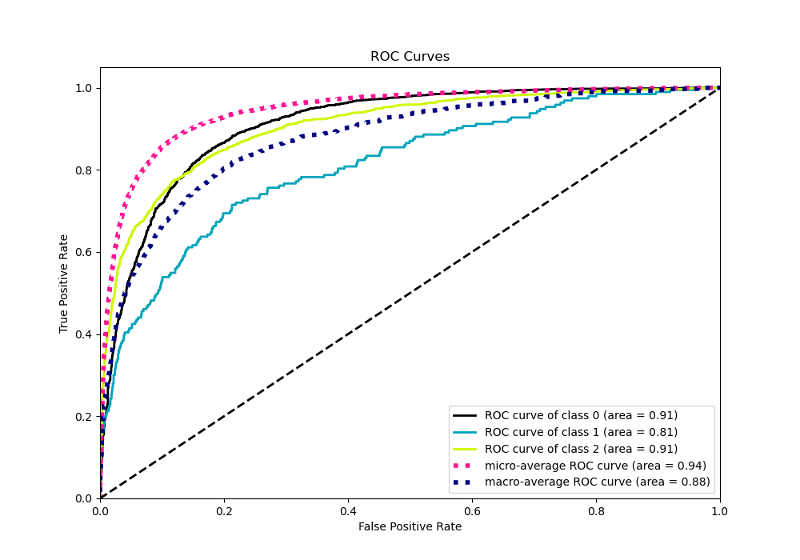
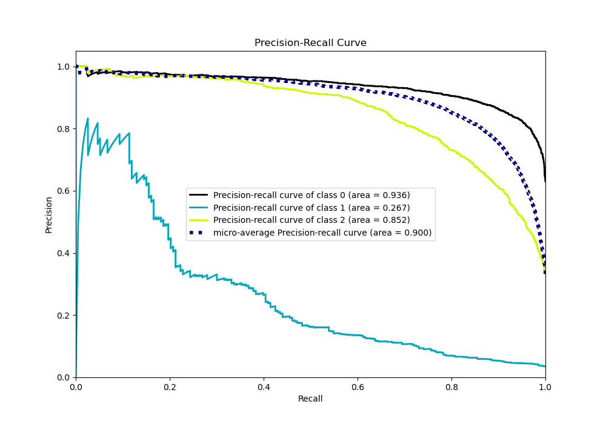

# Summary of 34_CatBoost_Stacked

[<< Go back](../README.md)

## CatBoost
- **n_jobs**: -1
- **learning_rate**: 0.2
- **depth**: 5
- **rsm**: 0.7
- **loss_function**: MultiClass
- **eval_metric**: MultiClass
- **num_class**: 3
- **explain_level**: 0

## Validation
 - **validation_type**: kfold
 - **shuffle**: True
 - **stratify**: True
 - **k_folds**: 10

## Optimized metric
logloss

## Training time

36.5 seconds

### Metric details
|           |           0 |          1 |           2 |   accuracy |   macro avg |   weighted avg |   logloss |
|:----------|------------:|-----------:|------------:|-----------:|------------:|---------------:|----------:|
| precision |    0.846012 |   0.666667 |    0.794326 |   0.828845 |    0.769002 |       0.822437 |   0.45004 |
| recall    |    0.921974 |   0.145078 |    0.724919 |   0.828845 |    0.597323 |       0.828845 |   0.45004 |
| f1-score  |    0.882361 |   0.238298 |    0.758037 |   0.828845 |    0.626232 |       0.818237 |   0.45004 |
| support   | 3486        | 193        | 1854        |   0.828845 | 5533        |    5533        |   0.45004 |

## Confusion matrix
|              |   Predicted as 0 |   Predicted as 1 |   Predicted as 2 |
|:-------------|-----------------:|-----------------:|-----------------:|
| Labeled as 0 |             3214 |                5 |              267 |
| Labeled as 1 |               84 |               28 |               81 |
| Labeled as 2 |              501 |                9 |             1344 |

## Learning curves

## Confusion Matrix

## Normalized Confusion Matrix

## ROC Curve

## Precision Recall Curve

[<< Go back](../README.md)
