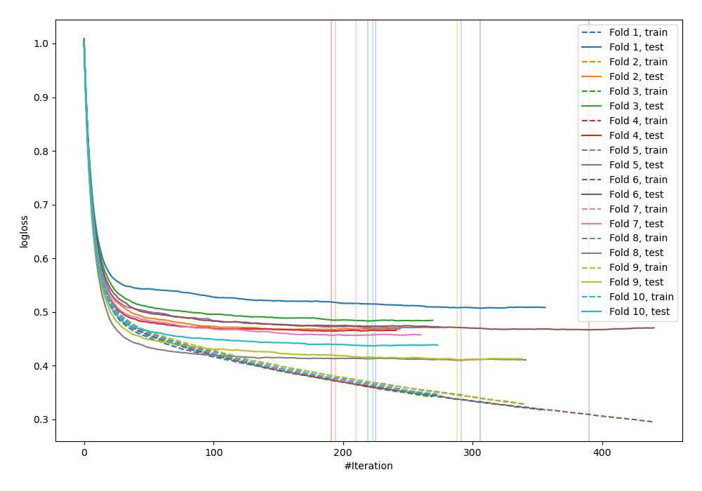
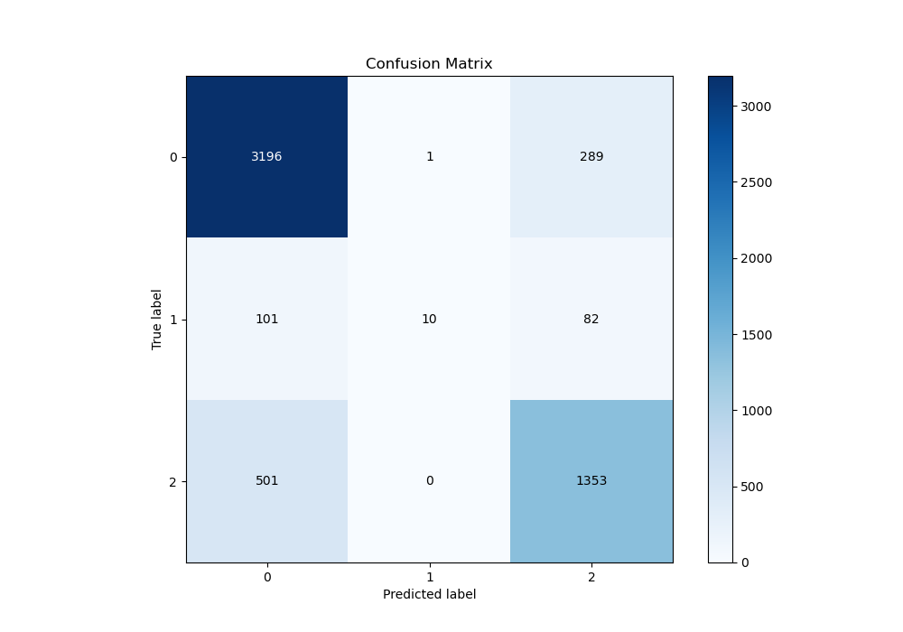
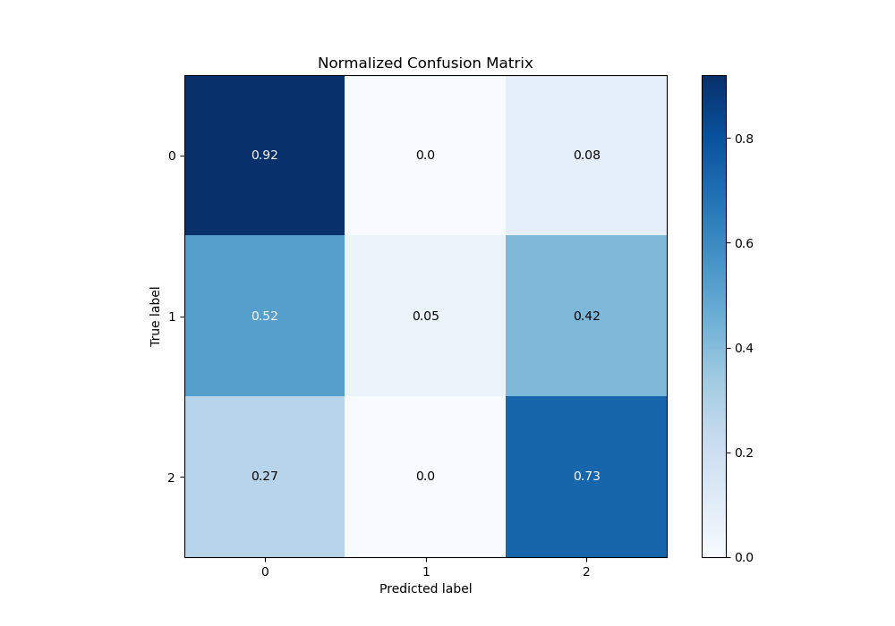
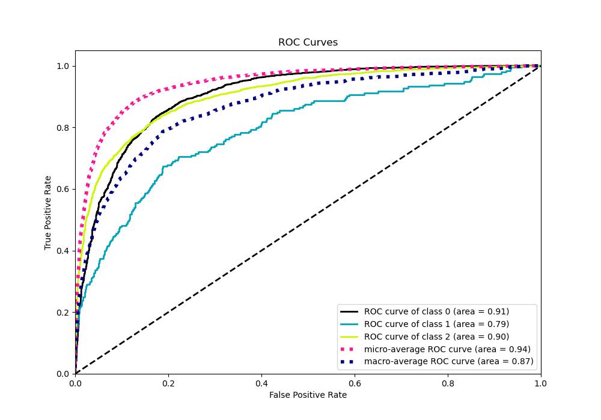
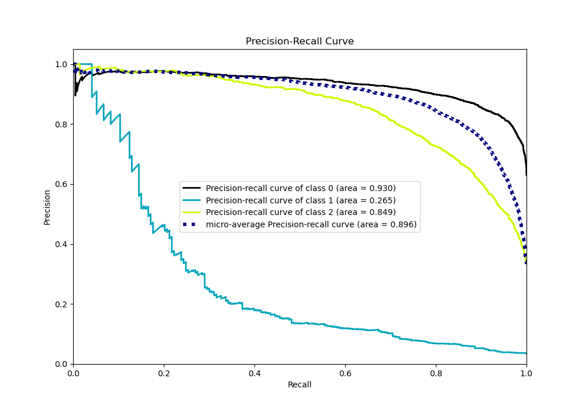

# Summary of 36_CatBoost

[<< Go back](../README.md)

## CatBoost
- **n_jobs**: -1
- **learning_rate**: 0.1
- **depth**: 5
- **rsm**: 0.7
- **loss_function**: MultiClass
- **eval_metric**: MultiClass
- **num_class**: 3
- **explain_level**: 0

## Validation
 - **validation_type**: kfold
 - **shuffle**: True
 - **stratify**: True
 - **k_folds**: 10

## Optimized metric
logloss

## Training time

14.0 seconds

### Metric details
|           |           0 |           1 |           2 |   accuracy |   macro avg |   weighted avg |   logloss |
|:----------|------------:|------------:|------------:|-----------:|------------:|---------------:|----------:|
| precision |    0.841496 |   0.909091  |    0.784803 |   0.823965 |    0.84513  |       0.824857 |  0.457327 |
| recall    |    0.91681  |   0.0518135 |    0.729773 |   0.823965 |    0.566132 |       0.823965 |  0.457327 |
| f1-score  |    0.87754  |   0.0980392 |    0.756288 |   0.823965 |    0.577289 |       0.809721 |  0.457327 |
| support   | 3486        | 193         | 1854        |   0.823965 | 5533        |    5533        |  0.457327 |

## Confusion matrix
|              |   Predicted as 0 |   Predicted as 1 |   Predicted as 2 |
|:-------------|-----------------:|-----------------:|-----------------:|
| Labeled as 0 |             3196 |                1 |              289 |
| Labeled as 1 |              101 |               10 |               82 |
| Labeled as 2 |              501 |                0 |             1353 |

## Learning curves

## Confusion Matrix

## Normalized Confusion Matrix

## ROC Curve

## Precision Recall Curve

[<< Go back](../README.md)
