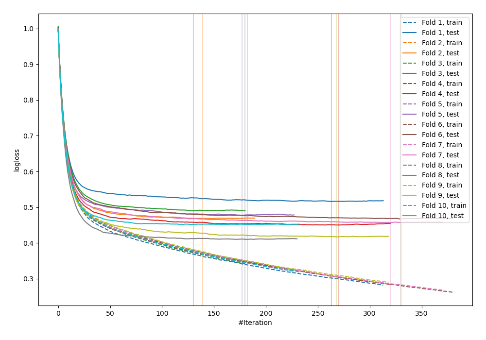
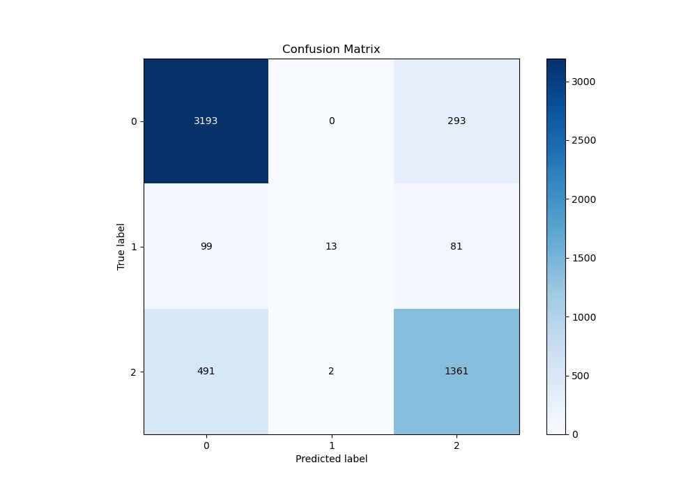
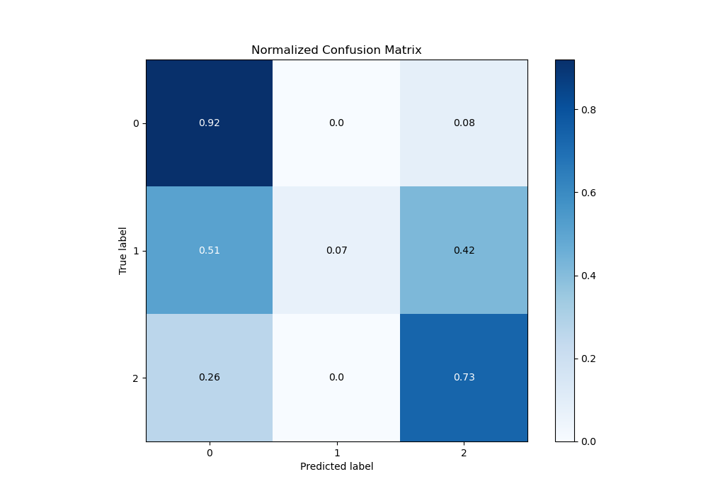
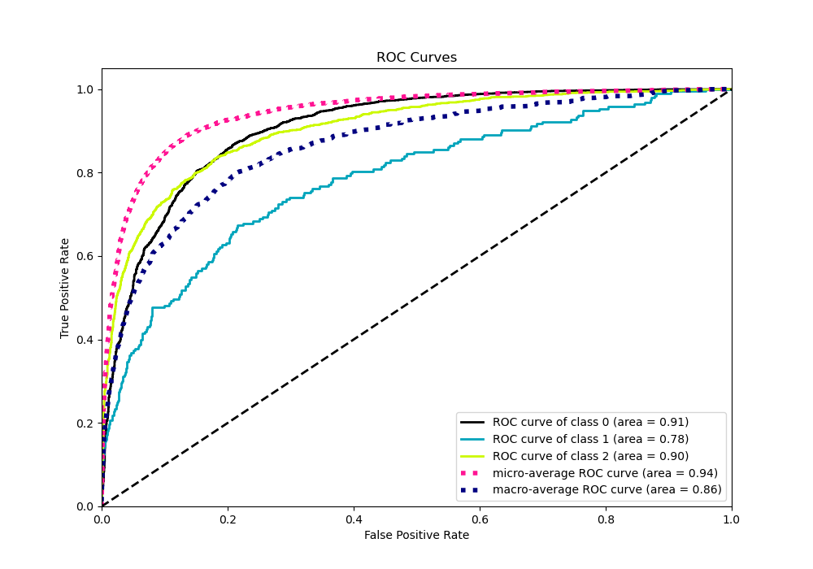
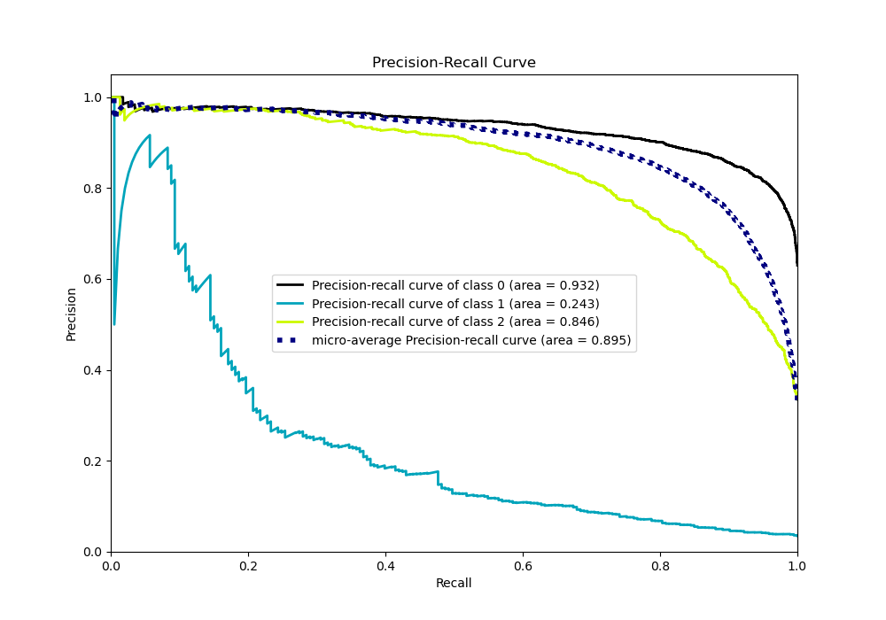

# Summary of 38_CatBoost

[<< Go back](../README.md)

## CatBoost
- **n_jobs**: -1
- **learning_rate**: 0.1
- **depth**: 6
- **rsm**: 0.9
- **loss_function**: MultiClass
- **eval_metric**: MultiClass
- **num_class**: 3
- **explain_level**: 0

## Validation
 - **validation_type**: kfold
 - **shuffle**: True
 - **stratify**: True
 - **k_folds**: 10

## Optimized metric
logloss

## Training time

17.1 seconds

### Metric details
|           |           0 |           1 |           2 |   accuracy |   macro avg |   weighted avg |   logloss |
|:----------|------------:|------------:|------------:|-----------:|------------:|---------------:|----------:|
| precision |    0.844039 |   0.866667  |    0.784438 |   0.825411 |    0.831715 |       0.824857 |  0.460473 |
| recall    |    0.91595  |   0.0673575 |    0.734088 |   0.825411 |    0.572465 |       0.825411 |  0.460473 |
| f1-score  |    0.878525 |   0.125     |    0.758429 |   0.825411 |    0.587318 |       0.811999 |  0.460473 |
| support   | 3486        | 193         | 1854        |   0.825411 | 5533        |    5533        |  0.460473 |

## Confusion matrix
|              |   Predicted as 0 |   Predicted as 1 |   Predicted as 2 |
|:-------------|-----------------:|-----------------:|-----------------:|
| Labeled as 0 |             3193 |                0 |              293 |
| Labeled as 1 |               99 |               13 |               81 |
| Labeled as 2 |              491 |                2 |             1361 |

## Learning curves

## Confusion Matrix

## Normalized Confusion Matrix

## ROC Curve

## Precision Recall Curve

[<< Go back](../README.md)
