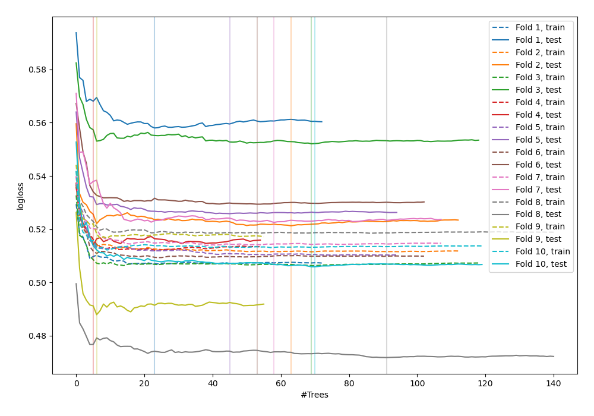
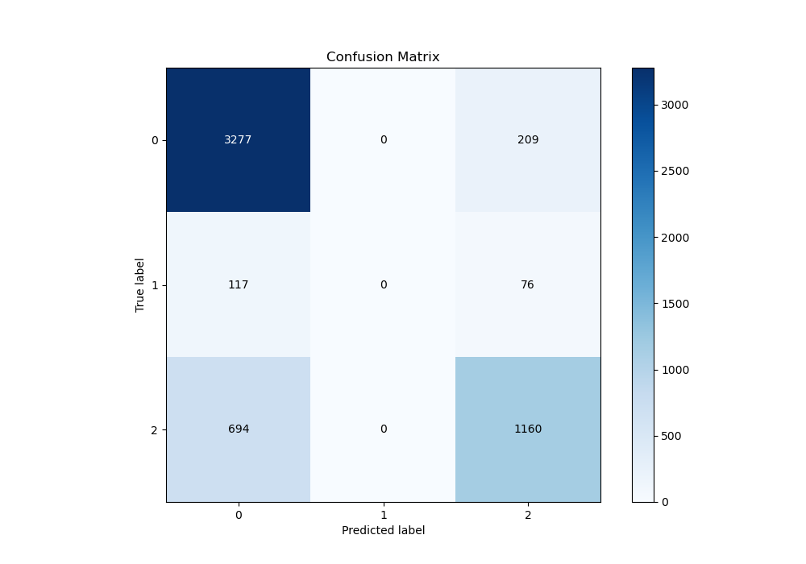
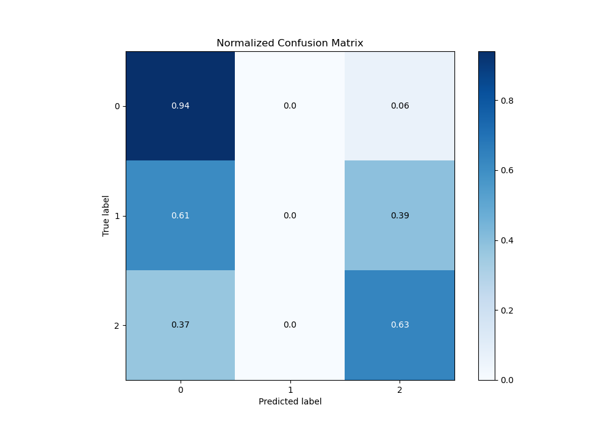
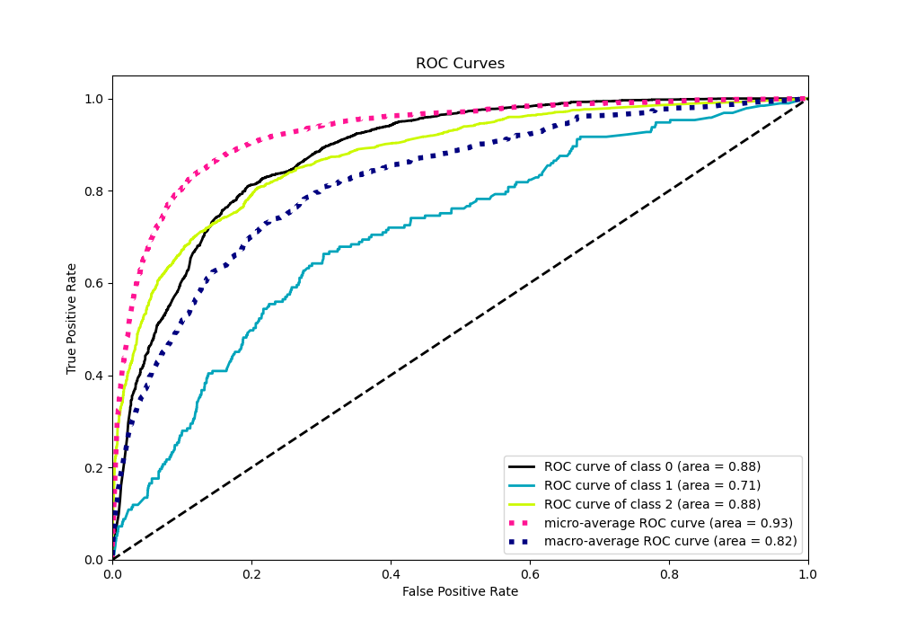
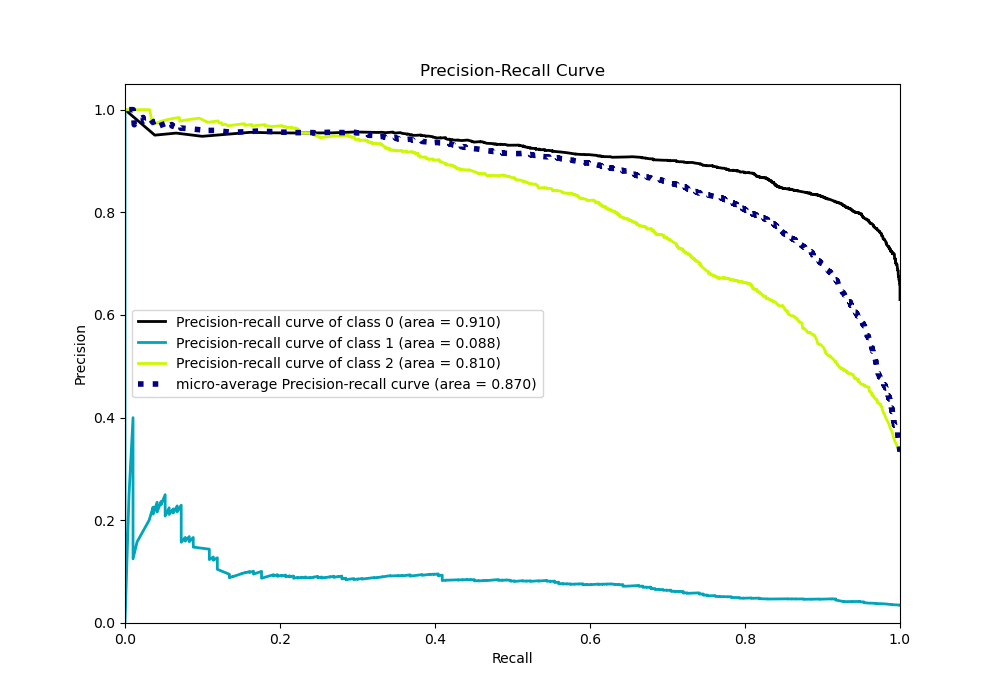

# Summary of 41_RandomForest

[<< Go back](../README.md)

## Random Forest
- **n_jobs**: -1
- **criterion**: gini
- **max_features**: 0.8
- **min_samples_split**: 40
- **max_depth**: 3
- **eval_metric_name**: logloss
- **num_class**: 3
- **explain_level**: 0

## Validation
 - **validation_type**: kfold
 - **shuffle**: True
 - **stratify**: True
 - **k_folds**: 10

## Optimized metric
logloss

## Training time

12.9 seconds

### Metric details
|           |           0 |   1 |           2 |   accuracy |   macro avg |   weighted avg |   logloss |
|:----------|------------:|----:|------------:|-----------:|------------:|---------------:|----------:|
| precision |    0.801614 |   0 |    0.802768 |   0.801916 |    0.534794 |       0.774039 |  0.518895 |
| recall    |    0.940046 |   0 |    0.625674 |   0.801916 |    0.521907 |       0.801916 |  0.518895 |
| f1-score  |    0.865329 |   0 |    0.703243 |   0.801916 |    0.522857 |       0.780833 |  0.518895 |
| support   | 3486        | 193 | 1854        |   0.801916 | 5533        |    5533        |  0.518895 |

## Confusion matrix
|              |   Predicted as 0 |   Predicted as 1 |   Predicted as 2 |
|:-------------|-----------------:|-----------------:|-----------------:|
| Labeled as 0 |             3277 |                0 |              209 |
| Labeled as 1 |              117 |                0 |               76 |
| Labeled as 2 |              694 |                0 |             1160 |

## Learning curves

## Confusion Matrix

## Normalized Confusion Matrix

## ROC Curve

## Precision Recall Curve

[<< Go back](../README.md)
