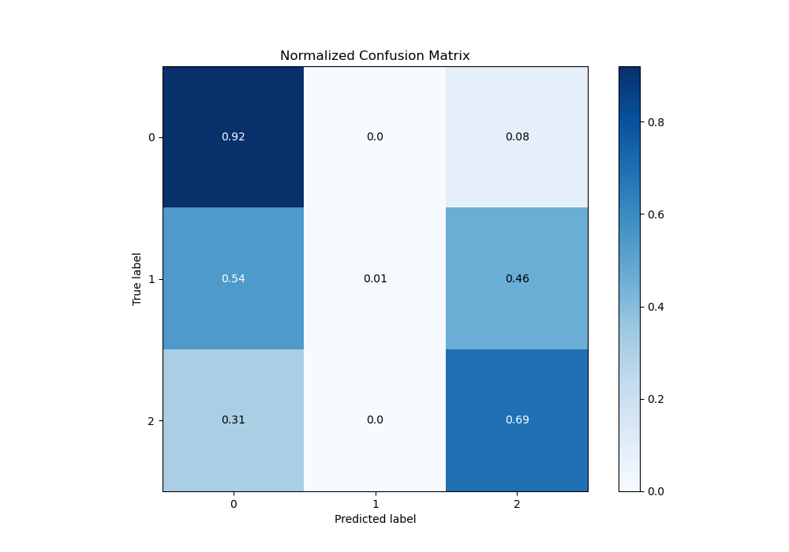

# Summary of 44_RandomForest

[<< Go back](../README.md)

## Random Forest
- **n_jobs**: -1
- **criterion**: gini
- **max_features**: 1.0
- **min_samples_split**: 40
- **max_depth**: 7
- **eval_metric_name**: logloss
- **num_class**: 3
- **explain_level**: 0

## Validation
 - **validation_type**: kfold
 - **shuffle**: True
 - **stratify**: True
 - **k_folds**: 10

## Optimized metric
logloss

## Training time

18.7 seconds

### Metric details
|           |           0 |            1 |           2 |   accuracy |   macro avg |   weighted avg |   logloss |
|:----------|------------:|-------------:|------------:|-----------:|------------:|---------------:|----------:|
| precision |    0.827719 |   1          |    0.783932 |   0.814748 |    0.87055  |       0.819056 |  0.486692 |
| recall    |    0.923408 |   0.00518135 |    0.694714 |   0.814748 |    0.541101 |       0.814748 |  0.486692 |
| f1-score  |    0.872949 |   0.0103093  |    0.736631 |   0.814748 |    0.539963 |       0.797181 |  0.486692 |
| support   | 3486        | 193          | 1854        |   0.814748 | 5533        |    5533        |  0.486692 |

## Confusion matrix
|              |   Predicted as 0 |   Predicted as 1 |   Predicted as 2 |
|:-------------|-----------------:|-----------------:|-----------------:|
| Labeled as 0 |             3219 |                0 |              267 |
| Labeled as 1 |              104 |                1 |               88 |
| Labeled as 2 |              566 |                0 |             1288 |

## Learning curves

## Confusion Matrix

## Normalized Confusion Matrix

## ROC Curve

## Precision Recall Curve

[<< Go back](../README.md)
