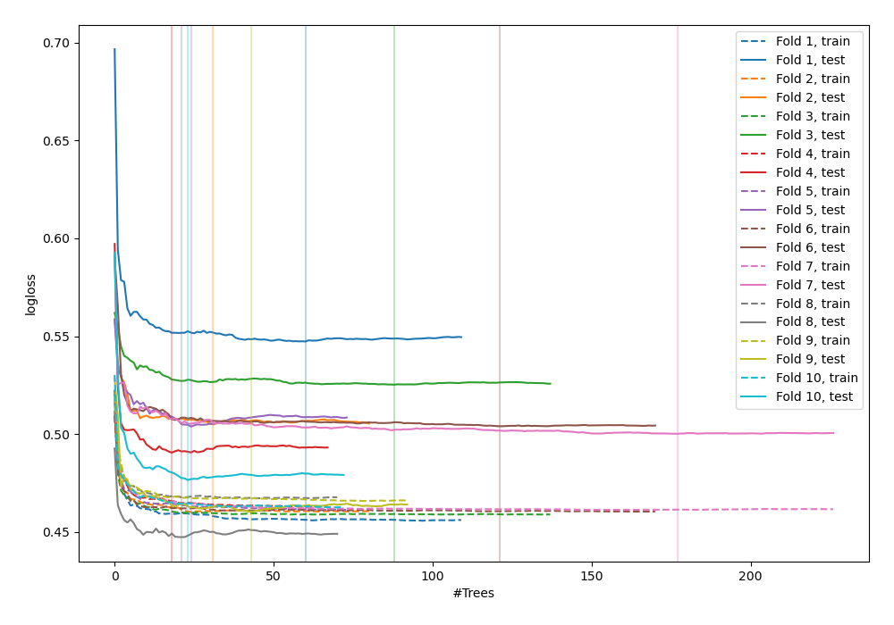
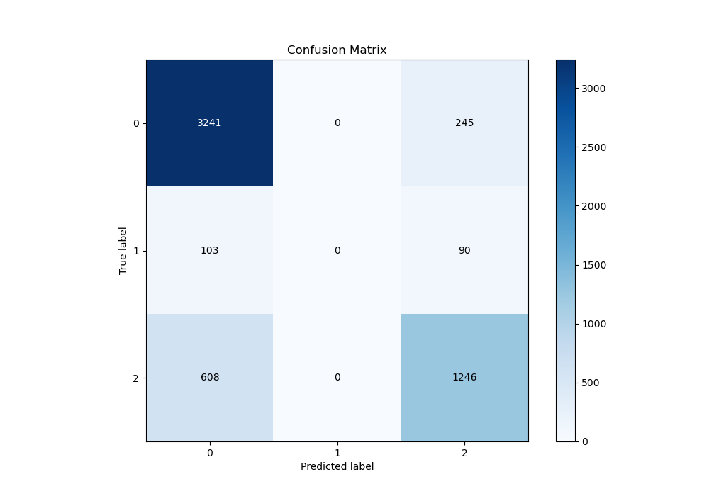
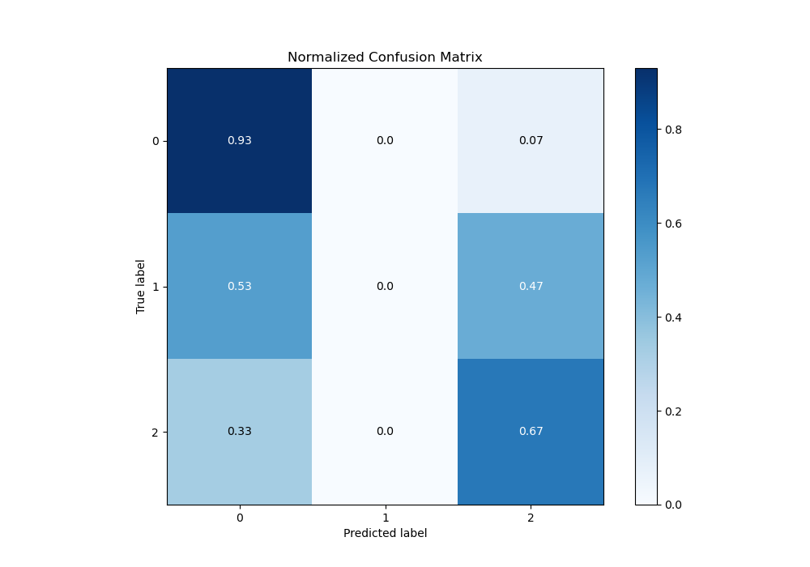
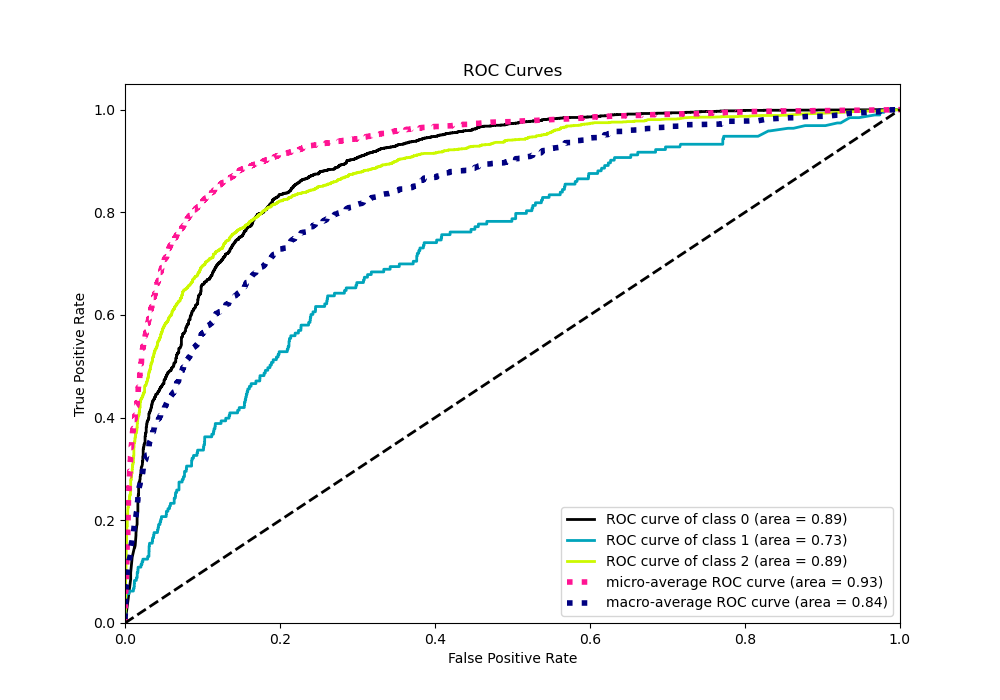
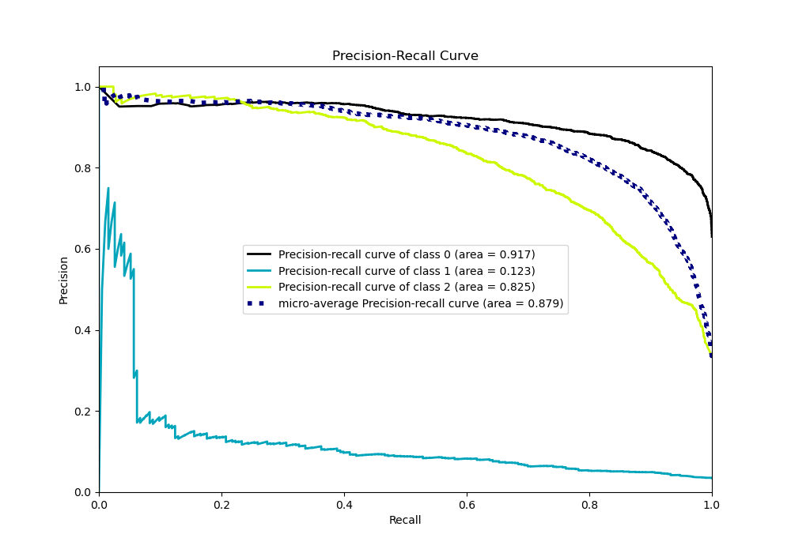

# Summary of 45_RandomForest

[<< Go back](../README.md)

## Random Forest
- **n_jobs**: -1
- **criterion**: gini
- **max_features**: 0.9
- **min_samples_split**: 40
- **max_depth**: 5
- **eval_metric_name**: logloss
- **num_class**: 3
- **explain_level**: 0

## Validation
 - **validation_type**: kfold
 - **shuffle**: True
 - **stratify**: True
 - **k_folds**: 10

## Optimized metric
logloss

## Training time

15.4 seconds

### Metric details
|           |           0 |   1 |           2 |   accuracy |   macro avg |   weighted avg |   logloss |
|:----------|------------:|----:|------------:|-----------:|------------:|---------------:|----------:|
| precision |    0.820091 |   0 |    0.788109 |   0.810952 |    0.536067 |       0.780768 |   0.49597 |
| recall    |    0.929719 |   0 |    0.67206  |   0.810952 |    0.533926 |       0.810952 |   0.49597 |
| f1-score  |    0.871471 |   0 |    0.725473 |   0.810952 |    0.532315 |       0.792152 |   0.49597 |
| support   | 3486        | 193 | 1854        |   0.810952 | 5533        |    5533        |   0.49597 |

## Confusion matrix
|              |   Predicted as 0 |   Predicted as 1 |   Predicted as 2 |
|:-------------|-----------------:|-----------------:|-----------------:|
| Labeled as 0 |             3241 |                0 |              245 |
| Labeled as 1 |              103 |                0 |               90 |
| Labeled as 2 |              608 |                0 |             1246 |

## Learning curves

## Confusion Matrix

## Normalized Confusion Matrix

## ROC Curve

## Precision Recall Curve

[<< Go back](../README.md)
