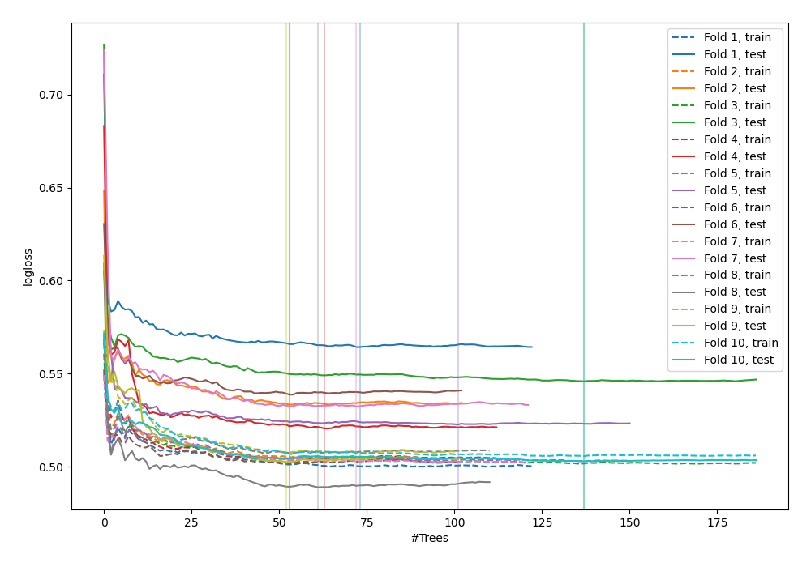
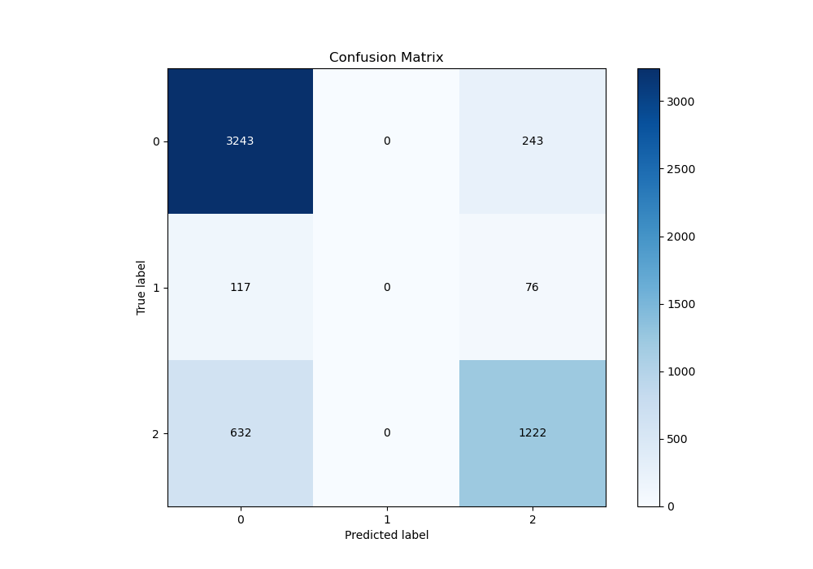
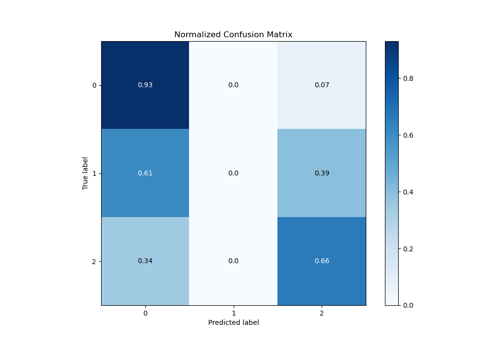
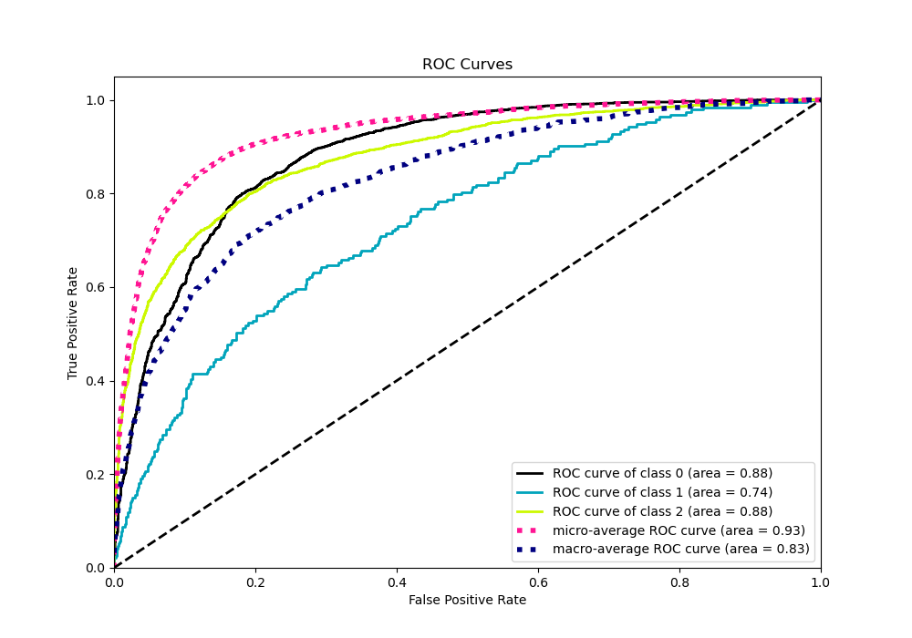
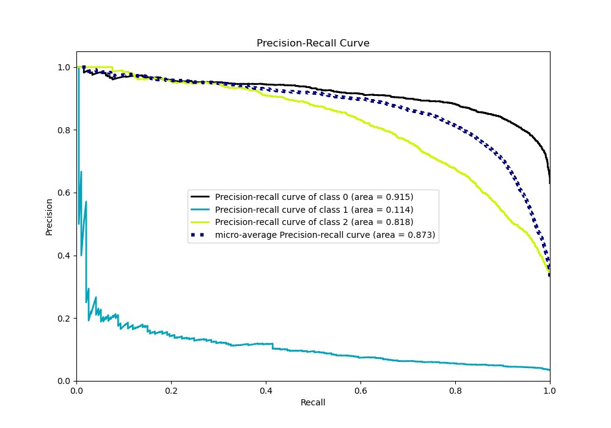

# Summary of 51_ExtraTrees

[<< Go back](../README.md)

## Extra Trees Classifier (Extra Trees)
- **n_jobs**: -1
- **criterion**: entropy
- **max_features**: 0.6
- **min_samples_split**: 50
- **max_depth**: 6
- **eval_metric_name**: logloss
- **num_class**: 3
- **explain_level**: 0

## Validation
 - **validation_type**: kfold
 - **shuffle**: True
 - **stratify**: True
 - **k_folds**: 10

## Optimized metric
logloss

## Training time

14.9 seconds

### Metric details
|           |           0 |   1 |           2 |   accuracy |   macro avg |   weighted avg |   logloss |
|:----------|------------:|----:|------------:|-----------:|------------:|---------------:|----------:|
| precision |    0.812375 |   0 |    0.792992 |   0.806976 |    0.535122 |       0.777543 |  0.525199 |
| recall    |    0.930293 |   0 |    0.659115 |   0.806976 |    0.529803 |       0.806976 |  0.525199 |
| f1-score  |    0.867344 |   0 |    0.719882 |   0.806976 |    0.529075 |       0.787678 |  0.525199 |
| support   | 3486        | 193 | 1854        |   0.806976 | 5533        |    5533        |  0.525199 |

## Confusion matrix
|              |   Predicted as 0 |   Predicted as 1 |   Predicted as 2 |
|:-------------|-----------------:|-----------------:|-----------------:|
| Labeled as 0 |             3243 |                0 |              243 |
| Labeled as 1 |              117 |                0 |               76 |
| Labeled as 2 |              632 |                0 |             1222 |

## Learning curves

## Confusion Matrix

## Normalized Confusion Matrix

## ROC Curve

## Precision Recall Curve

[<< Go back](../README.md)
