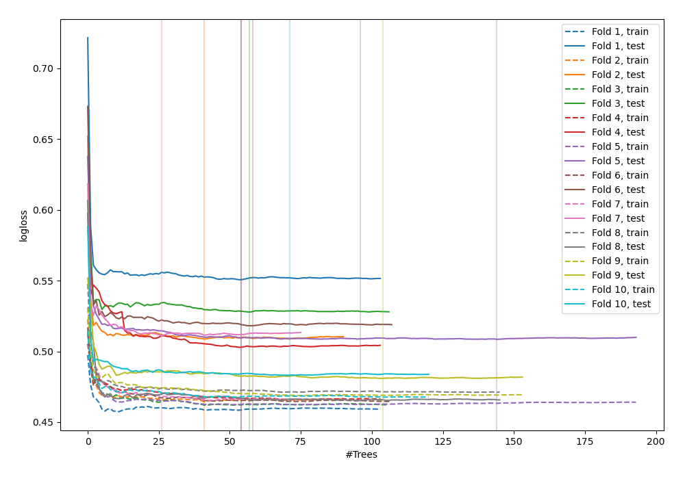
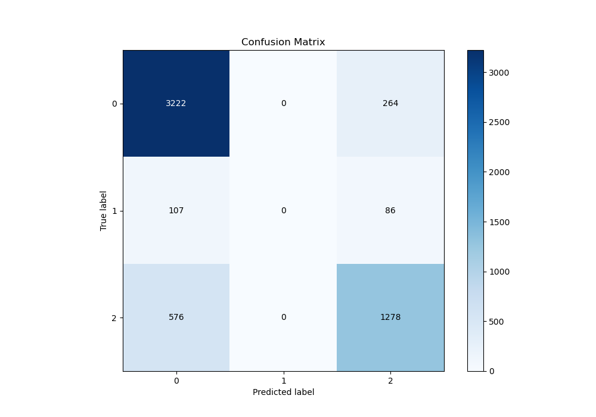
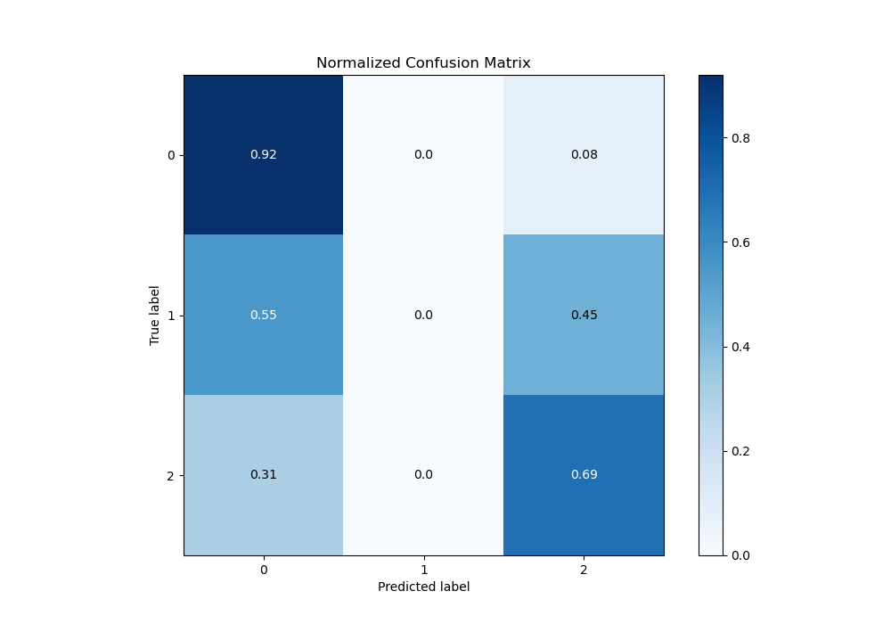
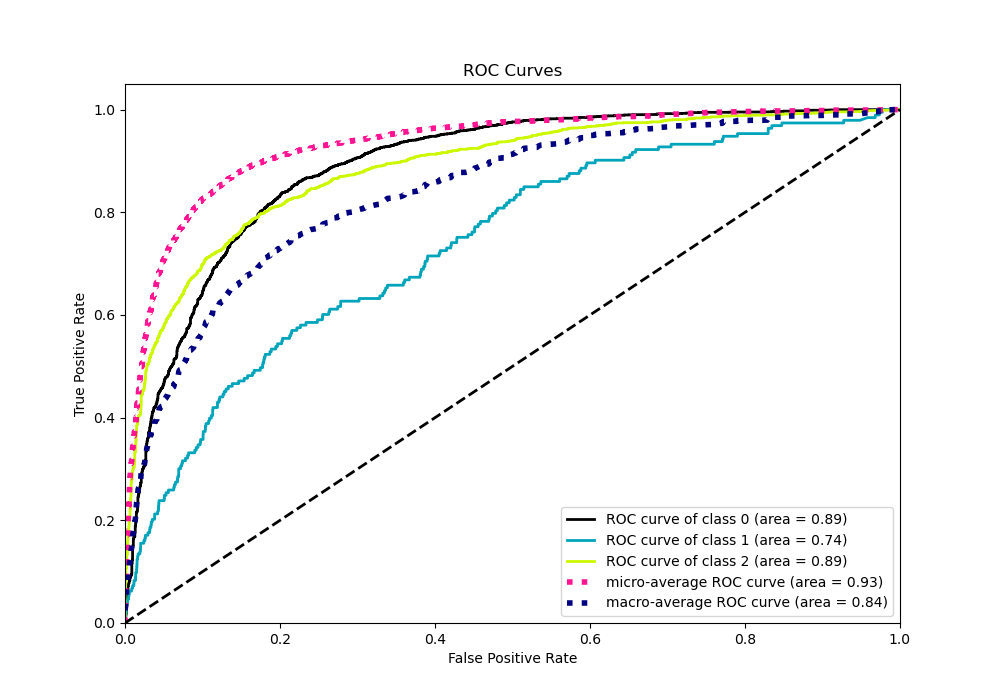
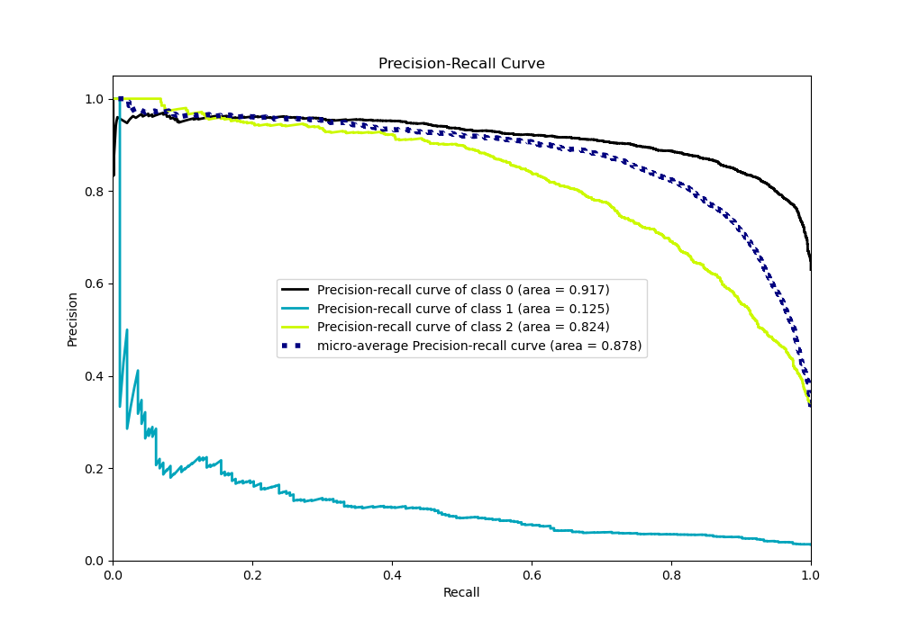

# Summary of 53_ExtraTrees

[<< Go back](../README.md)

## Extra Trees Classifier (Extra Trees)
- **n_jobs**: -1
- **criterion**: gini
- **max_features**: 1.0
- **min_samples_split**: 40
- **max_depth**: 7
- **eval_metric_name**: logloss
- **num_class**: 3
- **explain_level**: 0

## Validation
 - **validation_type**: kfold
 - **shuffle**: True
 - **stratify**: True
 - **k_folds**: 10

## Optimized metric
logloss

## Training time

15.2 seconds

### Metric details
|           |           0 |   1 |           2 |   accuracy |   macro avg |   weighted avg |   logloss |
|:----------|------------:|----:|------------:|-----------:|------------:|---------------:|----------:|
| precision |    0.825096 |   0 |    0.785012 |   0.813302 |    0.536703 |       0.782884 |  0.505747 |
| recall    |    0.924269 |   0 |    0.68932  |   0.813302 |    0.537863 |       0.813302 |  0.505747 |
| f1-score  |    0.871871 |   0 |    0.734061 |   0.813302 |    0.535311 |       0.795281 |  0.505747 |
| support   | 3486        | 193 | 1854        |   0.813302 | 5533        |    5533        |  0.505747 |

## Confusion matrix
|              |   Predicted as 0 |   Predicted as 1 |   Predicted as 2 |
|:-------------|-----------------:|-----------------:|-----------------:|
| Labeled as 0 |             3222 |                0 |              264 |
| Labeled as 1 |              107 |                0 |               86 |
| Labeled as 2 |              576 |                0 |             1278 |

## Learning curves

## Confusion Matrix

## Normalized Confusion Matrix

## ROC Curve

## Precision Recall Curve

[<< Go back](../README.md)
