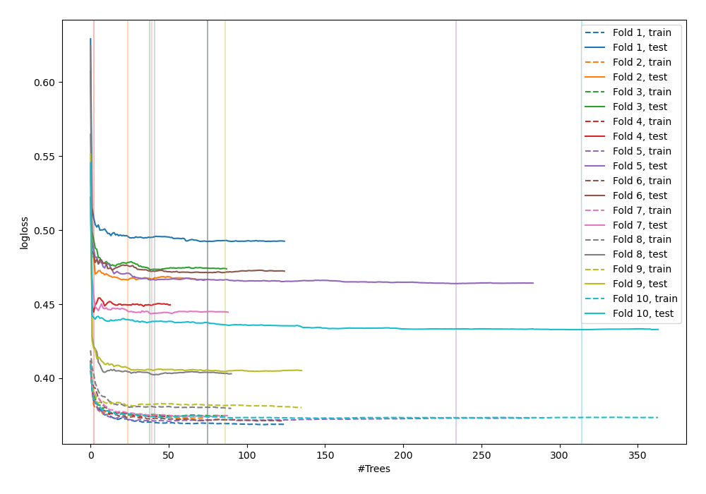
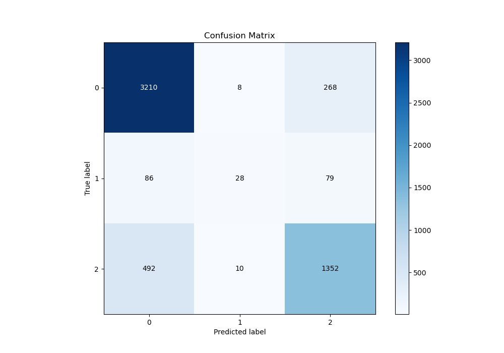
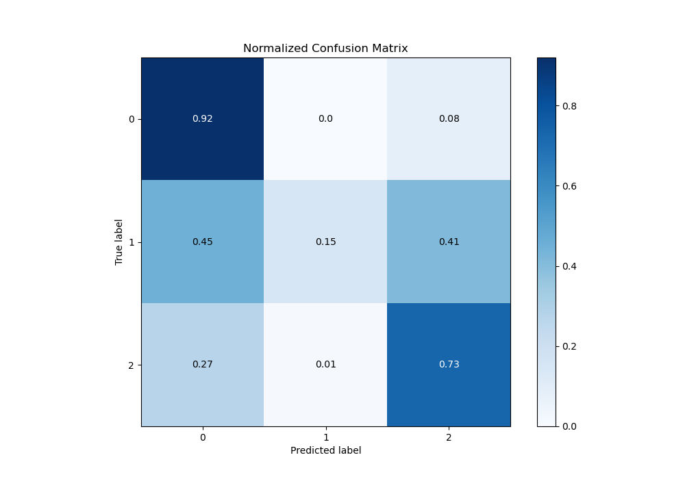
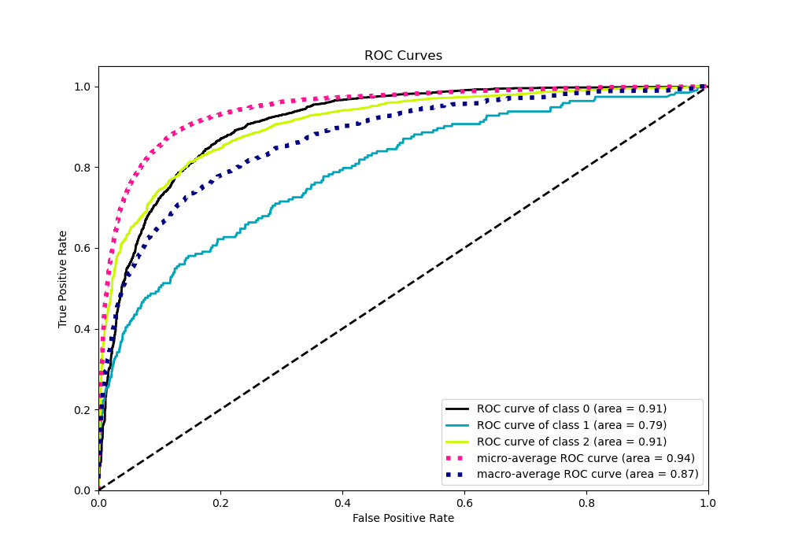
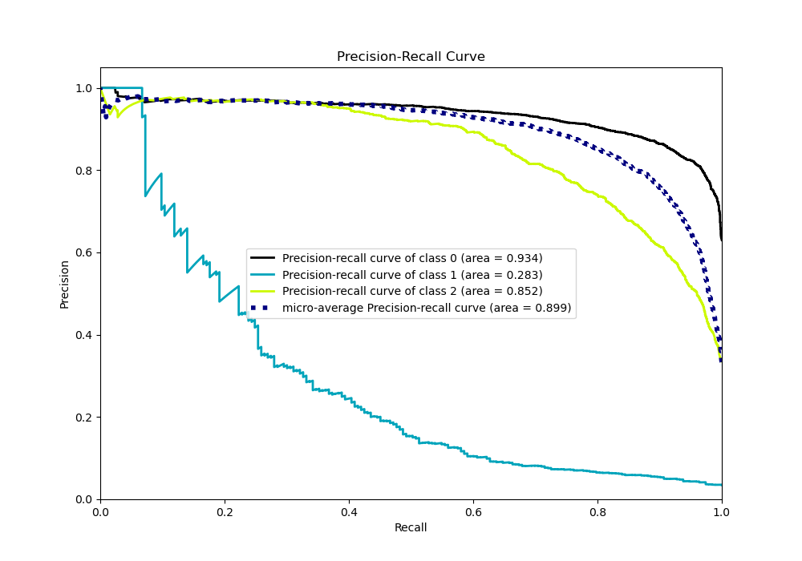

# Summary of 53_ExtraTrees_SelectedFeatures_Stacked

[<< Go back](../README.md)

## Extra Trees Classifier (Extra Trees)
- **n_jobs**: -1
- **criterion**: gini
- **max_features**: 1.0
- **min_samples_split**: 40
- **max_depth**: 7
- **eval_metric_name**: logloss
- **num_class**: 3
- **explain_level**: 0

## Validation
 - **validation_type**: kfold
 - **shuffle**: True
 - **stratify**: True
 - **k_folds**: 10

## Optimized metric
logloss

## Training time

71.3 seconds

### Metric details
|           |           0 |          1 |           2 |   accuracy |   macro avg |   weighted avg |   logloss |
|:----------|------------:|-----------:|------------:|-----------:|------------:|---------------:|----------:|
| precision |    0.847413 |   0.608696 |    0.795762 |   0.829568 |    0.750624 |       0.821779 |  0.449535 |
| recall    |    0.920826 |   0.145078 |    0.729234 |   0.829568 |    0.598379 |       0.829568 |  0.449535 |
| f1-score  |    0.882596 |   0.23431  |    0.761047 |   0.829568 |    0.625984 |       0.819254 |  0.449535 |
| support   | 3486        | 193        | 1854        |   0.829568 | 5533        |    5533        |  0.449535 |

## Confusion matrix
|              |   Predicted as 0 |   Predicted as 1 |   Predicted as 2 |
|:-------------|-----------------:|-----------------:|-----------------:|
| Labeled as 0 |             3210 |                8 |              268 |
| Labeled as 1 |               86 |               28 |               79 |
| Labeled as 2 |              492 |               10 |             1352 |

## Learning curves

## Confusion Matrix

## Normalized Confusion Matrix

## ROC Curve

## Precision Recall Curve

[<< Go back](../README.md)
