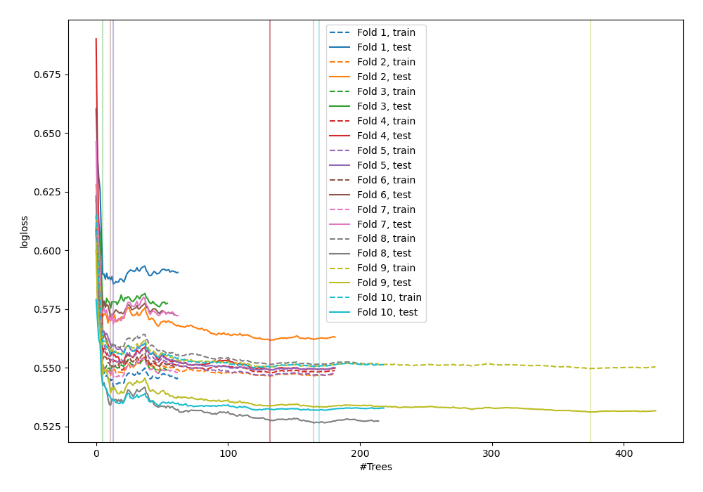
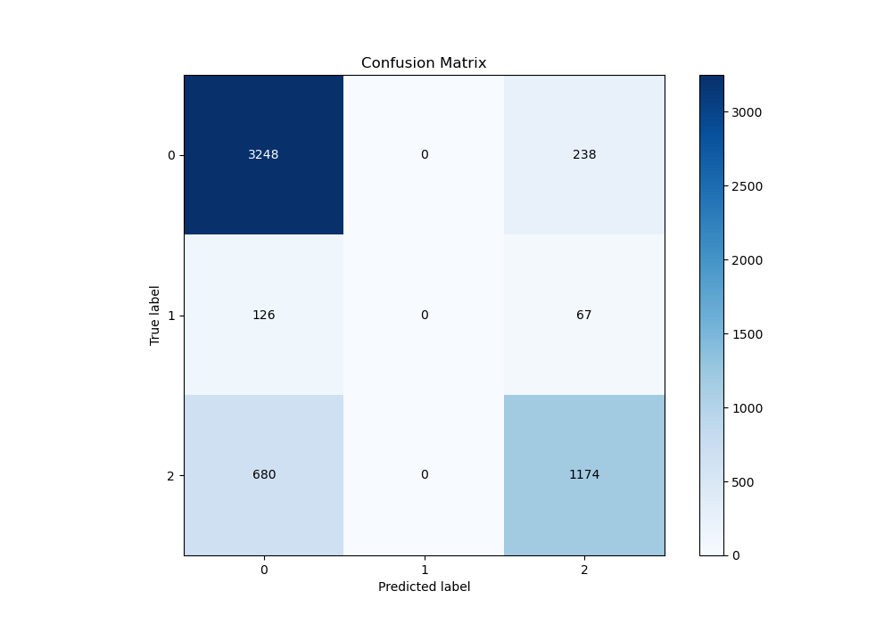
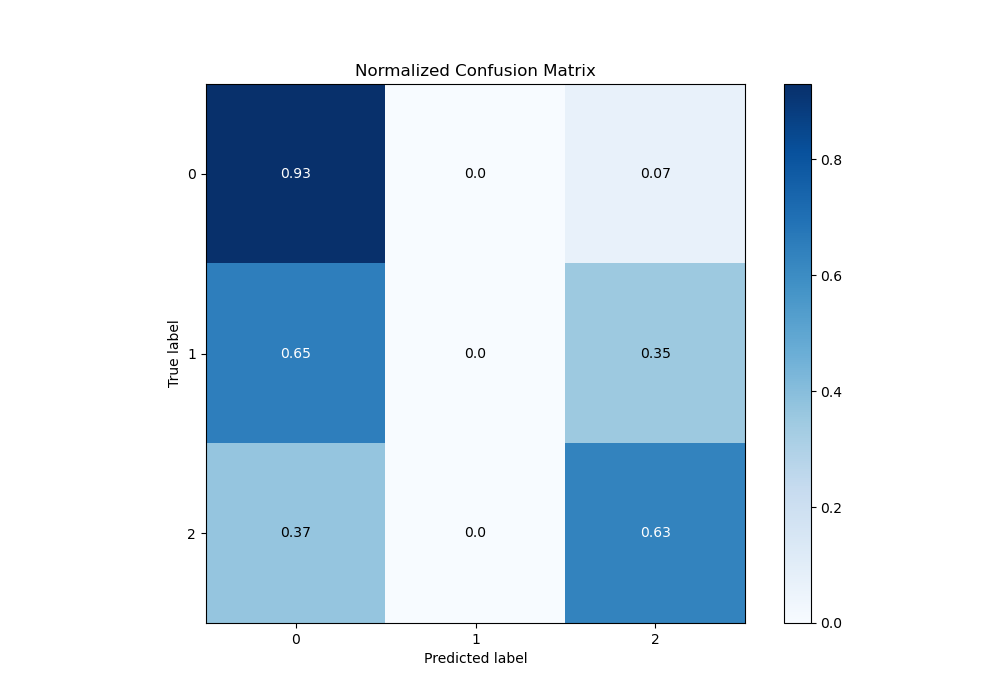
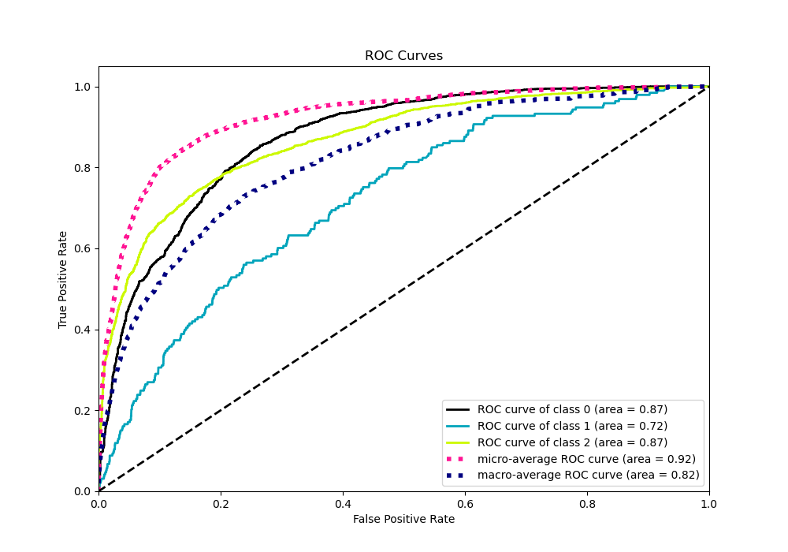
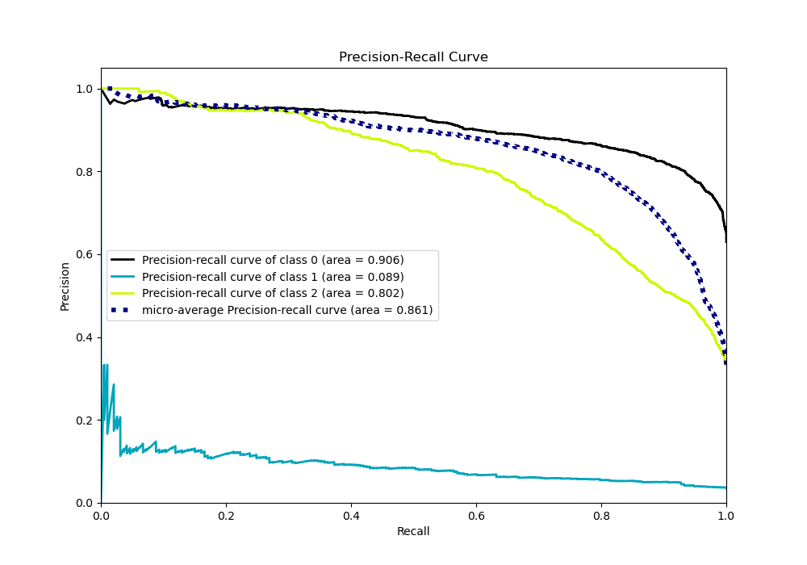

# Summary of 55_ExtraTrees

[<< Go back](../README.md)

## Extra Trees Classifier (Extra Trees)
- **n_jobs**: -1
- **criterion**: gini
- **max_features**: 0.6
- **min_samples_split**: 20
- **max_depth**: 4
- **eval_metric_name**: logloss
- **num_class**: 3
- **explain_level**: 0

## Validation
 - **validation_type**: kfold
 - **shuffle**: True
 - **stratify**: True
 - **k_folds**: 10

## Optimized metric
logloss

## Training time

18.7 seconds

### Metric details
|           |           0 |   1 |           2 |   accuracy |   macro avg |   weighted avg |   logloss |
|:----------|------------:|----:|------------:|-----------:|------------:|---------------:|----------:|
| precision |    0.801184 |   0 |    0.79378  |   0.799205 |    0.531655 |       0.770756 |  0.554967 |
| recall    |    0.931727 |   0 |    0.633225 |   0.799205 |    0.521651 |       0.799205 |  0.554967 |
| f1-score  |    0.861538 |   0 |    0.70447  |   0.799205 |    0.522003 |       0.778856 |  0.554967 |
| support   | 3486        | 193 | 1854        |   0.799205 | 5533        |    5533        |  0.554967 |

## Confusion matrix
|              |   Predicted as 0 |   Predicted as 1 |   Predicted as 2 |
|:-------------|-----------------:|-----------------:|-----------------:|
| Labeled as 0 |             3248 |                0 |              238 |
| Labeled as 1 |              126 |                0 |               67 |
| Labeled as 2 |              680 |                0 |             1174 |

## Learning curves

## Confusion Matrix

## Normalized Confusion Matrix

## ROC Curve

## Precision Recall Curve

[<< Go back](../README.md)
