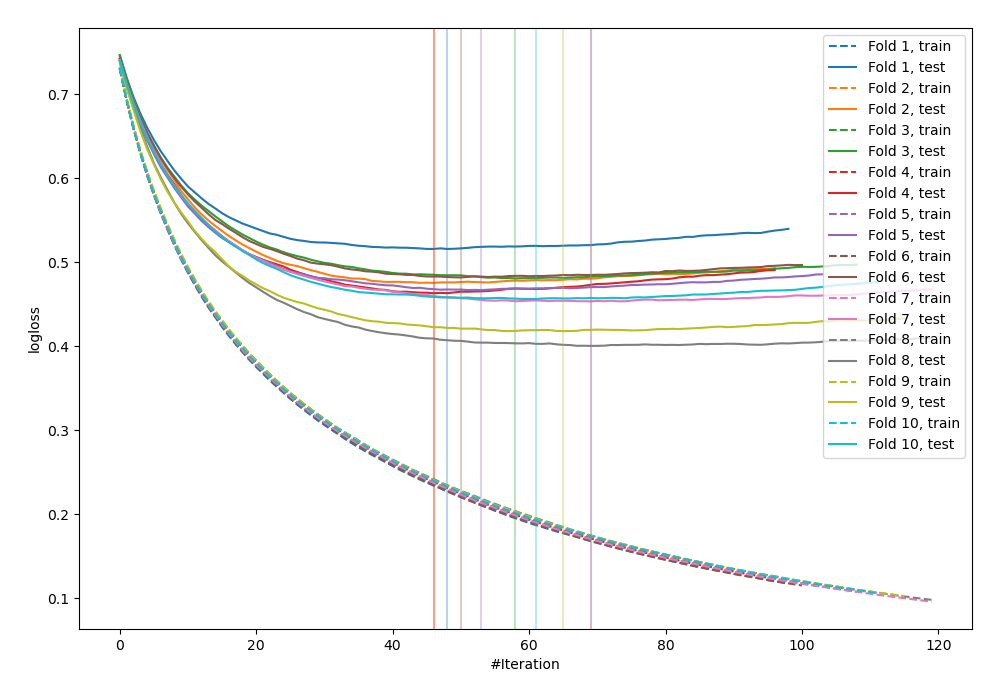
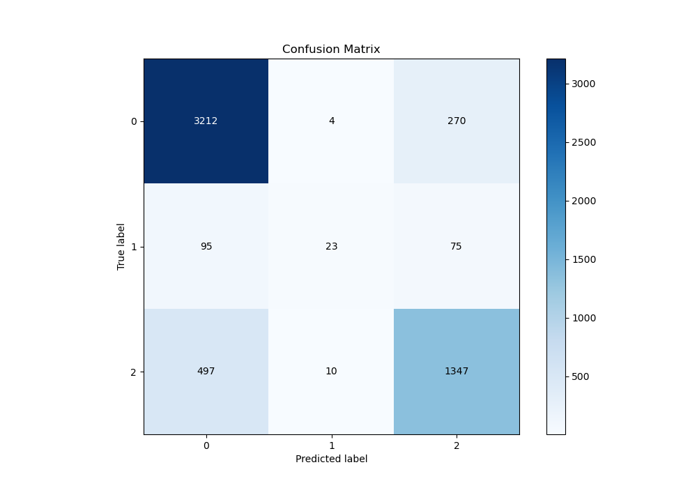
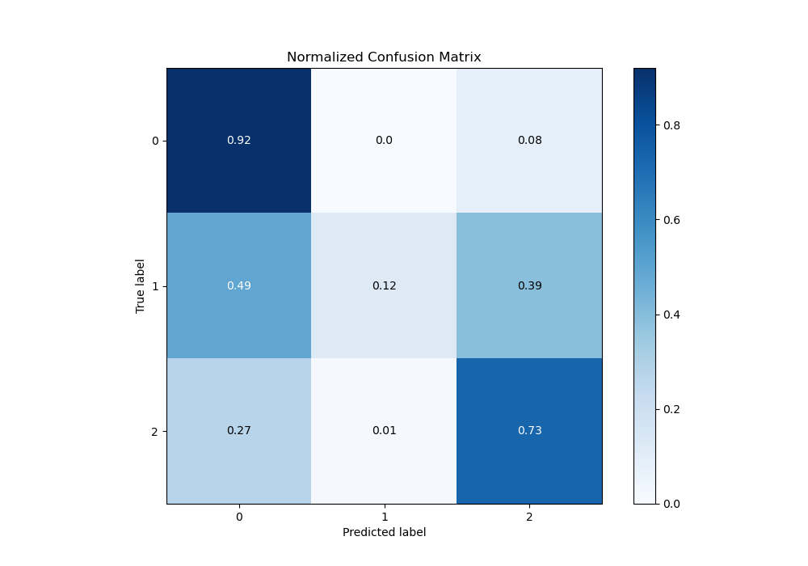
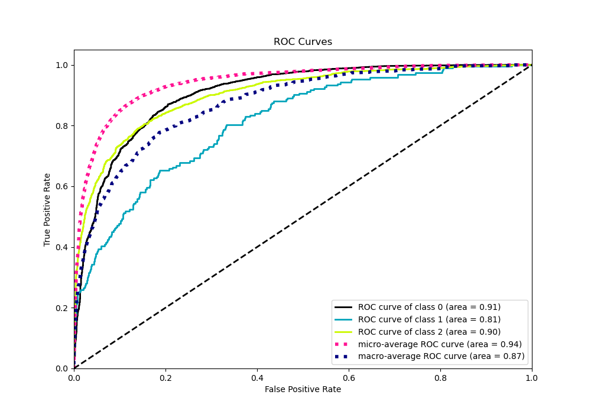
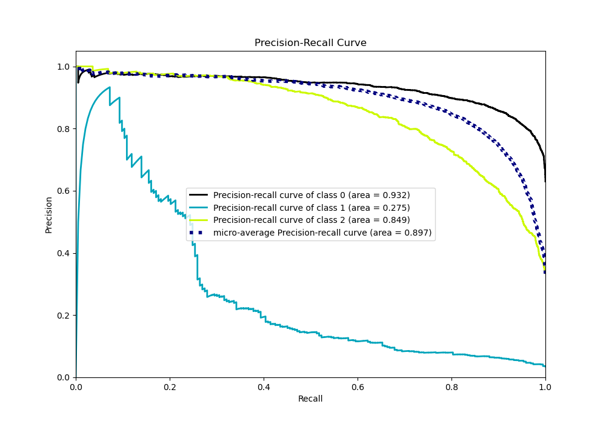

# Summary of 5_Default_LightGBM

[<< Go back](../README.md)

## LightGBM
- **n_jobs**: -1
- **objective**: multiclass
- **num_leaves**: 63
- **learning_rate**: 0.05
- **feature_fraction**: 0.9
- **bagging_fraction**: 0.9
- **min_data_in_leaf**: 10
- **metric**: multi_logloss
- **custom_eval_metric_name**: None
- **num_class**: 3
- **explain_level**: 0

## Validation
 - **validation_type**: kfold
 - **shuffle**: True
 - **stratify**: True
 - **k_folds**: 10

## Optimized metric
logloss

## Training time

9.8 seconds

### Metric details
|           |           0 |          1 |           2 |   accuracy |   macro avg |   weighted avg |   logloss |
|:----------|------------:|-----------:|------------:|-----------:|------------:|---------------:|----------:|
| precision |    0.844374 |   0.621622 |    0.796099 |   0.828122 |    0.754032 |       0.820428 |  0.461241 |
| recall    |    0.9214   |   0.119171 |    0.726537 |   0.828122 |    0.589036 |       0.828122 |  0.461241 |
| f1-score  |    0.881207 |   0.2      |    0.759729 |   0.828122 |    0.613645 |       0.816741 |  0.461241 |
| support   | 3486        | 193        | 1854        |   0.828122 | 5533        |    5533        |  0.461241 |

## Confusion matrix
|              |   Predicted as 0 |   Predicted as 1 |   Predicted as 2 |
|:-------------|-----------------:|-----------------:|-----------------:|
| Labeled as 0 |             3212 |                4 |              270 |
| Labeled as 1 |               95 |               23 |               75 |
| Labeled as 2 |              497 |               10 |             1347 |

## Learning curves

## Confusion Matrix

## Normalized Confusion Matrix

## ROC Curve

## Precision Recall Curve

[<< Go back](../README.md)
