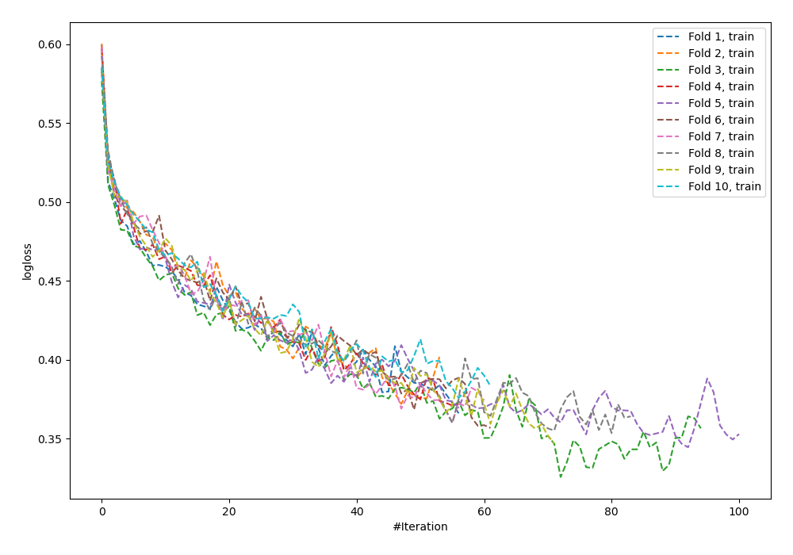
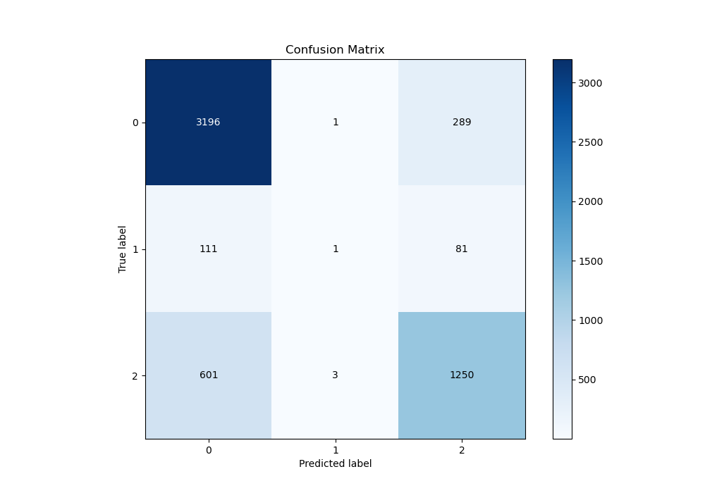
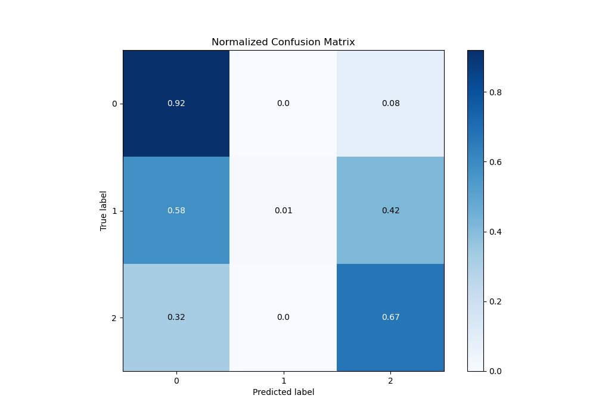
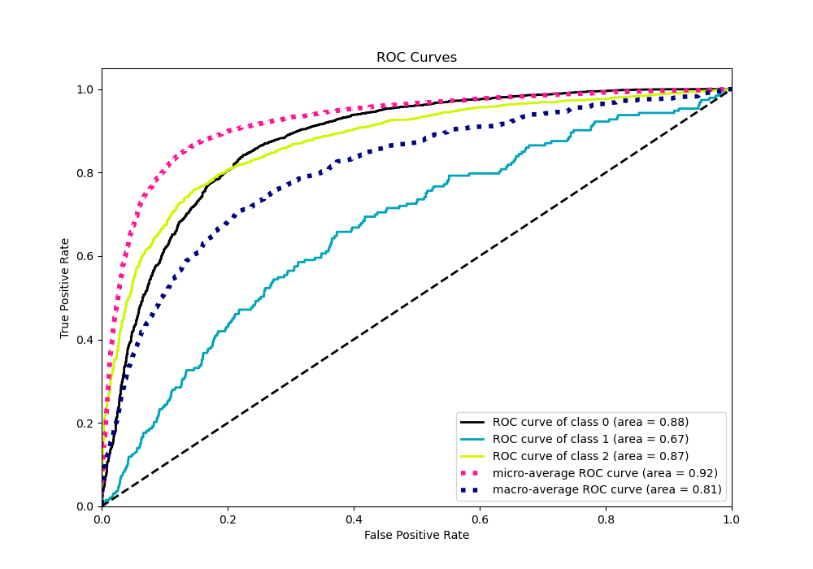
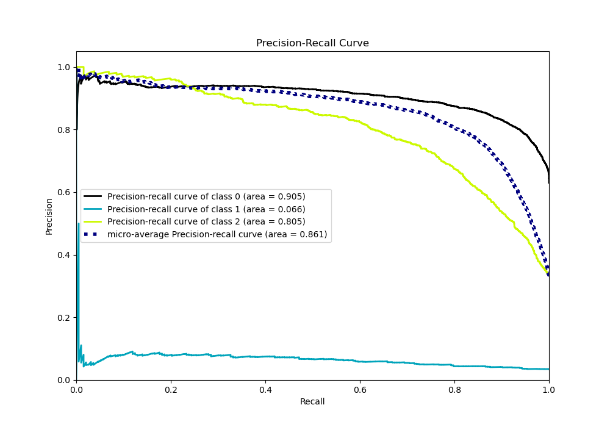

# Summary of 60_NeuralNetwork

[<< Go back](../README.md)

## Neural Network
- **n_jobs**: -1
- **dense_1_size**: 32
- **dense_2_size**: 32
- **learning_rate**: 0.05
- **num_class**: 3
- **explain_level**: 0

## Validation
 - **validation_type**: kfold
 - **shuffle**: True
 - **stratify**: True
 - **k_folds**: 10

## Optimized metric
logloss

## Training time

13.8 seconds

### Metric details
|           |           0 |            1 |           2 |   accuracy |   macro avg |   weighted avg |   logloss |
|:----------|------------:|-------------:|------------:|-----------:|------------:|---------------:|----------:|
| precision |    0.81781  |   0.2        |    0.771605 |   0.803723 |    0.596472 |       0.780777 |  0.561438 |
| recall    |    0.91681  |   0.00518135 |    0.674218 |   0.803723 |    0.53207  |       0.803723 |  0.561438 |
| f1-score  |    0.864485 |   0.010101   |    0.719632 |   0.803723 |    0.531406 |       0.786145 |  0.561438 |
| support   | 3486        | 193          | 1854        |   0.803723 | 5533        |    5533        |  0.561438 |

## Confusion matrix
|              |   Predicted as 0 |   Predicted as 1 |   Predicted as 2 |
|:-------------|-----------------:|-----------------:|-----------------:|
| Labeled as 0 |             3196 |                1 |              289 |
| Labeled as 1 |              111 |                1 |               81 |
| Labeled as 2 |              601 |                3 |             1250 |

## Learning curves

## Confusion Matrix

## Normalized Confusion Matrix

## ROC Curve

## Precision Recall Curve

[<< Go back](../README.md)
