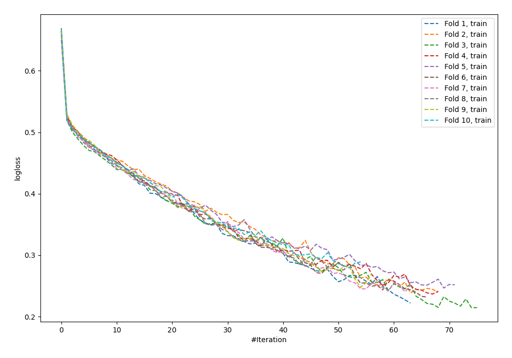
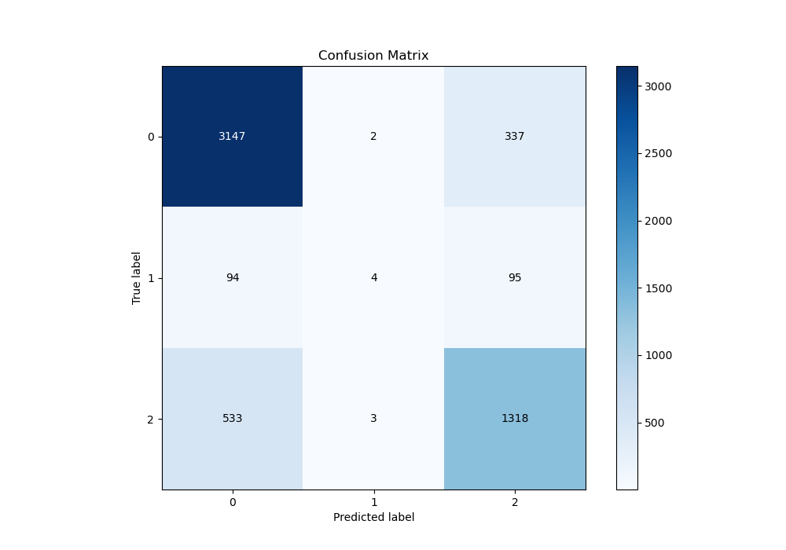
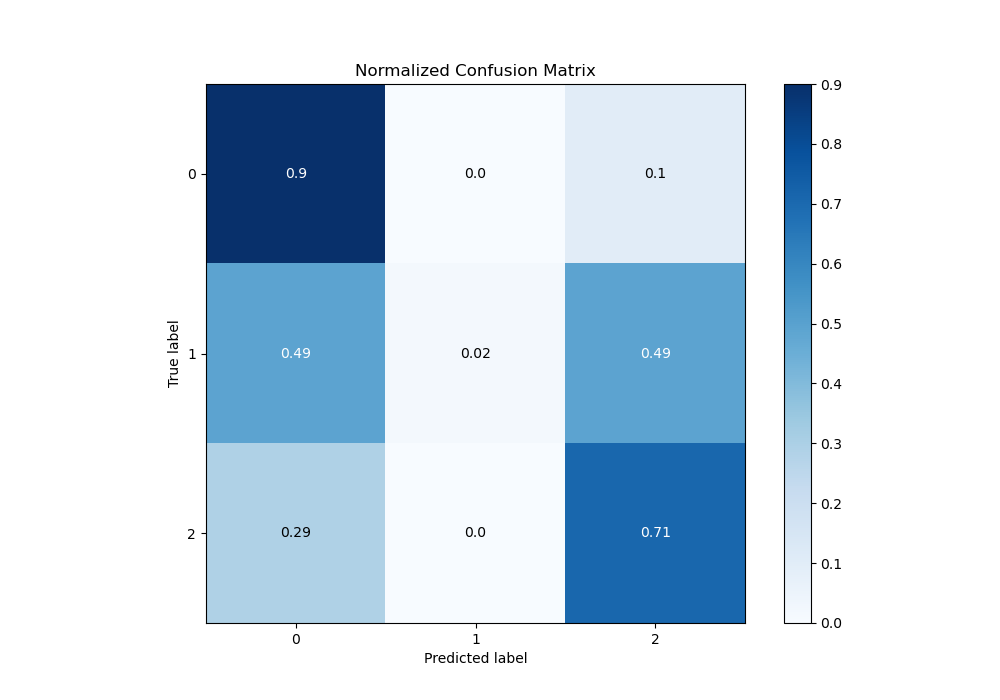
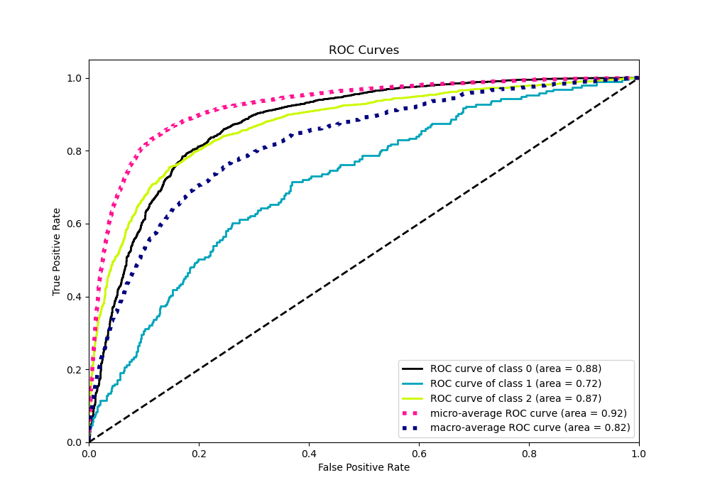
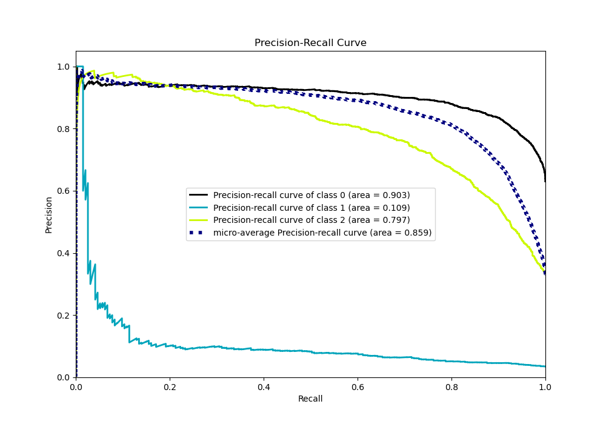

# Summary of 61_NeuralNetwork

[<< Go back](../README.md)

## Neural Network
- **n_jobs**: -1
- **dense_1_size**: 64
- **dense_2_size**: 16
- **learning_rate**: 0.01
- **num_class**: 3
- **explain_level**: 0

## Validation
 - **validation_type**: kfold
 - **shuffle**: True
 - **stratify**: True
 - **k_folds**: 10

## Optimized metric
logloss

## Training time

14.9 seconds

### Metric details
|           |           0 |           1 |           2 |   accuracy |   macro avg |   weighted avg |   logloss |
|:----------|------------:|------------:|------------:|-----------:|------------:|---------------:|----------:|
| precision |    0.833863 |   0.444444  |    0.753143 |   0.807699 |    0.67715  |       0.793232 |  0.539436 |
| recall    |    0.902754 |   0.0207254 |    0.710895 |   0.807699 |    0.544792 |       0.807699 |  0.539436 |
| f1-score  |    0.866942 |   0.039604  |    0.73141  |   0.807699 |    0.545985 |       0.792669 |  0.539436 |
| support   | 3486        | 193         | 1854        |   0.807699 | 5533        |    5533        |  0.539436 |

## Confusion matrix
|              |   Predicted as 0 |   Predicted as 1 |   Predicted as 2 |
|:-------------|-----------------:|-----------------:|-----------------:|
| Labeled as 0 |             3147 |                2 |              337 |
| Labeled as 1 |               94 |                4 |               95 |
| Labeled as 2 |              533 |                3 |             1318 |

## Learning curves

## Confusion Matrix

## Normalized Confusion Matrix

## ROC Curve

## Precision Recall Curve

[<< Go back](../README.md)
