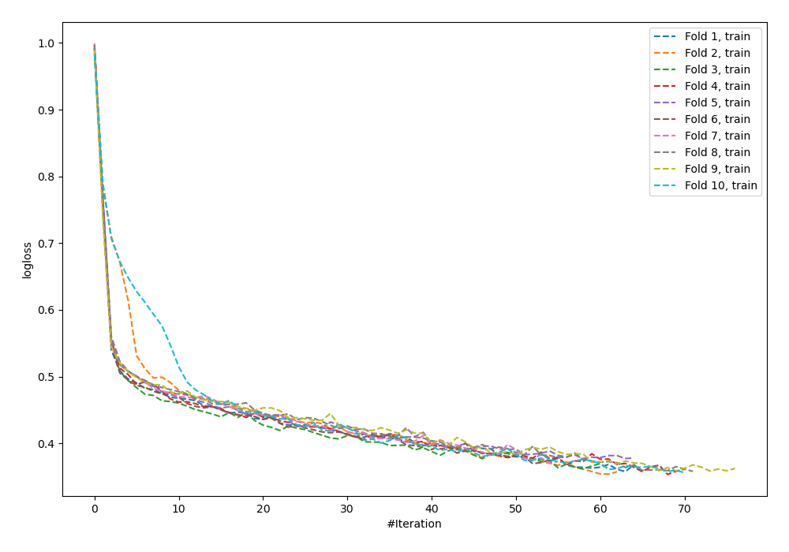
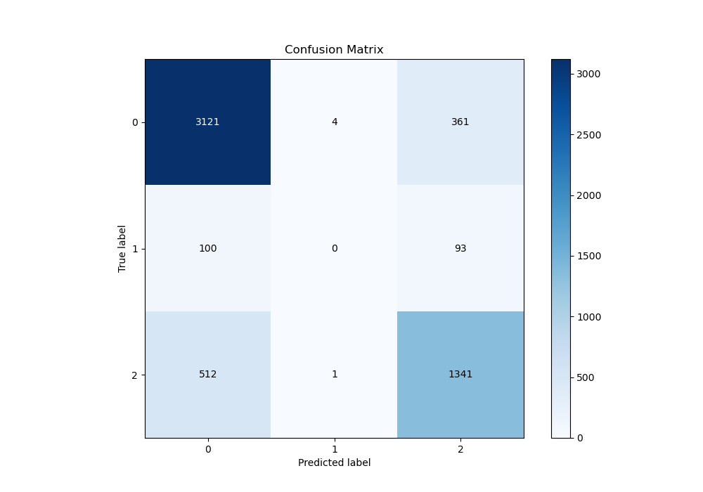
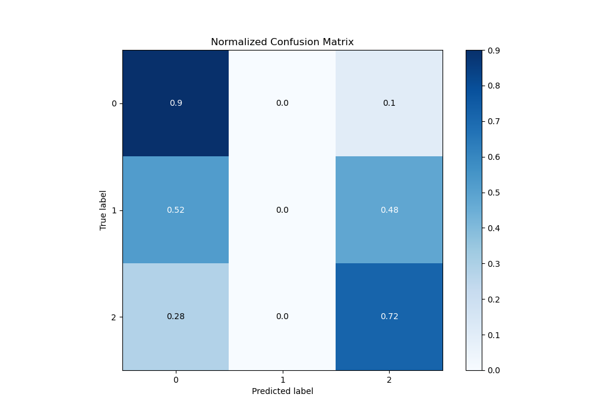
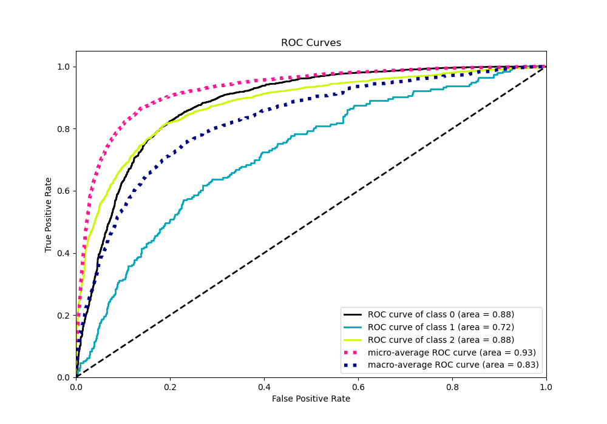
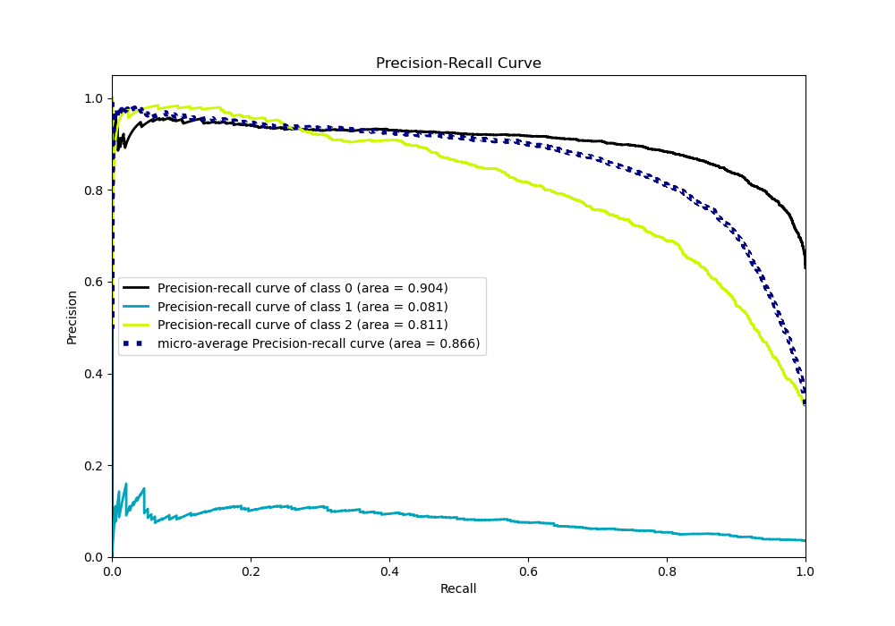

# Summary of 62_NeuralNetwork

[<< Go back](../README.md)

## Neural Network
- **n_jobs**: -1
- **dense_1_size**: 64
- **dense_2_size**: 4
- **learning_rate**: 0.01
- **num_class**: 3
- **explain_level**: 0

## Validation
 - **validation_type**: kfold
 - **shuffle**: True
 - **stratify**: True
 - **k_folds**: 10

## Optimized metric
logloss

## Training time

14.6 seconds

### Metric details
|           |           0 |   1 |           2 |   accuracy |   macro avg |   weighted avg |   logloss |
|:----------|------------:|----:|------------:|-----------:|------------:|---------------:|----------:|
| precision |    0.836057 |   0 |    0.747075 |   0.806434 |    0.527711 |       0.777078 |  0.521398 |
| recall    |    0.895295 |   0 |    0.723301 |   0.806434 |    0.539532 |       0.806434 |  0.521398 |
| f1-score  |    0.864663 |   0 |    0.734996 |   0.806434 |    0.53322  |       0.791053 |  0.521398 |
| support   | 3486        | 193 | 1854        |   0.806434 | 5533        |    5533        |  0.521398 |

## Confusion matrix
|              |   Predicted as 0 |   Predicted as 1 |   Predicted as 2 |
|:-------------|-----------------:|-----------------:|-----------------:|
| Labeled as 0 |             3121 |                4 |              361 |
| Labeled as 1 |              100 |                0 |               93 |
| Labeled as 2 |              512 |                1 |             1341 |

## Learning curves

## Confusion Matrix

## Normalized Confusion Matrix

## ROC Curve

## Precision Recall Curve

[<< Go back](../README.md)
