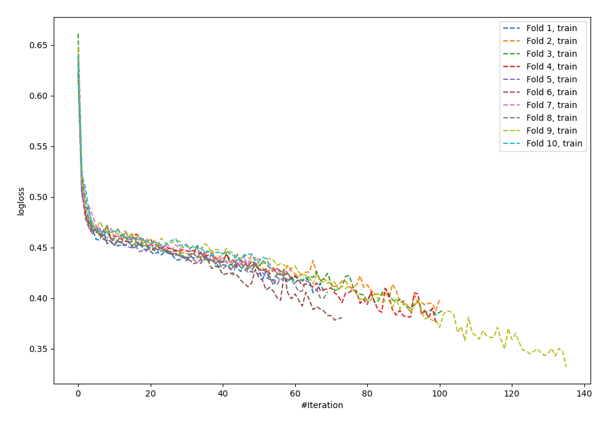
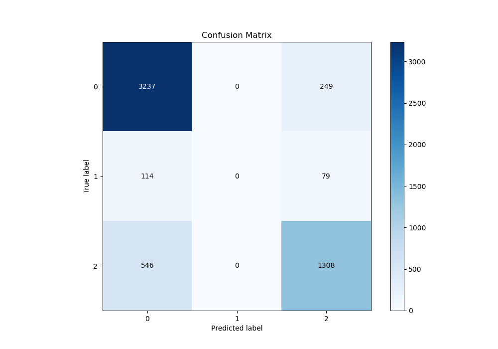
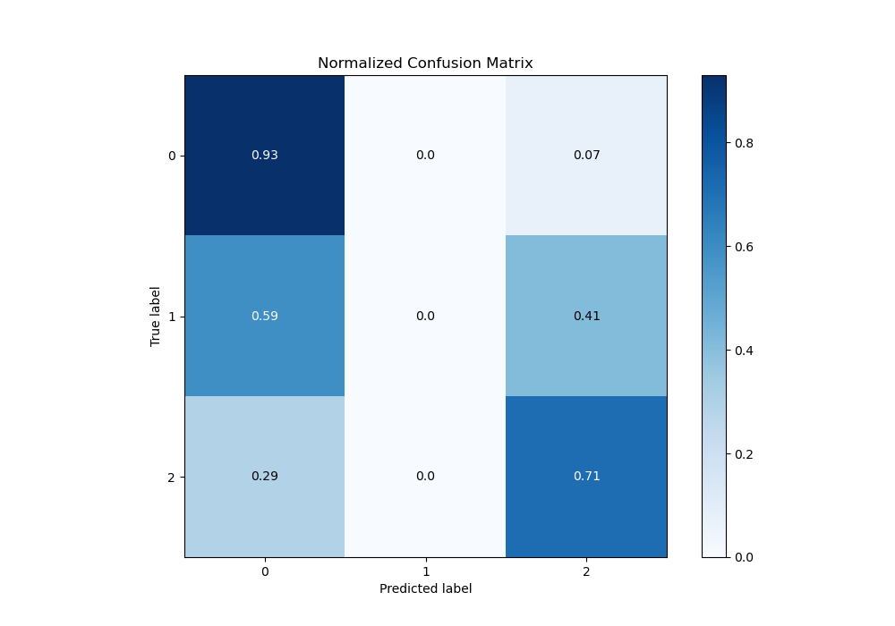
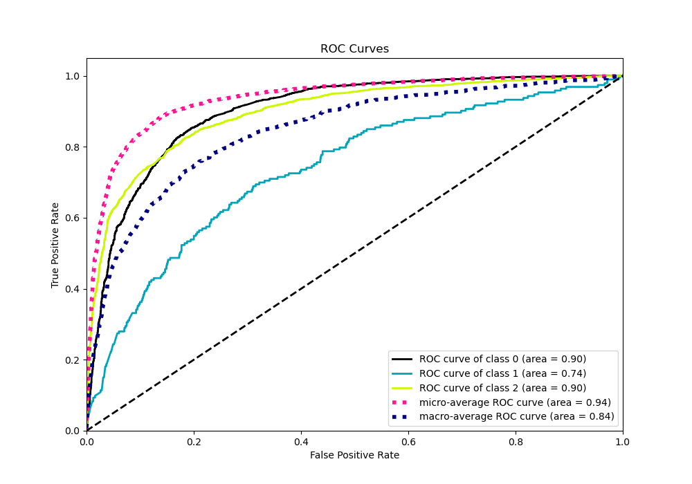
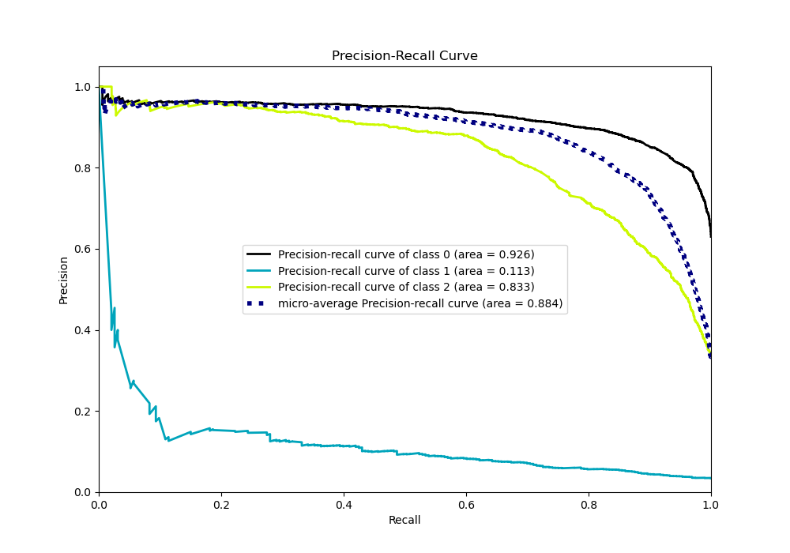

# Summary of 62_NeuralNetwork_SelectedFeatures_Stacked

[<< Go back](../README.md)

## Neural Network
- **n_jobs**: -1
- **dense_1_size**: 64
- **dense_2_size**: 4
- **learning_rate**: 0.01
- **num_class**: 3
- **explain_level**: 0

## Validation
 - **validation_type**: kfold
 - **shuffle**: True
 - **stratify**: True
 - **k_folds**: 10

## Optimized metric
logloss

## Training time

29.1 seconds

### Metric details
|           |           0 |   1 |           2 |   accuracy |   macro avg |   weighted avg |   logloss |
|:----------|------------:|----:|------------:|-----------:|------------:|---------------:|----------:|
| precision |    0.830639 |   0 |    0.799511 |   0.821435 |    0.543383 |       0.791235 |  0.493217 |
| recall    |    0.928571 |   0 |    0.705502 |   0.821435 |    0.544691 |       0.821435 |  0.493217 |
| f1-score  |    0.876879 |   0 |    0.74957  |   0.821435 |    0.54215  |       0.803634 |  0.493217 |
| support   | 3486        | 193 | 1854        |   0.821435 | 5533        |    5533        |  0.493217 |

## Confusion matrix
|              |   Predicted as 0 |   Predicted as 1 |   Predicted as 2 |
|:-------------|-----------------:|-----------------:|-----------------:|
| Labeled as 0 |             3237 |                0 |              249 |
| Labeled as 1 |              114 |                0 |               79 |
| Labeled as 2 |              546 |                0 |             1308 |

## Learning curves

## Confusion Matrix

## Normalized Confusion Matrix

## ROC Curve

## Precision Recall Curve

[<< Go back](../README.md)
