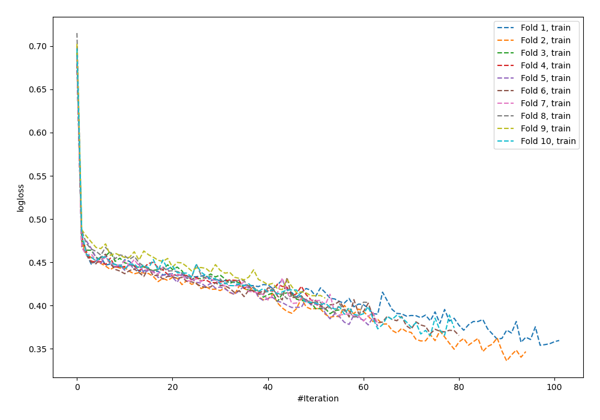
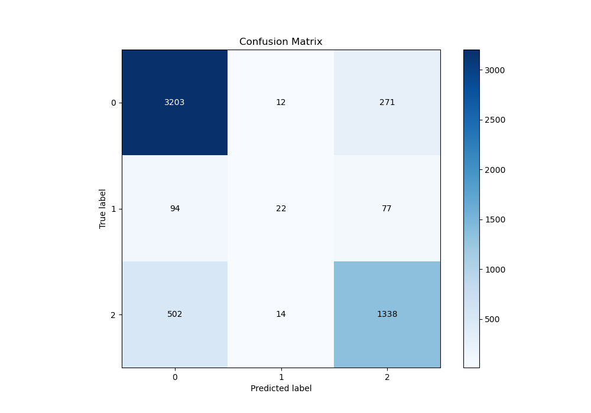
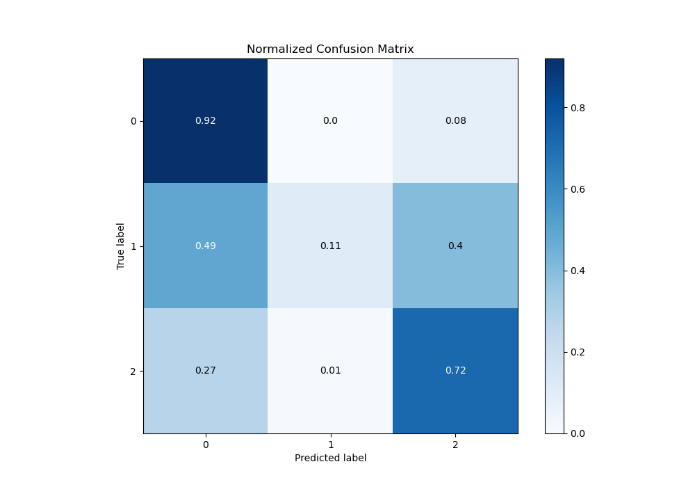
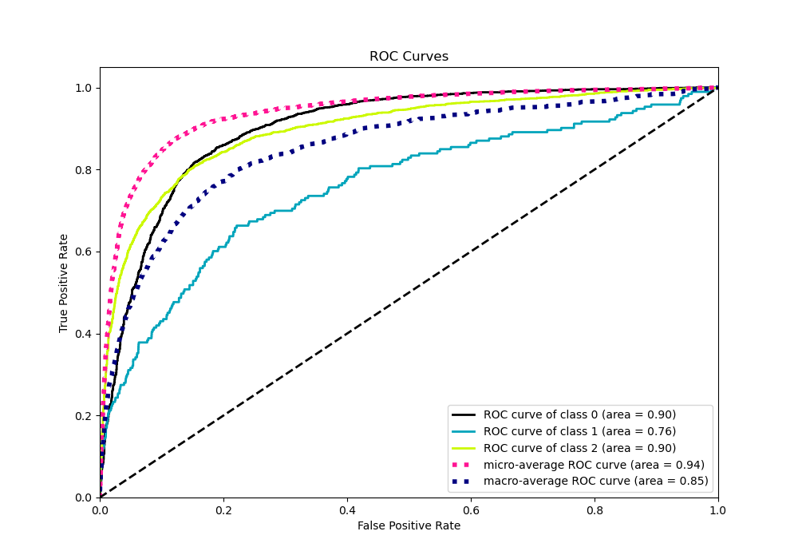
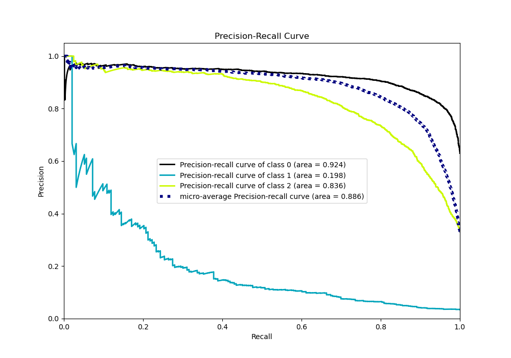

# Summary of 62_NeuralNetwork_Stacked

[<< Go back](../README.md)

## Neural Network
- **n_jobs**: -1
- **dense_1_size**: 64
- **dense_2_size**: 4
- **learning_rate**: 0.01
- **num_class**: 3
- **explain_level**: 0

## Validation
 - **validation_type**: kfold
 - **shuffle**: True
 - **stratify**: True
 - **k_folds**: 10

## Optimized metric
logloss

## Training time

25.0 seconds

### Metric details
|           |           0 |          1 |           2 |   accuracy |   macro avg |   weighted avg |   logloss |
|:----------|------------:|-----------:|------------:|-----------:|------------:|---------------:|----------:|
| precision |    0.843117 |   0.458333 |    0.793594 |   0.824688 |    0.698348 |       0.813101 |  0.476787 |
| recall    |    0.918818 |   0.11399  |    0.721683 |   0.824688 |    0.58483  |       0.824688 |  0.476787 |
| f1-score  |    0.879341 |   0.182573 |    0.755932 |   0.824688 |    0.605949 |       0.813685 |  0.476787 |
| support   | 3486        | 193        | 1854        |   0.824688 | 5533        |    5533        |  0.476787 |

## Confusion matrix
|              |   Predicted as 0 |   Predicted as 1 |   Predicted as 2 |
|:-------------|-----------------:|-----------------:|-----------------:|
| Labeled as 0 |             3203 |               12 |              271 |
| Labeled as 1 |               94 |               22 |               77 |
| Labeled as 2 |              502 |               14 |             1338 |

## Learning curves

## Confusion Matrix

## Normalized Confusion Matrix

## ROC Curve

## Precision Recall Curve

[<< Go back](../README.md)
