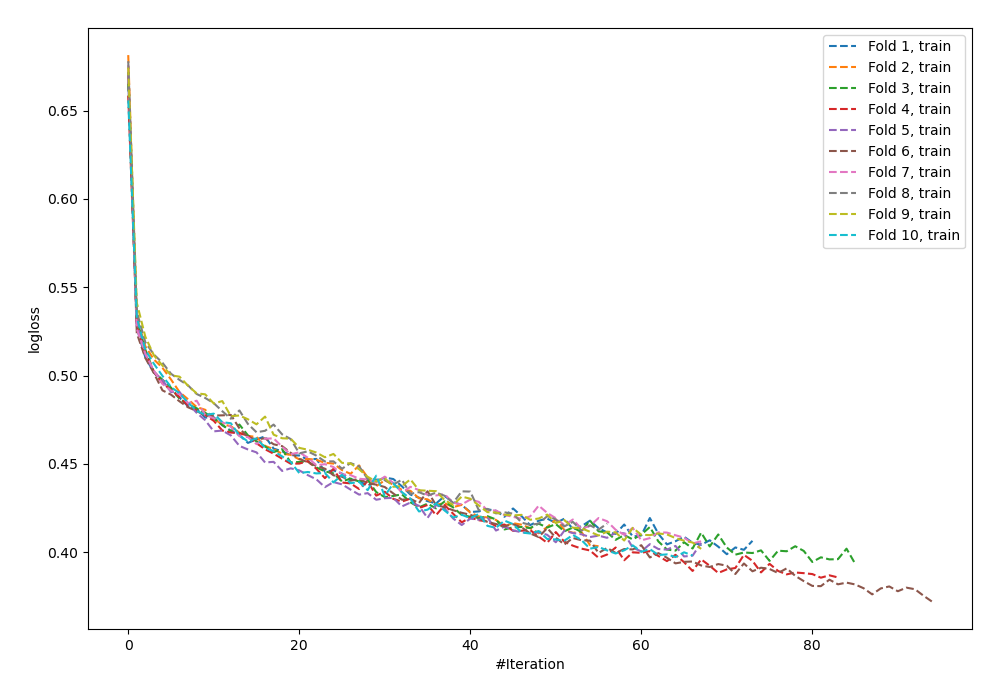

# Summary of 63_NeuralNetwork

[<< Go back](../README.md)

## Neural Network
- **n_jobs**: -1
- **dense_1_size**: 16
- **dense_2_size**: 16
- **learning_rate**: 0.01
- **num_class**: 3
- **explain_level**: 0

## Validation
 - **validation_type**: kfold
 - **shuffle**: True
 - **stratify**: True
 - **k_folds**: 10

## Optimized metric
logloss

## Training time

13.8 seconds

### Metric details
|           |           0 |   1 |           2 |   accuracy |   macro avg |   weighted avg |   logloss |
|:----------|------------:|----:|------------:|-----------:|------------:|---------------:|----------:|
| precision |    0.832315 |   0 |    0.744199 |   0.803723 |    0.525505 |       0.773756 |  0.525612 |
| recall    |    0.898451 |   0 |    0.709277 |   0.803723 |    0.535909 |       0.803723 |  0.525612 |
| f1-score  |    0.864119 |   0 |    0.726319 |   0.803723 |    0.530146 |       0.787803 |  0.525612 |
| support   | 3486        | 193 | 1854        |   0.803723 | 5533        |    5533        |  0.525612 |

## Confusion matrix
|              |   Predicted as 0 |   Predicted as 1 |   Predicted as 2 |
|:-------------|-----------------:|-----------------:|-----------------:|
| Labeled as 0 |             3132 |                0 |              354 |
| Labeled as 1 |               95 |                0 |               98 |
| Labeled as 2 |              536 |                3 |             1315 |

## Learning curves

## Confusion Matrix

## Normalized Confusion Matrix

## ROC Curve

## Precision Recall Curve

[<< Go back](../README.md)
