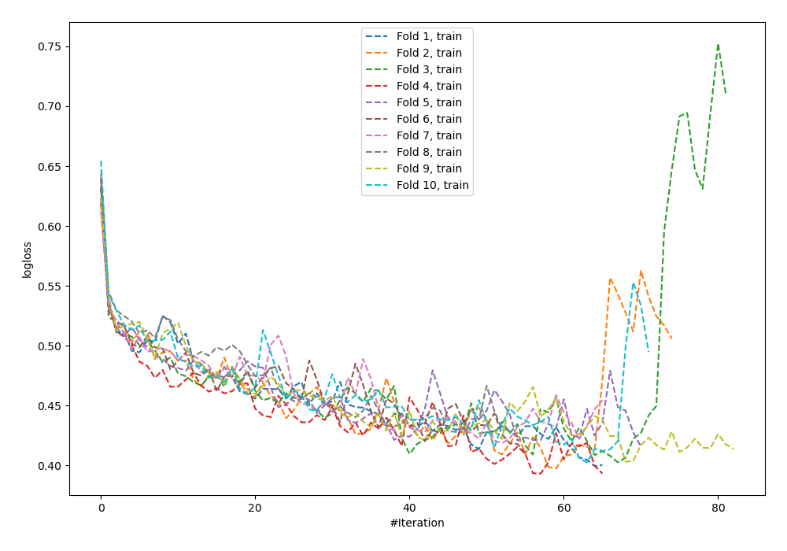
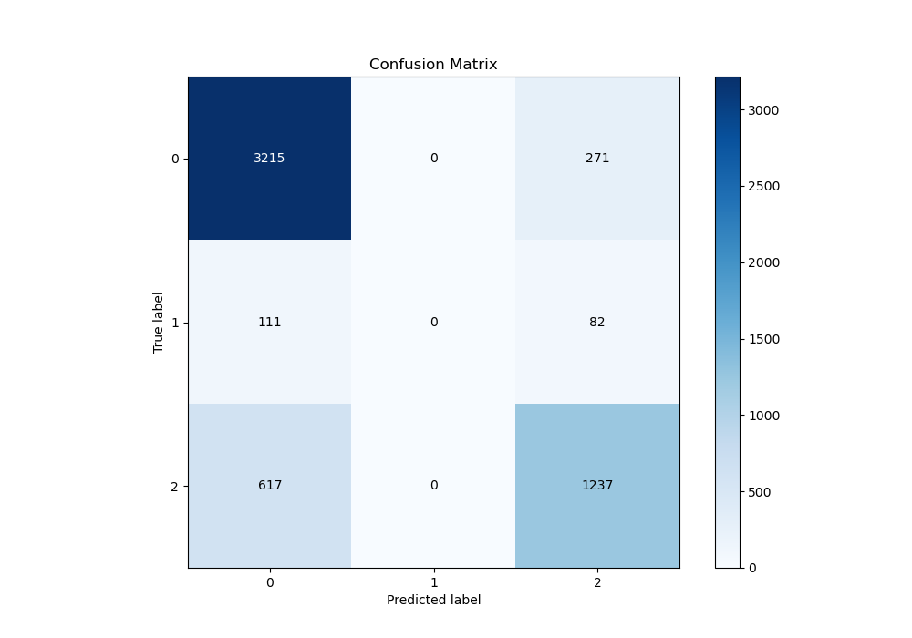
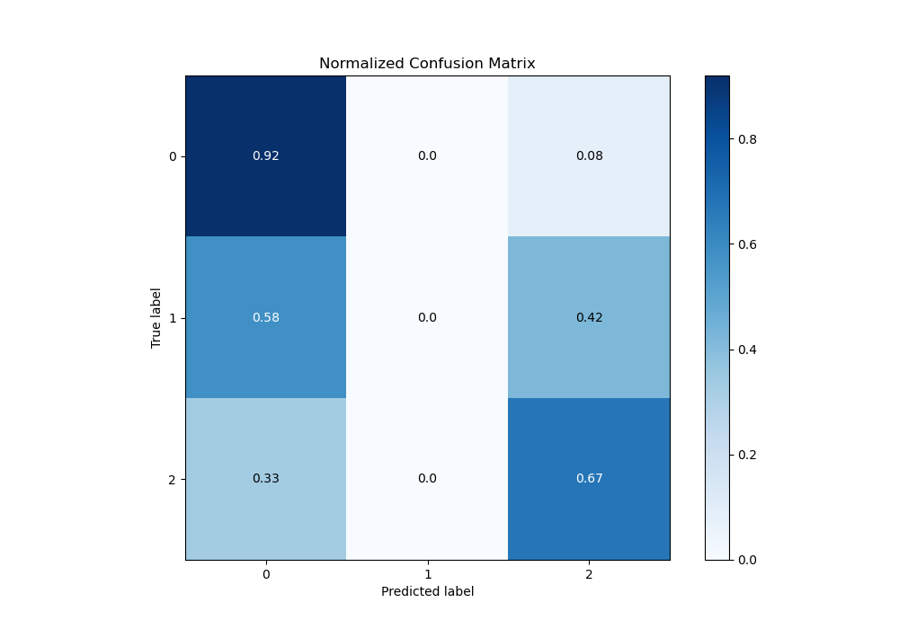
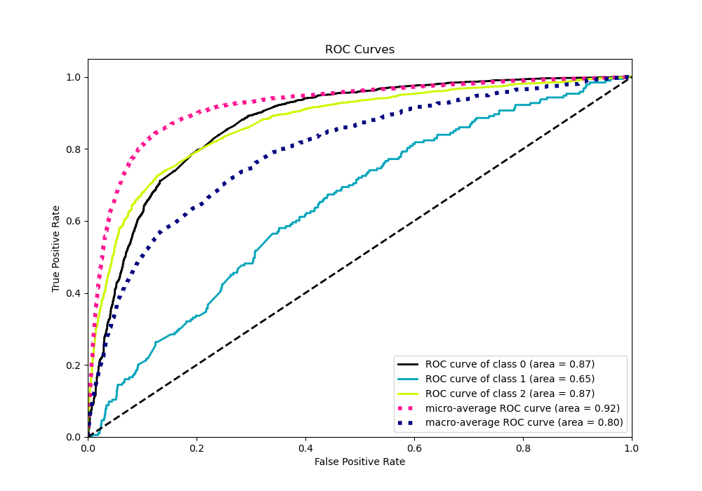
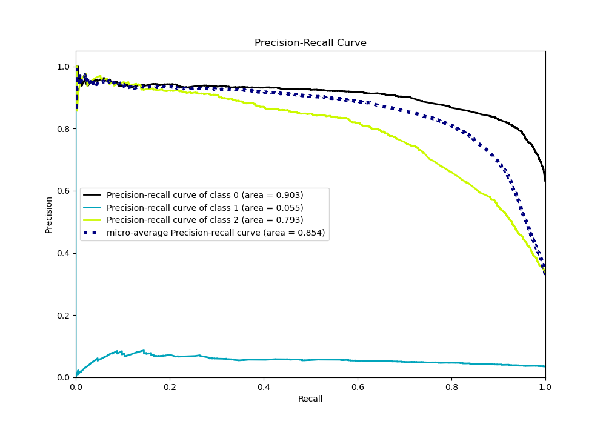

# Summary of 64_NeuralNetwork

[<< Go back](../README.md)

## Neural Network
- **n_jobs**: -1
- **dense_1_size**: 64
- **dense_2_size**: 8
- **learning_rate**: 0.1
- **num_class**: 3
- **explain_level**: 0

## Validation
 - **validation_type**: kfold
 - **shuffle**: True
 - **stratify**: True
 - **k_folds**: 10

## Optimized metric
logloss

## Training time

15.6 seconds

### Metric details
|           |           0 |   1 |           2 |   accuracy |   macro avg |   weighted avg |   logloss |
|:----------|------------:|----:|------------:|-----------:|------------:|---------------:|----------:|
| precision |    0.815369 |   0 |    0.777987 |   0.804627 |    0.531119 |       0.774402 |     0.562 |
| recall    |    0.92226  |   0 |    0.667206 |   0.804627 |    0.529822 |       0.804627 |     0.562 |
| f1-score  |    0.865527 |   0 |    0.718351 |   0.804627 |    0.527959 |       0.78602  |     0.562 |
| support   | 3486        | 193 | 1854        |   0.804627 | 5533        |    5533        |     0.562 |

## Confusion matrix
|              |   Predicted as 0 |   Predicted as 1 |   Predicted as 2 |
|:-------------|-----------------:|-----------------:|-----------------:|
| Labeled as 0 |             3215 |                0 |              271 |
| Labeled as 1 |              111 |                0 |               82 |
| Labeled as 2 |              617 |                0 |             1237 |

## Learning curves

## Confusion Matrix

## Normalized Confusion Matrix

## ROC Curve

## Precision Recall Curve

[<< Go back](../README.md)
