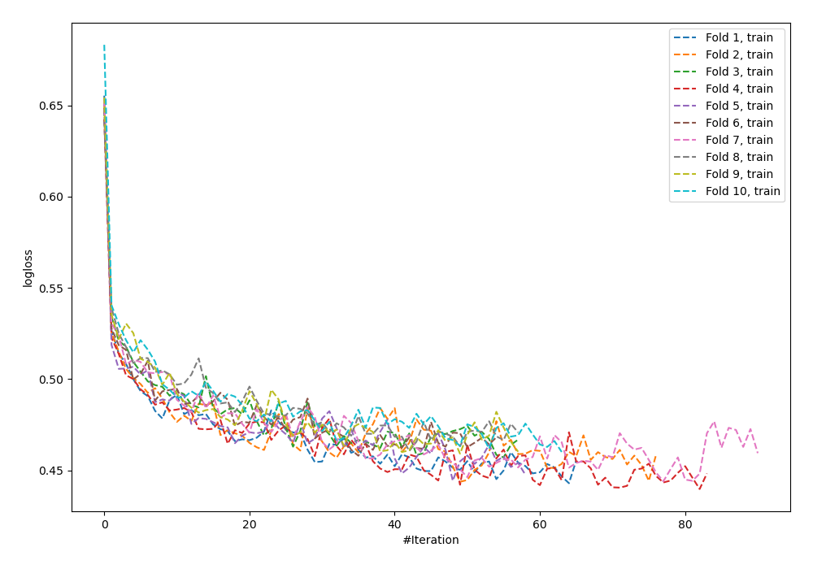
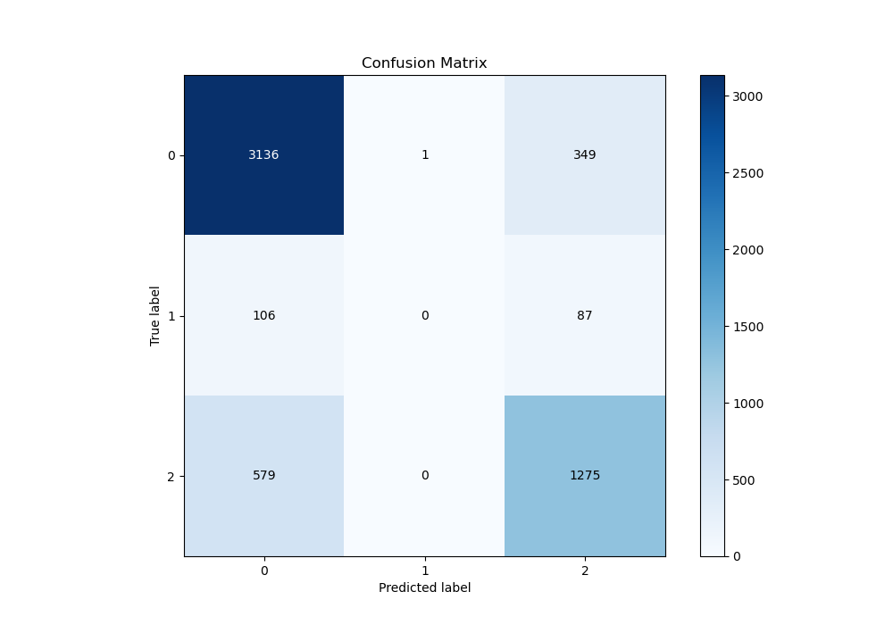
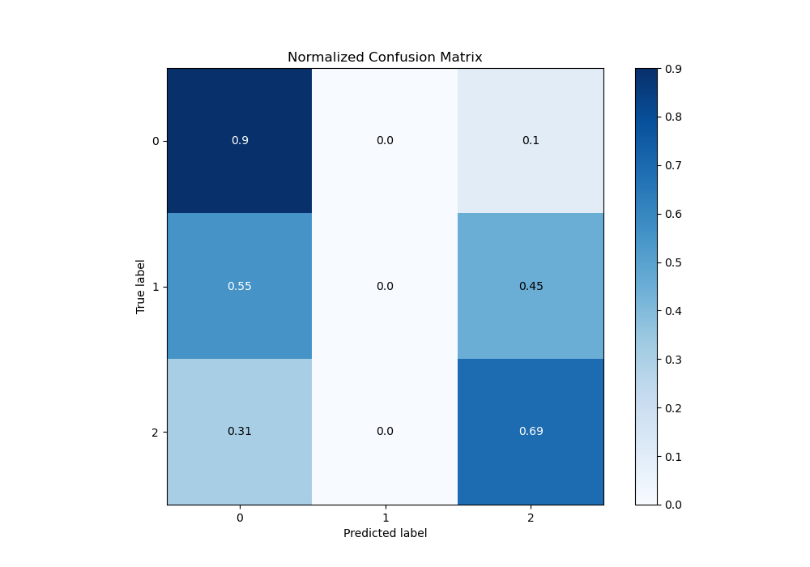
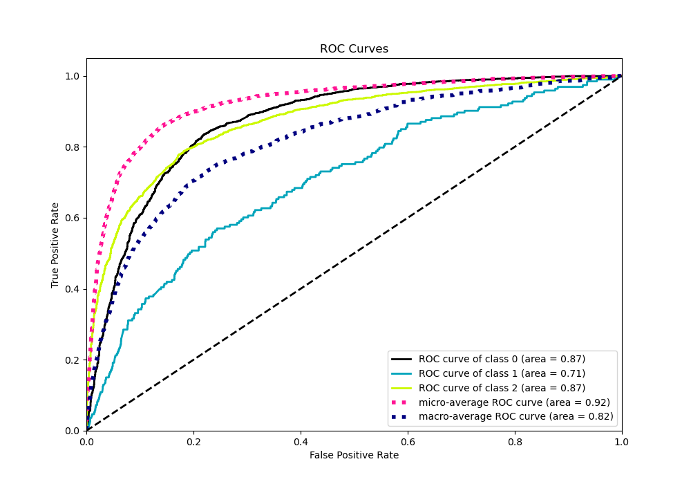
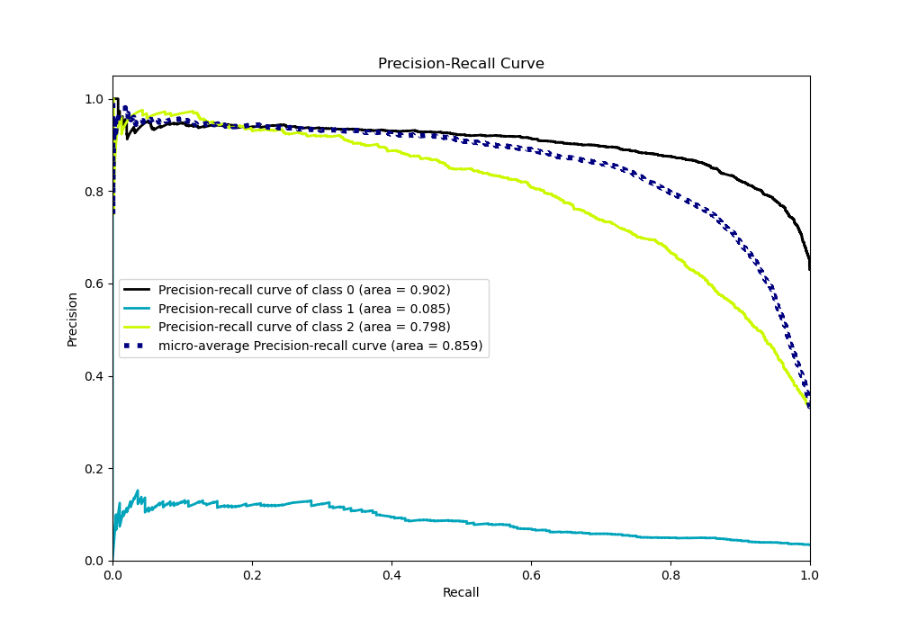

# Summary of 65_NeuralNetwork

[<< Go back](../README.md)

## Neural Network
- **n_jobs**: -1
- **dense_1_size**: 16
- **dense_2_size**: 32
- **learning_rate**: 0.08
- **num_class**: 3
- **explain_level**: 0

## Validation
 - **validation_type**: kfold
 - **shuffle**: True
 - **stratify**: True
 - **k_folds**: 10

## Optimized metric
logloss

## Training time

15.2 seconds

### Metric details
|           |           0 |   1 |           2 |   accuracy |   macro avg |   weighted avg |   logloss |
|:----------|------------:|----:|------------:|-----------:|------------:|---------------:|----------:|
| precision |    0.820728 |   0 |    0.745178 |   0.797217 |    0.521969 |       0.766784 |  0.541199 |
| recall    |    0.899598 |   0 |    0.687702 |   0.797217 |    0.5291   |       0.797217 |  0.541199 |
| f1-score  |    0.858355 |   0 |    0.715288 |   0.797217 |    0.524548 |       0.780475 |  0.541199 |
| support   | 3486        | 193 | 1854        |   0.797217 | 5533        |    5533        |  0.541199 |

## Confusion matrix
|              |   Predicted as 0 |   Predicted as 1 |   Predicted as 2 |
|:-------------|-----------------:|-----------------:|-----------------:|
| Labeled as 0 |             3136 |                1 |              349 |
| Labeled as 1 |              106 |                0 |               87 |
| Labeled as 2 |              579 |                0 |             1275 |

## Learning curves

## Confusion Matrix

## Normalized Confusion Matrix

## ROC Curve

## Precision Recall Curve

[<< Go back](../README.md)
