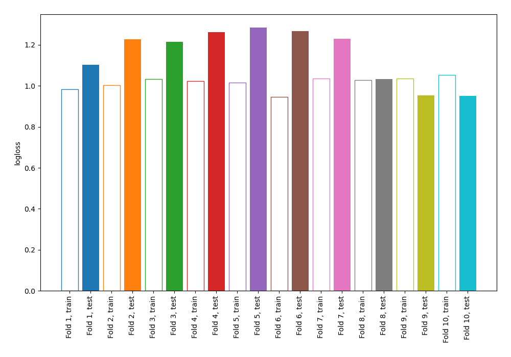
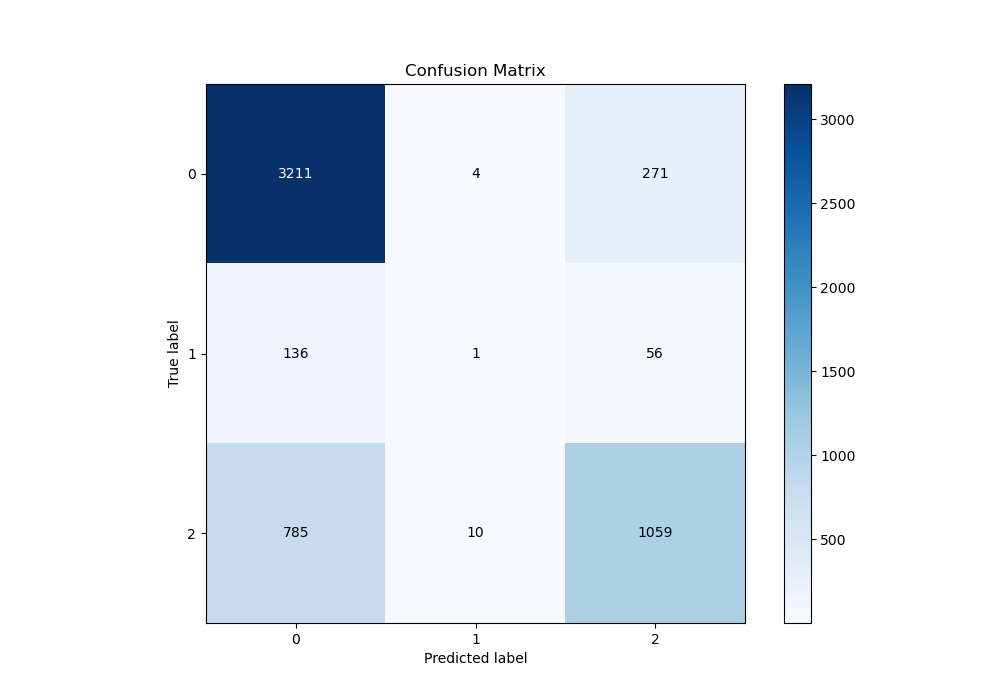
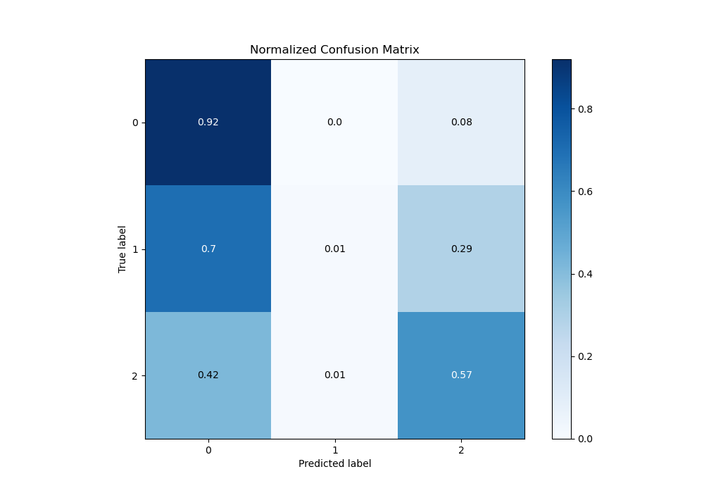
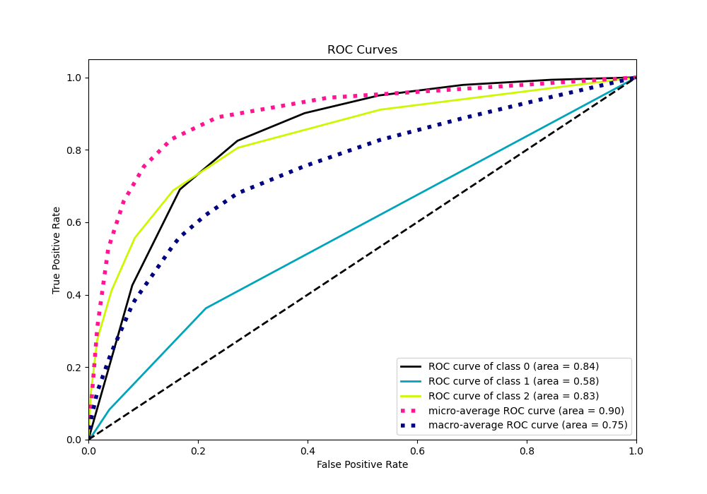
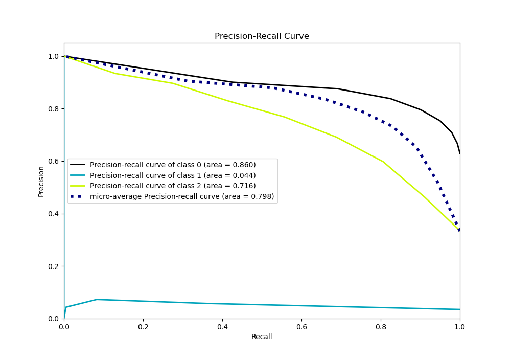

# Summary of 69_NearestNeighbors

[<< Go back](../README.md)

## k-Nearest Neighbors (Nearest Neighbors)
- **n_jobs**: -1
- **n_neighbors**: 7
- **weights**: uniform
- **num_class**: 3
- **explain_level**: 0

## Validation
 - **validation_type**: kfold
 - **shuffle**: True
 - **stratify**: True
 - **k_folds**: 10

## Optimized metric
logloss

## Training time

4.2 seconds

### Metric details
|           |           0 |            1 |           2 |   accuracy |   macro avg |   weighted avg |   logloss |
|:----------|------------:|-------------:|------------:|-----------:|------------:|---------------:|----------:|
| precision |    0.777106 |   0.0666667  |    0.764069 |   0.771914 |    0.535947 |       0.747956 |   1.15185 |
| recall    |    0.921113 |   0.00518135 |    0.571197 |   0.771914 |    0.499164 |       0.771914 |   1.15185 |
| f1-score  |    0.843003 |   0.00961538 |    0.653704 |   0.771914 |    0.502108 |       0.750503 |   1.15185 |
| support   | 3486        | 193          | 1854        |   0.771914 | 5533        |    5533        |   1.15185 |

## Confusion matrix
|              |   Predicted as 0 |   Predicted as 1 |   Predicted as 2 |
|:-------------|-----------------:|-----------------:|-----------------:|
| Labeled as 0 |             3211 |                4 |              271 |
| Labeled as 1 |              136 |                1 |               56 |
| Labeled as 2 |              785 |               10 |             1059 |

## Learning curves

## Confusion Matrix

## Normalized Confusion Matrix

## ROC Curve

## Precision Recall Curve

[<< Go back](../README.md)
