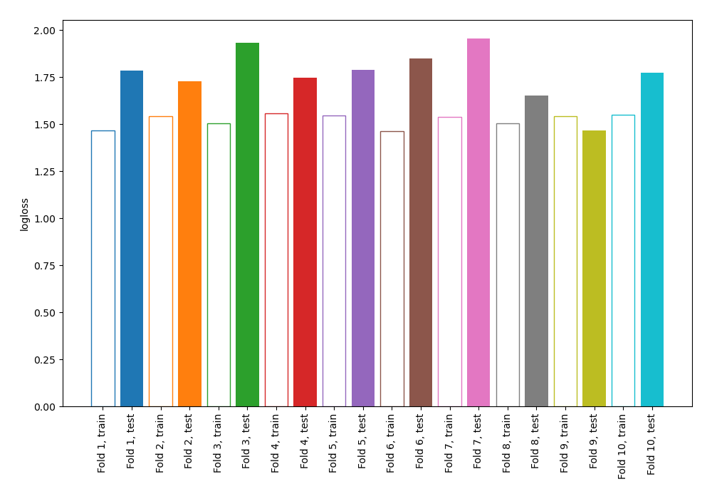
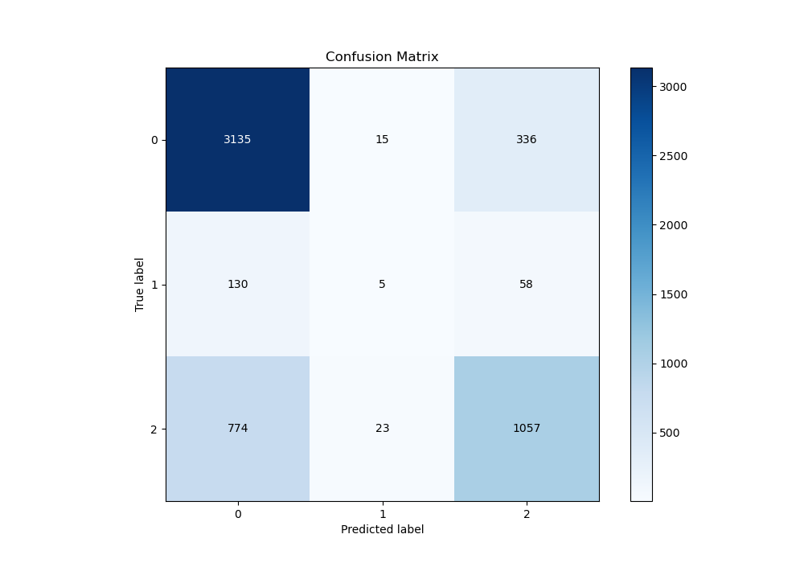
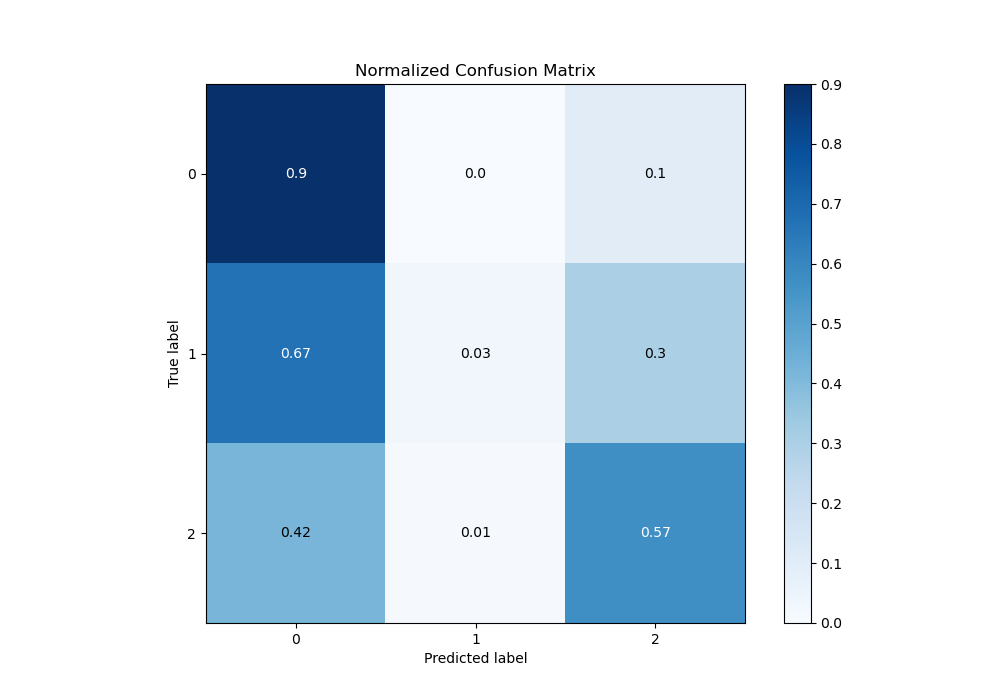
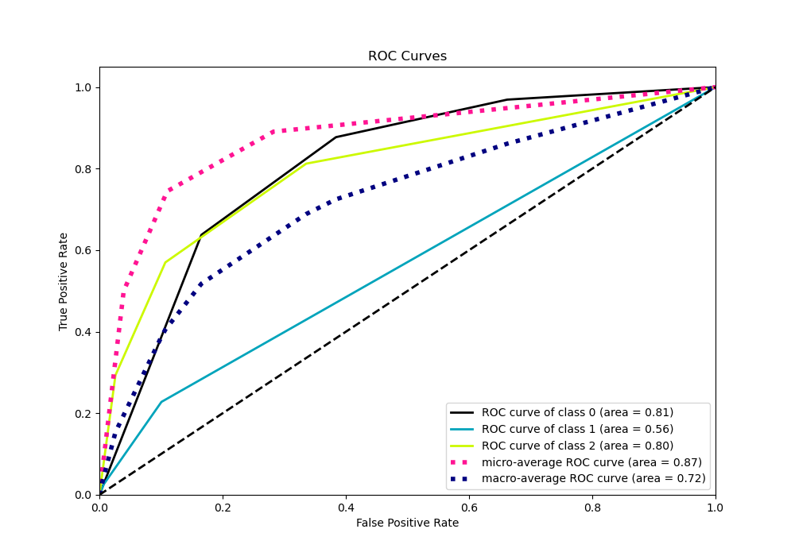
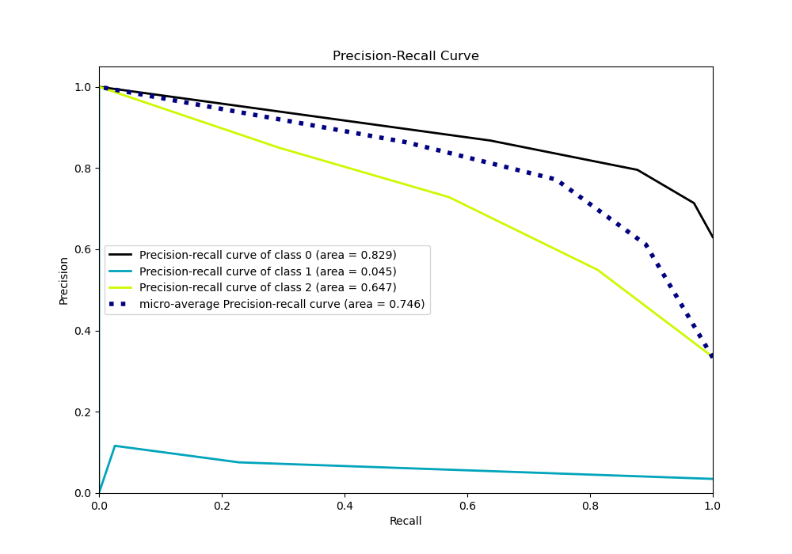

# Summary of 70_NearestNeighbors

[<< Go back](../README.md)

## k-Nearest Neighbors (Nearest Neighbors)
- **n_jobs**: -1
- **n_neighbors**: 3
- **weights**: uniform
- **num_class**: 3
- **explain_level**: 0

## Validation
 - **validation_type**: kfold
 - **shuffle**: True
 - **stratify**: True
 - **k_folds**: 10

## Optimized metric
logloss

## Training time

4.5 seconds

### Metric details
|           |           0 |           1 |           2 |   accuracy |   macro avg |   weighted avg |   logloss |
|:----------|------------:|------------:|------------:|-----------:|------------:|---------------:|----------:|
| precision |    0.776182 |   0.116279  |    0.728463 |    0.75854 |    0.540308 |       0.737174 |   1.76793 |
| recall    |    0.899312 |   0.0259067 |    0.570119 |    0.75854 |    0.498446 |       0.75854  |   1.76793 |
| f1-score  |    0.833223 |   0.0423729 |    0.639637 |    0.75854 |    0.505077 |       0.74077  |   1.76793 |
| support   | 3486        | 193         | 1854        |    0.75854 | 5533        |    5533        |   1.76793 |

## Confusion matrix
|              |   Predicted as 0 |   Predicted as 1 |   Predicted as 2 |
|:-------------|-----------------:|-----------------:|-----------------:|
| Labeled as 0 |             3135 |               15 |              336 |
| Labeled as 1 |              130 |                5 |               58 |
| Labeled as 2 |              774 |               23 |             1057 |

## Learning curves

## Confusion Matrix

## Normalized Confusion Matrix

## ROC Curve

## Precision Recall Curve

[<< Go back](../README.md)
