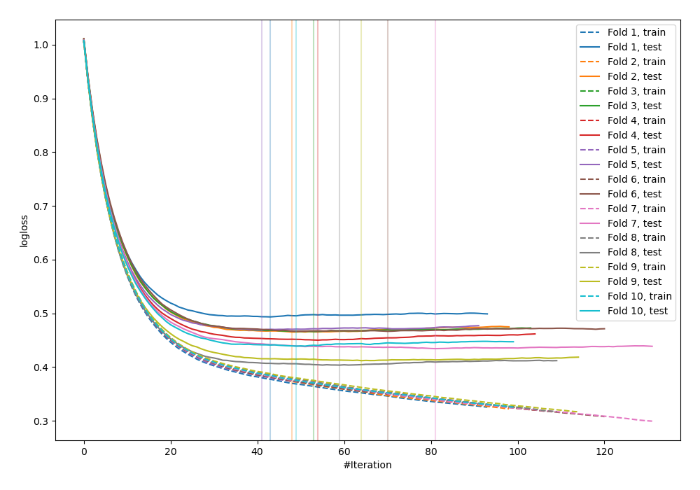
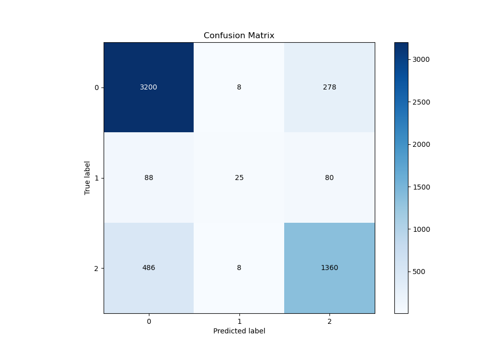
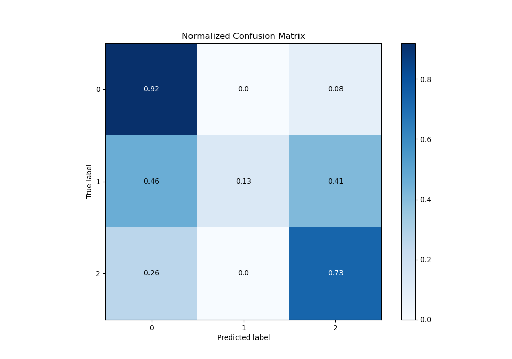
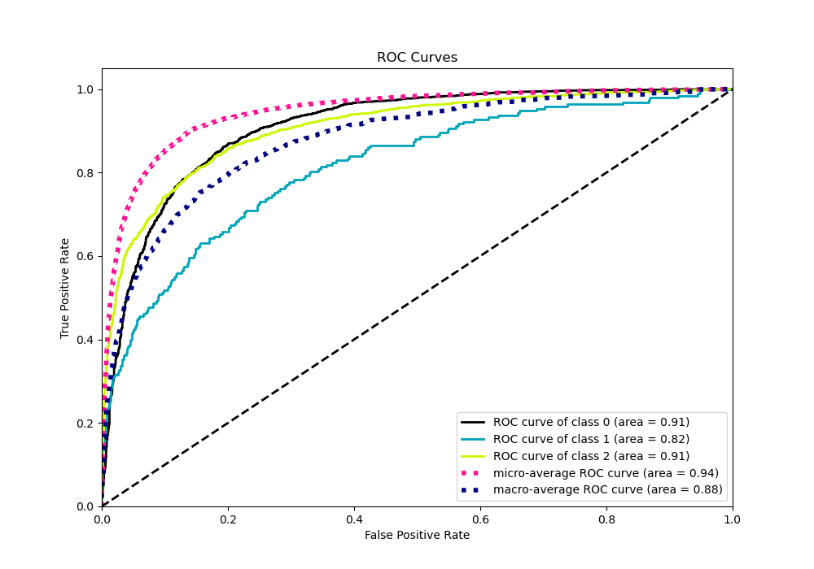
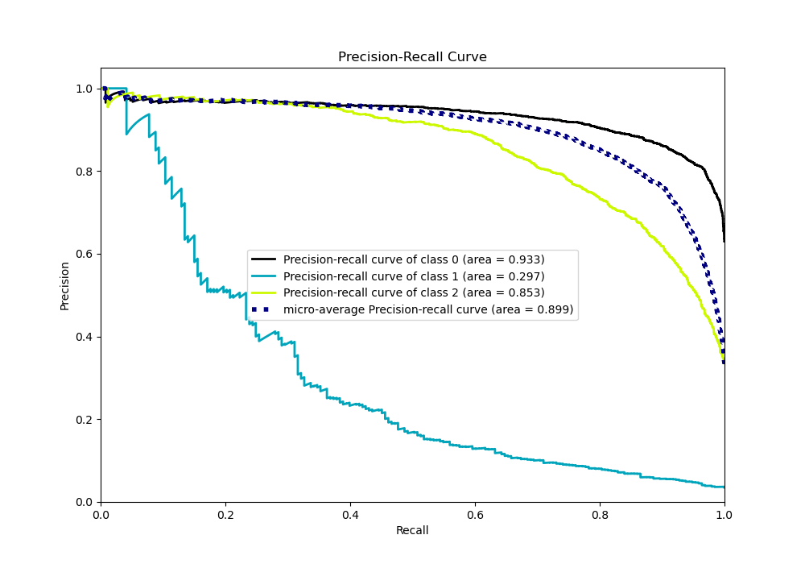

# Summary of 77_Xgboost_Stacked

[<< Go back](../README.md)

## Extreme Gradient Boosting (Xgboost)
- **n_jobs**: -1
- **objective**: multi:softprob
- **eta**: 0.1
- **max_depth**: 4
- **min_child_weight**: 25
- **subsample**: 0.7
- **colsample_bytree**: 0.6
- **eval_metric**: mlogloss
- **num_class**: 3
- **explain_level**: 0

## Validation
 - **validation_type**: kfold
 - **shuffle**: True
 - **stratify**: True
 - **k_folds**: 10

## Optimized metric
logloss

## Training time

29.2 seconds

### Metric details
|           |           0 |          1 |           2 |   accuracy |   macro avg |   weighted avg |   logloss |
|:----------|------------:|-----------:|------------:|-----------:|------------:|---------------:|----------:|
| precision |    0.847907 |   0.609756 |    0.791618 |   0.828664 |    0.74976  |       0.820738 |  0.450034 |
| recall    |    0.917958 |   0.129534 |    0.733549 |   0.828664 |    0.59368  |       0.828664 |  0.450034 |
| f1-score  |    0.881543 |   0.213675 |    0.761478 |   0.828664 |    0.618899 |       0.818015 |  0.450034 |
| support   | 3486        | 193        | 1854        |   0.828664 | 5533        |    5533        |  0.450034 |

## Confusion matrix
|              |   Predicted as 0 |   Predicted as 1 |   Predicted as 2 |
|:-------------|-----------------:|-----------------:|-----------------:|
| Labeled as 0 |             3200 |                8 |              278 |
| Labeled as 1 |               88 |               25 |               80 |
| Labeled as 2 |              486 |                8 |             1360 |

## Learning curves

## Confusion Matrix

## Normalized Confusion Matrix

## ROC Curve

## Precision Recall Curve

[<< Go back](../README.md)
