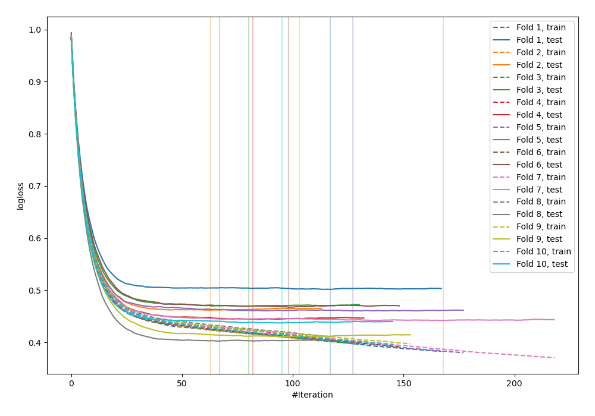
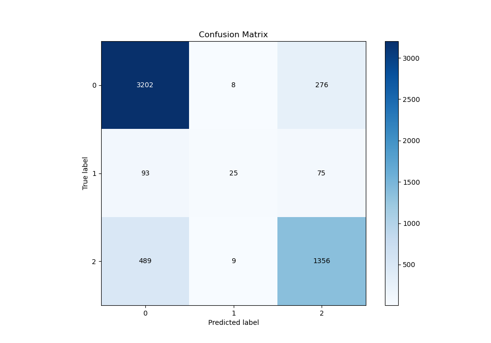
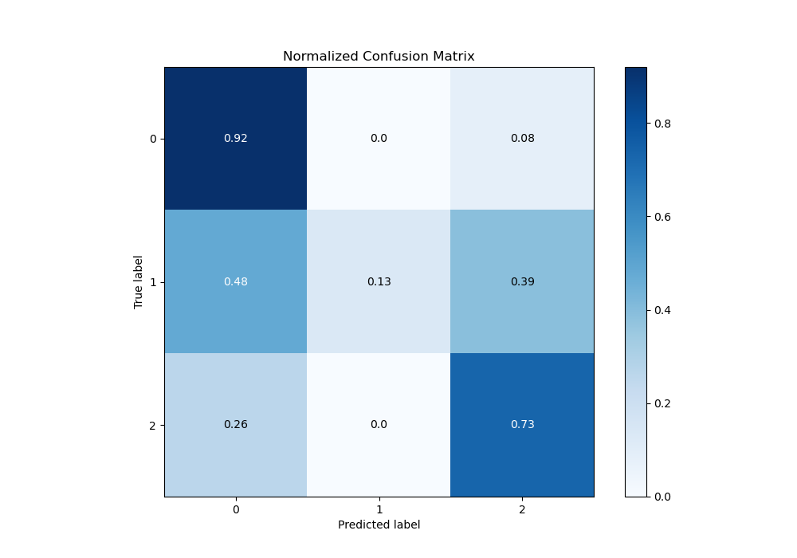
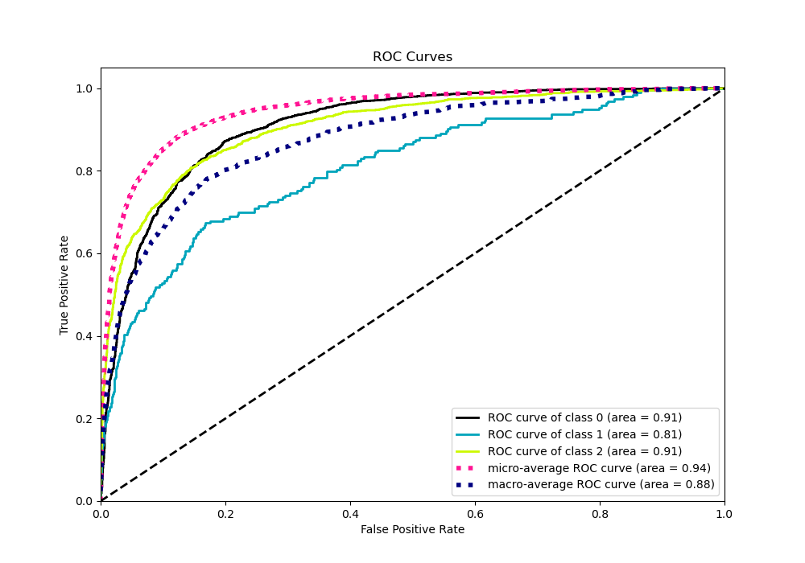
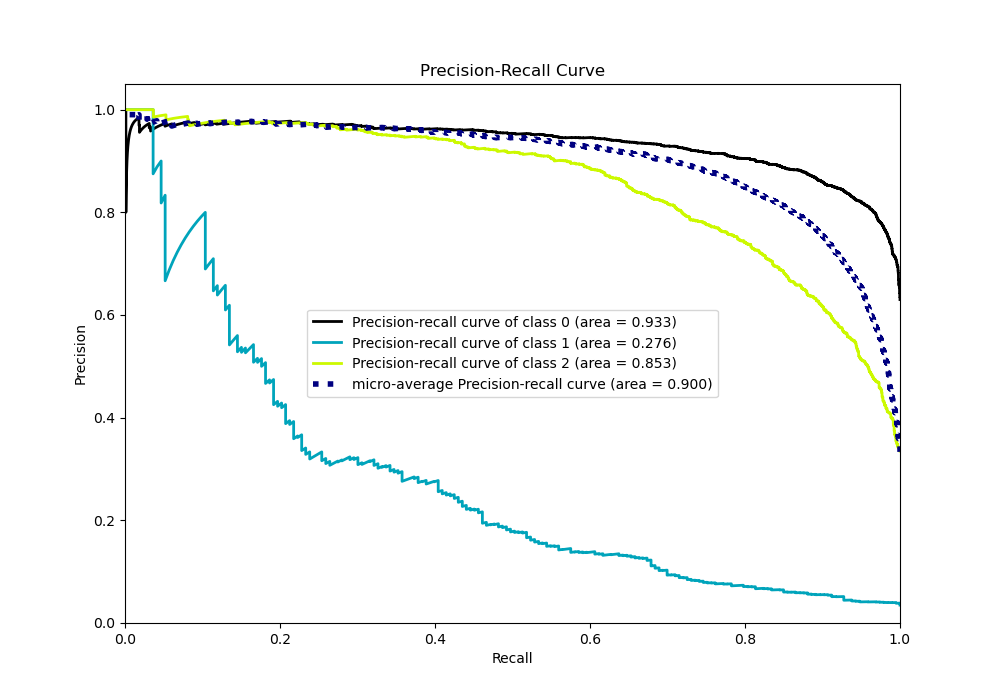

# Summary of 85_CatBoost_Stacked

[<< Go back](../README.md)

## CatBoost
- **n_jobs**: -1
- **learning_rate**: 0.1
- **depth**: 4
- **rsm**: 0.7
- **loss_function**: MultiClass
- **eval_metric**: MultiClass
- **num_class**: 3
- **explain_level**: 0

## Validation
 - **validation_type**: kfold
 - **shuffle**: True
 - **stratify**: True
 - **k_folds**: 10

## Optimized metric
logloss

## Training time

33.3 seconds

### Metric details
|           |           0 |          1 |           2 |   accuracy |   macro avg |   weighted avg |   logloss |
|:----------|------------:|-----------:|------------:|-----------:|------------:|---------------:|----------:|
| precision |    0.846195 |   0.595238 |    0.794376 |   0.828303 |    0.74527  |       0.820077 |  0.449942 |
| recall    |    0.918531 |   0.129534 |    0.731392 |   0.828303 |    0.593152 |       0.828303 |  0.449942 |
| f1-score  |    0.88088  |   0.212766 |    0.761584 |   0.828303 |    0.61841  |       0.817601 |  0.449942 |
| support   | 3486        | 193        | 1854        |   0.828303 | 5533        |    5533        |  0.449942 |

## Confusion matrix
|              |   Predicted as 0 |   Predicted as 1 |   Predicted as 2 |
|:-------------|-----------------:|-----------------:|-----------------:|
| Labeled as 0 |             3202 |                8 |              276 |
| Labeled as 1 |               93 |               25 |               75 |
| Labeled as 2 |              489 |                9 |             1356 |

## Learning curves

## Confusion Matrix

## Normalized Confusion Matrix

## ROC Curve

## Precision Recall Curve

[<< Go back](../README.md)
