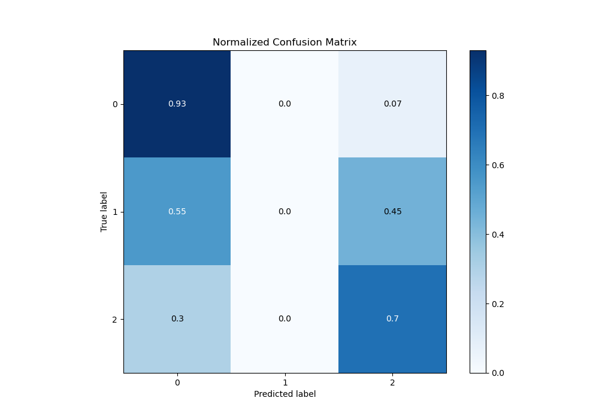

# Summary of 89_RandomForest

[<< Go back](../README.md)

## Random Forest
- **n_jobs**: -1
- **criterion**: gini
- **max_features**: 0.8
- **min_samples_split**: 30
- **max_depth**: 7
- **eval_metric_name**: logloss
- **num_class**: 3
- **explain_level**: 0

## Validation
 - **validation_type**: kfold
 - **shuffle**: True
 - **stratify**: True
 - **k_folds**: 10

## Optimized metric
logloss

## Training time

16.7 seconds

### Metric details
|           |           0 |   1 |           2 |   accuracy |   macro avg |   weighted avg |   logloss |
|:----------|------------:|----:|------------:|-----------:|------------:|---------------:|----------:|
| precision |    0.828498 |   0 |    0.788767 |   0.816736 |    0.539088 |       0.786286 |  0.482667 |
| recall    |    0.925703 |   0 |    0.696872 |   0.816736 |    0.540858 |       0.816736 |  0.482667 |
| f1-score  |    0.874407 |   0 |    0.739977 |   0.816736 |    0.538128 |       0.798862 |  0.482667 |
| support   | 3486        | 193 | 1854        |   0.816736 | 5533        |    5533        |  0.482667 |

## Confusion matrix
|              |   Predicted as 0 |   Predicted as 1 |   Predicted as 2 |
|:-------------|-----------------:|-----------------:|-----------------:|
| Labeled as 0 |             3227 |                0 |              259 |
| Labeled as 1 |              106 |                0 |               87 |
| Labeled as 2 |              562 |                0 |             1292 |

## Learning curves

## Confusion Matrix

## Normalized Confusion Matrix

## ROC Curve

## Precision Recall Curve

[<< Go back](../README.md)
